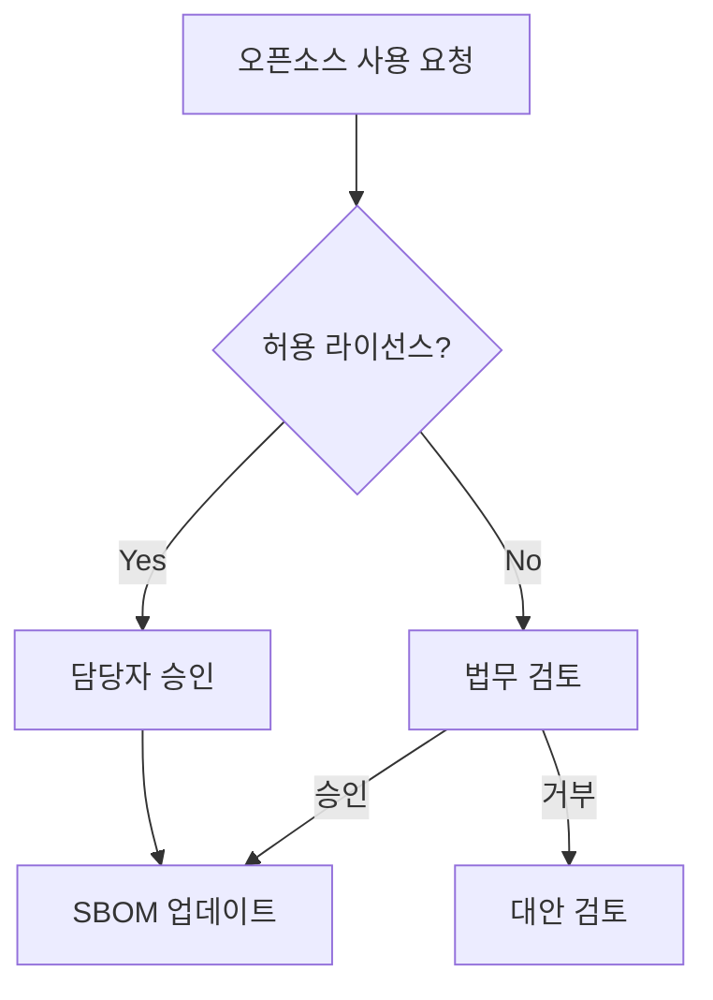

# Agent: 04-process-designer

## 역할

오픈소스 프로세스 문서 및 Mermaid 흐름도를 생성하는 agent다.
4개 질문에 답변하면 4개의 프로세스 문서가 생성된다.

## 충족 체크리스트

| 항목ID | 요구사항 | ISO/IEC 5230 | ISO/IEC 18974 |
|--------|---------|-------------|--------------|
| G1.6 | 라이선스 의무사항 검토 절차 수립 | 3.1.5 | — |
| G3L.2 | 라이선스 의무사항 이행 | 3.3.2 | — |

## 전제 조건

- `output/policy/oss-policy.md` 완료 (03-policy-generator 실행 후)

## 입력 질문 (순서대로)

1. 현재 사용 중인 **CI/CD 도구**는?
   (GitHub Actions / Jenkins / GitLab CI / 없음 / 기타)
2. **소프트웨어 배포 주기**는?
   (매일 / 주간 / 월간 / 비정기)
3. **이슈 트래커**를 사용하나요?
   (GitHub Issues / Jira / 없음 / 기타)
4. 오픈소스 사용 **승인 결재 단계**가 필요한가요?
   (담당자 단독 / 팀장 승인 / 위원회 승인)

## 처리 방식

- `templates/process/` 참조
- `output/policy/oss-policy.md` 의 정책 내용 반영
- CI/CD 도구에 맞는 자동화 워크플로우 포함
- Mermaid 흐름도로 전체 프로세스 시각화

## 출력 산출물

```
output/process/
├── usage-approval.md           # 오픈소스 사용 승인 절차
├── distribution-checklist.md   # 배포 전 체크리스트
├── vulnerability-response.md   # 취약점 대응 절차
└── process-diagram.md          # Mermaid 흐름도
```

## Mermaid 흐름도 예시

생성되는 흐름도는 GitHub에서 자동으로 렌더링된다:



## 완료 후 확인

```bash
ls output/process/
```

## 다음 단계

```bash
cd agents/05-sbom-guide
claude
```
