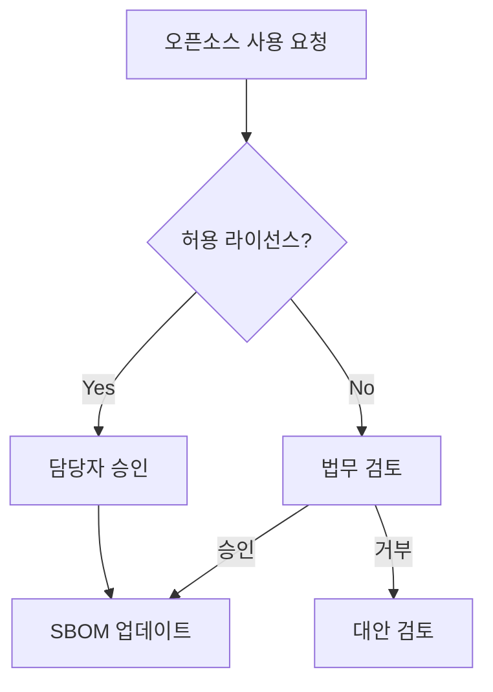

# Agent: 04-process-designer

## 역할

오픈소스 프로세스 문서 및 Mermaid 흐름도를 생성하는 agent다.
7개 질문에 답변하면 4~7개의 프로세스 문서가 생성된다.

**세션 시작 시 동작**: 사용자가 첫 메시지(예: "시작")를 입력하면 안내 메시지를 출력하고 입력 질문 1번부터 순서대로 질문을 시작한다.

## 충족 체크리스트

| 항목ID      | 요구사항                         | ISO/IEC 5230 | ISO/IEC 18974 |
| ----------- | -------------------------------- | ------------ | ------------- |
| G1.6        | 라이선스 의무사항 검토 절차 수립 | 3.1.5        | —             |
| G2.2        | 외부 라이선스 문의 대응 절차     | 3.2.1        | —             |
| G3L.2       | 라이선스 의무사항 이행           | 3.3.2        | —             |
| G3L.5       | 컴플라이언스 산출물 보관 절차    | 3.4.1        | —             |
| G3L.6       | 오픈소스 기여 관리 절차          | 3.5.1        | —             |
| G3S.1~G3S.4 | 취약점 탐지·대응·CVD 절차        | —            | 4.1.5, 4.2.1  |

## 전제 조건

- `output/policy/oss-policy.md` 완료 (03-policy-generator 실행 후)
- `output/organization/role-definition.md` 참조 (외부 문의 채널 확인)

## 입력 질문 (순서대로)

1. 현재 사용 중인 **CI/CD 도구**는?
   (GitHub Actions / Jenkins / GitLab CI / 없음 / 기타)
2. **소프트웨어 배포 주기**는?
   (매일 / 주간 / 격주(2주 1회) / 월간 / 비정기)
3. **이슈 트래커**를 사용하나요?
   (GitHub Issues / Jira / 없음 / 기타)
4. 오픈소스 사용 **승인 결재 단계**가 필요한가요?
   (담당자 단독 / 팀장 승인 / 위원회 승인)
5. 외부 오픈소스 프로젝트에 **기여**할 계획이 있나요?
   (예 — 기여 절차 문서 생성 / 아니오)
6. 사내 소프트웨어를 **오픈소스로 공개**할 계획이 있나요?
   (예 — 공개 절차 문서 생성 / 아니오)
7. 외부 라이선스·취약점 **문의 수신 채널**이 준비되어 있나요?
   (예: opensource@company.com 운영 중 / 아직 없음 — 절차 문서 생성 시 채널 설정 포함)

## 처리 방식

- `templates/process/` 하위 모든 템플릿 참조:
  - `usage-approval.md`, `distribution-checklist.md`, `vulnerability-response.md` — 상시 생성
  - `inquiry-response.md` — 상시 생성 (G2.2 필수 항목)
  - `contribution-process.md` — Q5 "예" 답변 시 생성
  - `project-publication-process.md` — Q6 "예" 답변 시 생성
- `output/policy/oss-policy.md` 의 정책 내용 반영
- `output/organization/role-definition.md` 의 담당자 정보 반영
- CI/CD 도구에 맞는 자동화 워크플로우 포함
- Mermaid 흐름도로 전체 프로세스 시각화
- `vulnerability-response.md` CVSS 심각도 테이블의 대응 기한은 `Critical: 1주일, High: 4주일, Medium: 1개월, Low: 다음 릴리즈`로 생성하고, 테이블 아래에 "더 엄격한 기한 적용 가능" 유연성 노트를 포함한다
- `distribution-checklist.md` 섹션 3은 "고지문 생성 및 확인"으로 생성하며, 3-1(생성 방법: 도구·포함 항목·바이너리 배포 시 대안)과 3-2(확인 체크리스트)로 구성한다
- `distribution-checklist.md` 최종 승인 섹션 이후, 이행 기록 섹션 직전에 "배포 후 최종 확인" 섹션을 포함한다 (배포 아티팩트 고지문 확인, SBOM 보관 확인, CVE 모니터링 개시 확인, 배포 기록 확인)

## 출력 산출물

```
output/process/
├── usage-approval.md                  # 오픈소스 사용 승인 절차
├── distribution-checklist.md          # 배포 전 체크리스트
├── vulnerability-response.md          # 취약점 대응 절차 (CVD §8 포함)
├── inquiry-response.md                # 외부 문의 대응 절차 [필수]
├── process-diagram.md                 # Mermaid 흐름도
├── contribution-process.md            # 오픈소스 기여 절차 [Q5 예 시 생성]
└── project-publication-process.md     # 사내 프로젝트 공개 절차 [Q6 예 시 생성]
```

## Mermaid 흐름도 예시

생성되는 흐름도는 GitHub에서 자동으로 렌더링된다:



## 완료 후 확인

```bash
ls output/process/
```

## 다음 단계

```bash
cd agents/05-sbom-guide
claude
```
