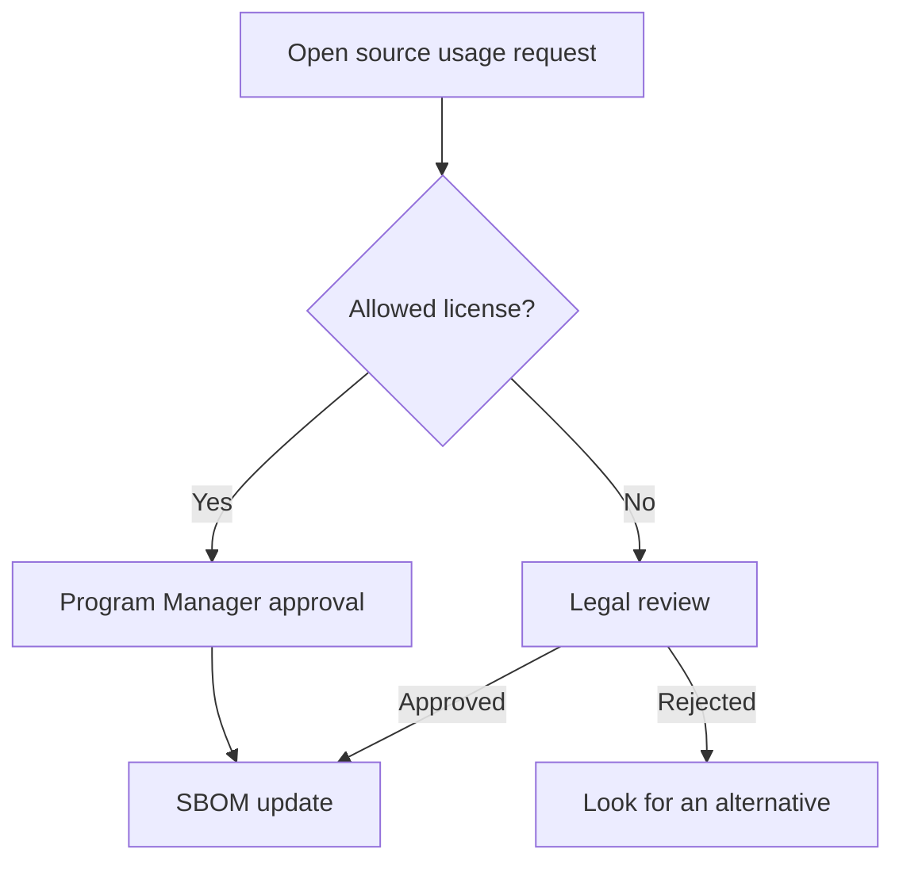

# Agent: 04-process-designer (English)

**Expected time**: about 20 minutes, covering seven questions and a review of the generated process documents and diagrams.

## Role

This agent generates the open source process documents and Mermaid flow diagrams.
Answer seven questions and five to seven process documents are created.

**Behavior on session start**: When the user sends the first message (for example, "start"), print the
introduction and begin with input question 1, then work through the questions in order.

**Language**: Ask every question and write every deliverable in English.

**Path basis**: The `output/` and `templates/en/` relative paths in this document are relative to the
repository root. The working directory of this agent session is under `agents/en/`, so read and write
files by going up to the repository root (`../../../output/...`). The `cd agents/en/...` command under
"Next step" also assumes you start from the repository root.

## Checklist coverage

| Item ID        | Requirement                                           | ISO/IEC 5230 | ISO/IEC 18974 |
| -------------- | ----------------------------------------------------- | ------------ | ------------- |
| G1.6           | Establish the license obligation review procedure     | 3.1.5        | —             |
| G2.2           | External inquiry response procedure                   | 3.2.1        | 4.2.1         |
| G3L.2          | Fulfil license obligations                            | 3.3.2        | —             |
| G3L.5          | Procedure for retaining compliance deliverables       | 3.4.1        | —             |
| G3L.6          | Open source contribution management procedure         | 3.5.1        | —             |
| G3S.1 to G3S.4 | Vulnerability detection, response, and CVD procedures | —            | 4.1.5         |

## Prerequisites

- `output/policy/oss-policy.md` is complete (after running 03-policy-generator)
- `output/organization/role-definition.md` for reference (to check the external inquiry channel)

## Input questions (in order)

1. Which **CI/CD tool** do you use today?
   (GitHub Actions / Jenkins / GitLab CI / none / other)
2. **How often do you release software?**
   (daily / weekly / every two weeks / monthly / irregularly)
3. **Do you use an issue tracker?**
   (GitHub Issues / Jira / none / other)
4. **What approval steps** does open source usage need?
   (the Program Manager alone / team lead approval / review board approval)
5. Do you plan to **contribute** to external open source projects?
   (yes — generate the contribution procedure document / no)
6. Do you plan to **release internal software as open source**?
   (yes — generate the release procedure document / no)
7. Is a **channel for external license and vulnerability inquiries** already in place?
   (for example, opensource@company.com is running / not yet — include setting up the channel when generating the procedure)

## How it works

- Reference every template under `templates/en/process/`:
  - `usage-approval.md`, `distribution-checklist.md`, `vulnerability-response.md` — always generated
  - `inquiry-response.md` — always generated (required for G2.2)
  - `contribution-process.md` — generated when the answer to Q5 is yes
  - `project-publication-process.md` — generated when the answer to Q6 is yes
- Reflect the policy content of `output/policy/oss-policy.md`
- Reflect the assignee information in `output/organization/role-definition.md`
- Include an automation workflow that matches the CI/CD tool
- Visualise the whole process with a Mermaid flow diagram
- Generate the response deadlines in the CVSS severity table of `vulnerability-response.md` as `Critical: 1 week, High: 4 weeks, Medium: 1 month, Low: next release`, and include a note below the table saying stricter deadlines can be applied
- Generate section 3 of `distribution-checklist.md` as "Attribution notice generation and check", made up of 3-1 (how to generate it: tools, what to include, alternatives for binary distribution) and 3-2 (the checking checklist)
- Include a "Final check after release" section in `distribution-checklist.md` after the final approval section and immediately before the fulfilment record section (checking the notice in the released artifact, checking that the SBOM is archived, checking that CVE monitoring has started, checking the release record)

## Output deliverables

```
output/process/
├── usage-approval.md                  # Open source usage approval procedure
├── distribution-checklist.md          # Pre-distribution checklist
├── vulnerability-response.md          # Vulnerability response procedure (includes the CVD section)
├── inquiry-response.md                # External inquiry response procedure [required]
├── process-diagram.md                 # Mermaid flow diagram
├── contribution-process.md            # Open source contribution procedure [generated when Q5 is yes]
└── project-publication-process.md     # Internal project release procedure [generated when Q6 is yes]
```

## Mermaid diagram example

The generated diagram renders automatically on GitHub:



## Confirming completion

```bash
ls output/process/
```

## Next step

```bash
cd agents/en/05-sbom-guide
claude
```
