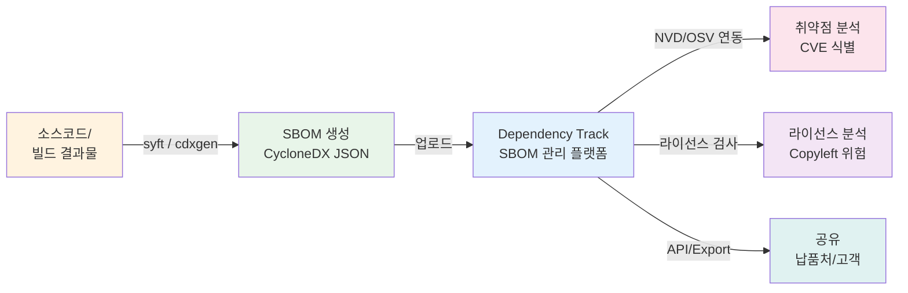

# SBOM 기본: 소프트웨어 구성 명세서 입문

## 1. 이 챕터에서 하는 일

이 챕터에서는 SBOM의 개념, 최소 필수 요소, 대표 포맷, 그리고 SBOM 생태계를 이해합니다.

실습은 없습니다. 읽기와 이해에 집중하면 됩니다.

이후 `05-tools/sbom-generation` 챕터에서 실제 SBOM을 생성할 때 이 배경 지식이 기반이 됩니다.
명령어를 실행하기 전에 "왜 이 도구를 쓰는가", "이 파일은 무엇인가"를 이해하는 것이 목표다.

---

## 2. SBOM이란 무엇인가

### 정의

SBOM(Software Bill of Materials)은 소프트웨어에 포함된 **모든 구성요소의 목록**입니다.
오픈소스 라이브러리, 프레임워크, 런타임, 빌드 도구 등 소프트웨어를 구성하는 모든 재료를 나열합니다.

### 식품 성분표 비유

식품 포장지에는 "밀가루, 설탕, 계란, 버터 ..."가 적혀 있습니다.
SBOM은 소프트웨어의 성분표다.

> "이 소프트웨어에는 React 18.2.0, axios 1.4.0, log4j 2.14.0이 들어있습니다."

소비자(납품처, 고객, 규제기관)는 이 목록을 보고 안전성과 라이선스를 확인합니다.

### SBOM이 없으면 무엇을 모르는가

SBOM 없이는 다음 질문에 답하기 어렵다.

| 상황                       | 문제                                           |
| -------------------------- | ---------------------------------------------- |
| 라이선스 감사              | 어떤 오픈소스를 쓰는지 몰라 라이선스 위반 위험 |
| Log4Shell 같은 취약점 발표 | 우리 제품이 영향을 받는지 즉각 파악 불가       |
| 납품처의 SBOM 요청         | 제공할 수 없어 납품 계약에 차질                |
| 공급망 감사                | 사용한 컴포넌트 증빙 자료 없음                 |

---

## 3. SBOM 최소 필수 요소 (NTIA 기준)

미국 NTIA(National Telecommunications and Information Administration)는 SBOM이 반드시 포함해야 할 7가지 최소 요소를 정의했다.

| 요소        | 영문명                   | 설명                           | 예시                                                   |
| ----------- | ------------------------ | ------------------------------ | ------------------------------------------------------ |
| 공급자명    | Supplier Name            | 컴포넌트를 만든 조직 또는 개인 | Apache Software Foundation                             |
| 컴포넌트명  | Component Name           | 패키지 또는 라이브러리 이름    | log4j-core                                             |
| 버전        | Version                  | 정확한 버전 문자열             | 2.14.1                                                 |
| 고유 식별자 | Other Unique Identifiers | CPE, PURL, 해시 등             | `pkg:maven/org.apache.logging.log4j/log4j-core@2.14.1` |
| 의존성 관계 | Dependency Relationship  | 다른 컴포넌트와의 관계         | spring-boot가 log4j-core에 의존                        |
| SBOM 작성자 | Author of SBOM Data      | SBOM을 생성한 도구 또는 사람   | syft v0.86.0                                           |
| 생성 시각   | Timestamp                | SBOM이 생성된 날짜와 시간      | 2024-01-15T09:30:00Z                                   |

> 이 단계는 ISO/IEC 18974 [G3B.1 배경] 요구사항의 이해 기반을 충족합니다.

**고유 식별자(PURL)란?**

PURL(Package URL)은 패키지를 전 세계적으로 유일하게 식별하는 표준 형식입니다.

```
pkg:{타입}/{네임스페이스}/{이름}@{버전}
```

예시:

- `pkg:npm/lodash@4.17.21` — npm 패키지
- `pkg:pypi/requests@2.28.0` — Python 패키지
- `pkg:maven/org.springframework/spring-core@6.0.0` — Java Maven 패키지

PURL이 있으면 취약점 데이터베이스(NVD, OSV)와 자동으로 매핑하여 CVE를 찾을 수 있습니다.

---

## 4. SBOM 포맷 비교

현재 업계에서 주로 사용하는 두 가지 표준 포맷이 있습니다.

| 항목        | SPDX                                          | CycloneDX                                   |
| ----------- | --------------------------------------------- | ------------------------------------------- |
| 관리 주체   | Linux Foundation                              | OWASP                                       |
| 최신 버전   | 2.3                                           | 1.5                                         |
| 특징        | 라이선스 컴플라이언스 중심, ISO/IEC 5962 표준 | 보안 특화 필드 포함, JSON/XML/Protobuf 지원 |
| 지원 도구   | fossology, reuse, spdx-tools                  | syft, cdxgen, Dependency-Track              |
| 주요 사용처 | 라이선스 감사, 오픈소스 기여                  | 보안 취약점 분석, 공급망 보안               |

### 이 키트에서 CycloneDX를 선택한 이유

1. **도구 지원이 풍부**: syft, cdxgen 모두 CycloneDX를 기본 출력으로 지원한다
2. **보안 특화 필드**: 취약점 정보(VEX)를 SBOM 안에 직접 포함할 수 있다
3. **JSON 형식**: 사람이 읽기 쉽고 CI/CD 파이프라인과 API 연동이 용이하다
4. **Dependency-Track 연동**: SBOM 관리 플랫폼과 완벽하게 연동된다

---

## 5. SBOM 생태계

SBOM은 단독으로 존재하지 않는다. 생성 → 관리 → 분석 → 공유의 흐름으로 이어진다.



### 생성 도구 소개

**syft**

- 제공: Anchore
- 용도: Docker 이미지, 컨테이너, 파일시스템에서 SBOM 생성
- 특징: 설치가 간단하고 다양한 언어 런타임을 자동 감지
- 명령어: `syft <이미지명> -o cyclonedx-json`

**cdxgen**

- 제공: OWASP
- 용도: 소스코드 디렉토리의 패키지 매니페스트 분석
- 특징: `package.json`, `pom.xml`, `requirements.txt` 등 언어별 파일을 자동 인식
- 명령어: `cdxgen -o bom.json`

두 도구 모두 `05-tools/sbom-generation` 챕터에서 실습합니다.

---

## 6. 자주 묻는 질문

**Q: SBOM을 만들면 회사 기술이 노출되지 않나요?**

A: SBOM은 사용한 오픈소스 목록이지 독자 개발 코드가 아닙니다. 노출되는 것은 "어떤 오픈소스 라이브러리를 사용하는가"입니다. 이미 대부분의 경쟁사가 같은 라이브러리를 사용하므로 경쟁 우위와 무관합니다.

---

**Q: 오픈소스가 없는 소프트웨어도 SBOM이 필요한가요?**

A: 현실적으로 순수 독자 개발 소프트웨어는 극히 드뭅니다. 빌드 도구, 런타임, 표준 라이브러리조차 오픈소스인 경우가 많습니다. SBOM을 생성해보면 예상보다 많은 오픈소스 컴포넌트가 발견됩니다.

---

**Q: SBOM은 얼마나 자주 갱신해야 하나요?**

A: 최소 릴리즈마다 갱신을 권장합니다. CI/CD 파이프라인에 통합하면 자동으로 최신 상태를 유지할 수 있습니다. ISO/IEC 18974는 SBOM의 최신성 유지를 요구합니다.

---

**Q: 납품처가 SBOM을 요구하면 어떻게 해야 하나요?**

A: 이 키트를 따라가면 CycloneDX JSON 형식의 SBOM을 생성할 수 있습니다. 납품처가 다른 포맷을 요구하는 경우 변환 도구를 사용하거나 담당자와 협의하여 조정할 수 있습니다.

---

## 7. 완료 확인 체크리스트

- [ ] SBOM의 정의와 필요성을 설명할 수 있다
- [ ] NTIA 7가지 최소 요소를 알고 있다
- [ ] SPDX vs CycloneDX 차이를 이해했다
- [ ] SBOM 생태계(생성 → 관리 → 분석 → 공유)를 파악했다

---

## 8. 다음 단계

이 문서를 읽었다면 SBOM의 개념과 생태계를 충분히 이해한 것입니다.

다음으로 `docs/01-setup/` 으로 이동하여 실습 환경을 준비합니다.
syft, cdxgen, Dependency-Track 설치를 완료하면 본격적인 실습을 시작할 수 있습니다.

```bash
# 다음 단계
cd docs/01-setup
```
