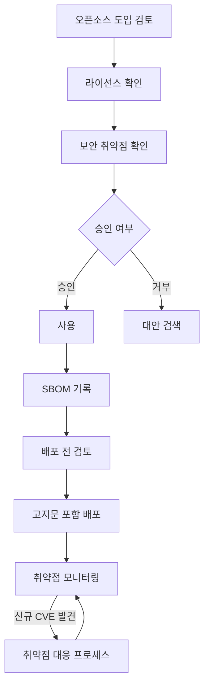
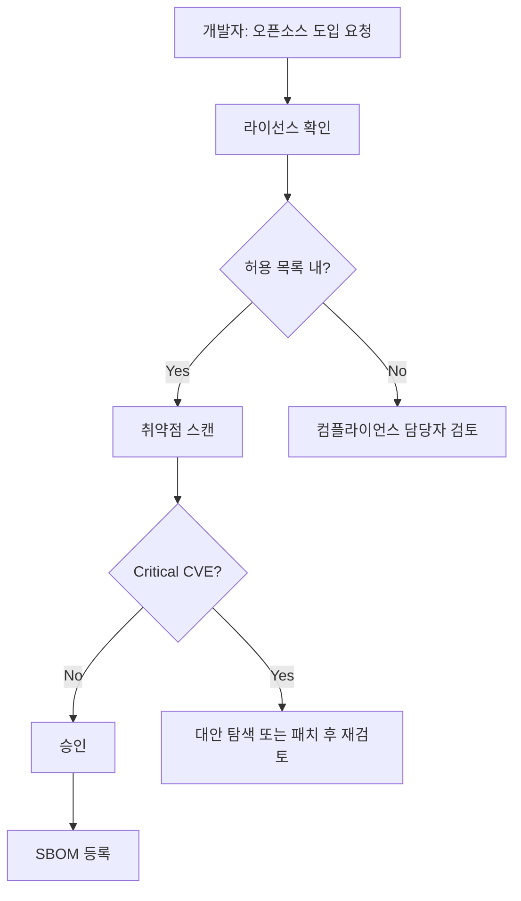

# 오픈소스 프로세스: 사용부터 배포까지

## 1. 이 챕터에서 하는 일

이 챕터에서는 오픈소스 사용 승인, 배포 전 체크리스트, 취약점 대응 절차를 문서화합니다.
정책이 "무엇을 해야 하는가"를 정의한다면, 프로세스는 "어떻게 실행하는가"를 정의합니다.
정책 문서에 "AGPL 사용 시 소스 공개 검토 필요"라고 명시되어 있더라도, 실무에서 누가, 언제,
어떤 양식으로 검토하는지를 정하지 않으면 정책은 선언에 그치고 만다.

`agents/04-process-designer` agent와 대화하여 회사 환경에 맞는 4~7개 산출물을 생성합니다.
CI/CD 파이프라인과의 통합 방안도 함께 다루며, 개발 흐름에 자연스럽게 내장되는
지속 가능한 컴플라이언스 체계를 목표로 합니다.

---

## 2. 배경 지식

### 프로세스가 필요한 이유

많은 조직이 오픈소스 정책을 만들고 나서 실제로 아무도 따르지 않는 상황을 경험합니다.
이유는 단순하다. 정책은 "무엇을"만 말하고 "어떻게"를 말하지 않기 때문입니다.

예를 들어, 정책에 "Copyleft 라이선스 오픈소스를 사용하는 경우 소스코드 공개 의무를
검토해야 한다"고 적혀 있다고 가정하자. 그런데 개발자 입장에서는 다음 질문에 대한
답이 없으면 행동할 수 없습니다.

- 누구에게 검토를 요청해야 하는가?
- 어떤 양식으로 요청하는가?
- 얼마나 기다려야 하는가?
- 검토 결과는 어디에 기록되는가?

프로세스 문서는 이 공백을 채운다. 구체적인 절차가 있어야 정책이 실제로 작동합니다.

### 오픈소스 라이프사이클 전체 흐름

오픈소스 하나가 코드베이스에 들어오고 나가는 전체 흐름을 이해하면 어디에 어떤
프로세스가 필요한지 명확해진다.



이 흐름에서 프로세스가 필요한 지점은 세 곳입니다.

1. **도입 시**: 라이선스와 취약점을 확인하고 승인을 받는 절차
2. **배포 시**: 컴플라이언스 의무 이행을 확인하는 체크리스트
3. **운영 중**: 신규 CVE 발견 시 대응하는 절차

### 핵심 프로세스 5가지

ISO/IEC 5230 §3.5는 오픈소스 커뮤니티 참여(기여 및 공개)에 대한 정책과 절차를 별도로 요구합니다. 기여나 공개 계획이 없는 조직도 "현재 해당 없음"을 명시한 정책 문서가 필요합니다.

#### 3-1. 오픈소스 사용 승인 프로세스

신규 오픈소스를 도입할 때는 라이선스 확인 → 취약점 확인 → 담당자 승인 순으로 진행합니다.
사전에 허용 라이선스 목록(allowlist)을 정의해 두면, 목록 내 라이선스는 자동 승인으로
처리하여 개발 속도에 미치는 영향을 최소화할 수 있습니다.

| 구분        | 기준                                            | 처리                |
| ----------- | ----------------------------------------------- | ------------------- |
| 허용        | 허용 라이선스 목록 내, 알려진 Critical CVE 없음 | 자동 승인           |
| 조건부 허용 | Copyleft 라이선스, High CVE 있음                | 담당자 검토 후 승인 |
| 금지        | 상용 불가 라이선스, Critical CVE 미패치         | 사용 금지           |

#### 3-2. 배포 전 컴플라이언스 체크

소프트웨어를 외부에 배포하기 전에 반드시 아래 항목을 확인합니다. 이 체크리스트를
통과하지 못하면 배포를 진행하지 않는다.

- SBOM 최신화 확인 (마지막 업데이트 일시)
- 고지문(NOTICE) 파일 포함 확인
- Copyleft 라이선스 소스코드 공개 의무 이행 확인
- 허용 라이선스 목록에 없는 라이선스 검토 완료 확인

#### 3-3. 취약점 대응 프로세스

SBOM이 있으면 신규 CVE가 발표되었을 때 자사 소프트웨어의 영향 여부를 빠르게 확인할 수
있습니다. CVE 심각도에 따라 대응 기한을 차등 적용하여 리소스를 효율적으로 사용합니다.

| 심각도   | CVSS 점수 | 대응 기한        | 조치                     |
| -------- | --------- | ---------------- | ------------------------ |
| Critical | 9.0~10.0  | 즉시 (24시간 내) | 즉시 패치 또는 사용 중단 |
| High     | 7.0~8.9   | 1주일 내         | 우선 패치 계획 수립      |
| Medium   | 4.0~6.9   | 1개월 내         | 다음 릴리즈에 포함       |
| Low      | 0.1~3.9   | 다음 릴리즈      | 백로그 등록              |

#### 3-4. 오픈소스 기여 프로세스 (§3.5.1)

외부 오픈소스 프로젝트에 코드·문서·버그 리포트를 기여하는 절차입니다.

**기여 시 주요 확인 항목:**

- IP 보호: 기여 내용에 회사 기밀, 특허 기술, 제3자 IP가 포함되지 않았는지 법무 확인
- CLA 처리: Contributor License Agreement 서명 여부 확인 및 기록
- 승인 단계: 기여 전 오픈소스 담당자 및 팀장 승인 (기여 규모에 따라 차등 적용)
- 기여 기록: 기여 내역(프로젝트, 내용, 담당자, 날짜)을 내부 대장에 관리

기여 계획이 없는 경우에도 `contribution-process.md`에 "현재 기여 계획 없음 — 향후 계획 수립 시 이 절차를 따른다"는 선언적 문서를 작성해두면 §3.5.1 요구사항을 충족할 수 있습니다.

#### 3-5. 사내 프로젝트 공개 프로세스 (§3.5.1)

내부에서 개발한 소프트웨어를 오픈소스로 공개하는 절차입니다.

**공개 전 주요 확인 항목:**

- IP 클리어런스: 공개 코드에 제3자 IP·고객 데이터·회사 기밀이 없는지 확인
- 라이선스 선택: 공개할 소프트웨어에 적용할 오픈소스 라이선스 결정 (MIT, Apache-2.0 등)
- 보안 스캔: 공개 전 취약점 및 하드코딩된 자격증명 스캔
- 승인 단계: CTO 또는 지정 위원회 최종 승인

공개 계획이 없는 경우에도 `project-publication-process.md`에 "현재 공개 계획 없음 — 공개 결정 시 이 절차를 따른다"는 선언적 문서를 작성해두면 §3.5.1 요구사항을 충족할 수 있습니다.

---

### CI/CD 통합 포인트

프로세스가 개발 흐름에 자연스럽게 통합되어야 지속 가능하다. 수동 체크를 자동화하면
담당자 부담이 줄고 누락 위험도 낮아진다.

```yaml
# .github/workflows/oss-compliance.yml
name: OSS Compliance Check

on:
  pull_request:
  schedule:
    - cron: '0 9 * * 1' # 매주 월요일 오전 9시

jobs:
  license-check:
    runs-on: ubuntu-latest
    steps:
      - uses: actions/checkout@v4
      - name: SBOM 생성
        run: |
          docker run --rm -v $(pwd):/project \
            anchore/syft:latest /project \
            --output cyclonedx-json > sbom.cdx.json
      - name: 라이선스 확인
        run: echo "라이선스 검토 단계"
```

주요 CI/CD 통합 지점은 다음과 같다.

- **PR 단계**: 새 의존성 추가 시 라이선스 자동 확인
- **빌드 단계**: SBOM 자동 생성
- **배포 전**: 배포 체크리스트 자동 실행
- **주기적 스캔**: 알려진 CVE 모니터링 (cron 스케줄)

CI/CD가 없는 환경에서도 수동 체크리스트 기반으로 동일한 프로세스를 운영할 수 있습니다.
나중에 CI/CD를 도입하면 수동 단계를 순차적으로 자동화하면 됩니다.

---

## 3. 셀프 스터디

:::info 셀프스터디 모드 (약 1~2시간)
프로세스는 회사 환경에 맞게 상당한 커스터마이징이 필요합니다. agent와 대화하며 진행합니다.
:::

### 사전 준비

agent를 실행하기 전에 아래 4개 질문에 대한 회사 상황을 미리 정리해 두면 대화가 빠르게
진행됩니다.

**agent가 묻는 7개 질문**

1. 현재 사용 중인 CI/CD 도구 (GitHub Actions / Jenkins / GitLab CI / 없음 / 기타)
2. 소프트웨어 배포 주기 (매일 / 주간 / 월간 / 비정기)
3. 이슈 트래커 사용 여부 (GitHub Issues / Jira / 없음 / 기타)
4. 오픈소스 사용 승인 결재 단계 (담당자 단독 / 팀장 승인 / 위원회 승인)
5. 외부 오픈소스 프로젝트에 기여할 계획이 있나요? (예 / 아니오)
6. 사내 소프트웨어를 오픈소스로 공개할 계획이 있나요? (예 / 아니오)
7. 외부 라이선스·취약점 문의 수신 채널이 준비되어 있나요? (채널 주소 또는 "아직 없음")

### 단계별 실습

**1단계**: 위 7개 질문에 대한 회사 상황 정리

**2단계**: agent 실행

:::tip 실행 전 확인
현재 Claude 세션을 먼저 종료(`/exit` 또는 `Ctrl+C`)한 뒤, 새 터미널에서 아래 명령을 실행하세요.
:::

```bash
cd agents/04-process-designer
claude
```

:::details Agent 대화 예시 (클릭해서 펼치기)
아래는 실제 agent와의 대화 흐름 예시입니다. 실행 시 이런 형태로 진행됩니다.

**Agent 안내 메시지:**

> 안녕하세요! 오픈소스 프로세스 산출물을 생성하는 agent입니다.
> 7개 질문에 답변하시면 프로세스 문서 4~7개가 자동으로 생성됩니다.

---

**질문 1/7** — 현재 사용 중인 CI/CD 도구는? (GitHub Actions / Jenkins / GitLab CI / 없음 / 기타)

`예시 답변: GitHub Actions`

**질문 2/7** — 소프트웨어 배포 주기는? (매일 / 주간 / 월간 / 비정기)

`예시 답변: 주간`

**질문 3/7** — 이슈 트래커를 사용하나요? (GitHub Issues / Jira / 없음 / 기타)

`예시 답변: GitHub Issues`

**질문 4/7** — 오픈소스 사용 승인 결재 단계가 필요한가요? (담당자 단독 / 팀장 승인 / 위원회 승인)

`예시 답변: 팀장 승인`

**질문 5/7** — 외부 오픈소스 프로젝트에 기여할 계획이 있나요? (예 / 아니오)

`예시 답변: 아니오`

**질문 6/7** — 사내 소프트웨어를 오픈소스로 공개할 계획이 있나요? (예 / 아니오)

`예시 답변: 아니오`

**질문 7/7** — 외부 라이선스·취약점 문의 수신 채널이 준비되어 있나요?

`예시 답변: opensource@example.com 운영 중`

---

**생성 완료 시 출력 예시:**

| 파일                                            | 조건    | 내용                                   |
| ----------------------------------------------- | ------- | -------------------------------------- |
| `output/process/usage-approval.md`              | 상시    | 오픈소스 도입 승인 양식 및 절차        |
| `output/process/distribution-checklist.md`      | 상시    | 배포 전 컴플라이언스 체크리스트        |
| `output/process/vulnerability-response.md`      | 상시    | 취약점 대응 절차서 (CVD §8 포함)       |
| `output/process/inquiry-response.md`            | 상시    | 외부 라이선스·보안 문의 대응 절차      |
| `output/process/process-diagram.md`             | 상시    | Mermaid 흐름도 포함 전체 프로세스 개요 |
| `output/process/contribution-process.md`        | Q5 "예" | 오픈소스 기여 절차 (CLA 처리 포함)     |
| `output/process/project-publication-process.md` | Q6 "예" | 사내 프로젝트 공개 절차                |

**직접 기입이 필요한 항목:**

- GitHub Actions 워크플로우 파일 경로 확인
- 승인자 이름 및 연락처
  :::

**3단계**: Claude 프롬프트가 열리면 `시작` 을 입력합니다.

**4단계**: 7개 질문에 순서대로 답변

**5단계**: 생성된 Mermaid 흐름도 검토

생성된 `output/process/process-diagram.md` 파일을 GitHub에서 열면 흐름도가 자동으로
렌더링됩니다. 흐름도가 실제 업무 흐름과 일치하는지 검토합니다. 수정이 필요하면 agent에게
추가 요청하거나 직접 파일을 편집합니다.

**6단계**: `output/process/` 디렉토리에 생성된 파일 확인

```bash
ls output/process/
# usage-approval.md
# distribution-checklist.md
# vulnerability-response.md
# inquiry-response.md
# process-diagram.md
# contribution-process.md  (Q5 "예" 답변 시)
# project-publication-process.md  (Q6 "예" 답변 시)
```

**6단계**: CI/CD 통합 계획 수립

현재 사용 중인 CI/CD 도구에 맞는 워크플로우 파일을 프로젝트에 추가하는 계획을 수립합니다.
즉시 적용이 어렵다면 다음 스프린트 또는 다음 릴리즈 사이클에 포함하는 일정을 잡는다.

### 막혔을 때

- **CI/CD가 없으면**: "없음"으로 답변. agent가 수동 체크리스트 기반 프로세스를 생성합니다. 이후 CI/CD를 도입하면 단계적으로 자동화할 수 있습니다.
- **결재 단계가 모호하면**: 현재 팀에서 실제로 사용하는 방식을 그대로 입력합니다. 나중에 수정 가능하다.
- **Mermaid가 렌더링되지 않으면**: [mermaid.live](https://mermaid.live) 에서 직접 확인합니다.

### 예상 결과물

| 파일                                            | 내용                                    |
| ----------------------------------------------- | --------------------------------------- |
| `output/process/usage-approval.md`              | 오픈소스 도입 승인 양식 및 절차         |
| `output/process/distribution-checklist.md`      | 배포 전 컴플라이언스 체크리스트         |
| `output/process/vulnerability-response.md`      | 취약점 대응 절차서 (CVD 90일 원칙 포함) |
| `output/process/inquiry-response.md`            | 외부 라이선스·보안 문의 대응 절차       |
| `output/process/process-diagram.md`             | Mermaid 흐름도 포함 전체 프로세스 개요  |
| `output/process/contribution-process.md`        | 기여 절차 (Q5 "예" 시 생성)             |
| `output/process/project-publication-process.md` | 프로젝트 공개 절차 (Q6 "예" 시 생성)    |

:::info 충족되는 표준 요구사항
이 실습을 완료하면 아래 요구사항이 충족됩니다.

**ISO/IEC 5230**

| 항목 ID | 요구사항                          | 자체인증 체크리스트                                                                                                                   |
| ------- | --------------------------------- | ------------------------------------------------------------------------------------------------------------------------------------- |
| 3.1.5   | 라이선스 의무사항 검토 절차       | Do you have a documented procedure to review and record the obligations, restrictions, and rights granted by each identified license? |
| 3.2.1   | 외부 라이선스·보안 문의 수신 절차 | Do you have a documented procedure for receiving and handling inquiries about open source compliance?                                 |
| 3.3.2   | 배포 전 컴플라이언스 준비         | Do you have a process for creating the necessary compliance artifacts for each distribution?                                          |
| 3.4.1   | 컴플라이언스 산출물 관리          | Do you have a process to ensure compliance artifacts accompany each distribution?                                                     |
| 3.5.1   | 오픈소스 기여 관리 절차           | Do you have a process for contributing to open source projects?                                                                       |

**ISO/IEC 18974**

| 항목 ID | 요구사항                        | 자체인증 체크리스트                                                                                            |
| ------- | ------------------------------- | -------------------------------------------------------------------------------------------------------------- |
| 4.1.5   | 취약점 탐지 및 대응 절차        | Do you have a documented procedure for handling known vulnerabilities in open source components?               |
| 4.2.1   | 외부 보안 취약점 신고 대응 절차 | Do you have a documented procedure for receiving and handling reports of open source security vulnerabilities? |

:::

---

## 4. 완료 확인 체크리스트

아래 항목을 모두 완료해야 이 챕터가 완성됩니다.

- [ ] `output/process/usage-approval.md` 생성됨
- [ ] `output/process/distribution-checklist.md` 생성됨
- [ ] `output/process/vulnerability-response.md` 생성됨 (CVD §8 포함)
- [ ] `output/process/inquiry-response.md` 생성됨 [필수]
- [ ] `output/process/process-diagram.md` 생성됨 (Mermaid 흐름도 포함)
- [ ] `output/process/contribution-process.md` 생성됨 (기여 계획 여부와 무관하게 선언 문서 작성)
- [ ] `output/process/project-publication-process.md` 생성됨 (공개 계획 여부와 무관하게 선언 문서 작성)
- [ ] 취약점 심각도별 대응 기한이 정의됨
- [ ] 허용 라이선스 자동 승인 기준이 명시됨
- [ ] 외부 문의 수신 채널(이메일)이 절차에 명시됨

### process-diagram.md 예시 (일부)

생성된 흐름도가 아래와 유사한 구조를 포함하는지 확인합니다.



> 이 단계는 ISO/IEC 5230 3.1.5, 3.2.1, 3.3.2, 3.4.1, 3.5.1 및 ISO/IEC 18974 4.1.5, 4.2.1 요구사항을 충족합니다.

> 📋 **산출물 예시**: [프로세스 산출물 Best Practice](/reference/samples/process)에서 생성된 파일의 실제 형식을 확인할 수 있습니다.

---

## 5. 다음 단계

`output/process/` 4개 파일이 모두 생성되었으면 SBOM 생성 단계로 이동합니다.

:::tip 실행 전 확인
현재 Claude 세션을 먼저 종료(`/exit` 또는 `Ctrl+C`)한 뒤, 새 터미널에서 아래 명령을 실행하세요.
:::

```bash
cd agents/05-sbom-guide
claude
```

또는 문서를 먼저 읽고 싶다면 [SBOM 생성: syft와 cdxgen으로 소프트웨어 구성 명세 만들기](../05-tools/sbom-generation/index.md)로 이동합니다.

SBOM(소프트웨어 명세서)은 이 챕터에서 만든 프로세스가 실제로 작동하는지 확인하는 핵심
도구다. 어떤 오픈소스가 포함되어 있는지를 기계 가독 형식으로 기록하면, 라이선스 의무
이행 여부와 취약점 영향 범위를 자동으로 확인할 수 있습니다.
