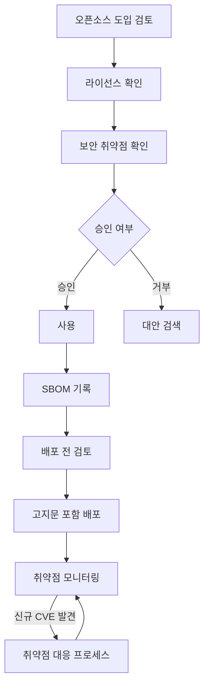
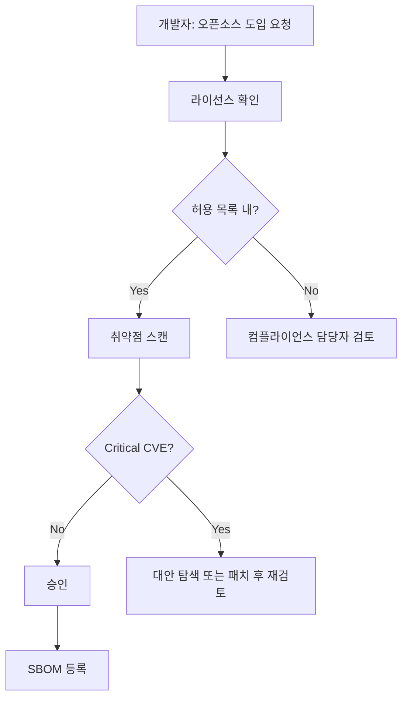

# 오픈소스 프로세스: 사용부터 배포까지

<Prerequisite items={[{label: '3. 오픈소스 정책', href: '/docs/policy'}]} />

## 1. 이 챕터에서 하는 일

이 챕터에서는 오픈소스 사용 승인, 배포 전 체크리스트, 취약점 대응 절차를 문서화합니다.
정책이 "무엇을 해야 하는가"라면 프로세스는 "어떻게 실행하는가"입니다. 정책에
"AGPL 사용 시 소스 공개 검토 필요"라고 적혀 있어도, 누가·언제·어떤 양식으로 검토하는지
정하지 않으면 그 정책은 선언에 그칩니다.

`agents/04-process-designer` agent와 대화해 회사 환경에 맞는 5~7개 산출물을 생성합니다.
CI/CD 통합 방안도 함께 다뤄, 개발 흐름에 자연스럽게 내장되는 지속 가능한 체계를 목표로 합니다.

---

## 2. 배경 지식

:::tip
SBOM·CVE·CVSS 등 낯선 약어는 [용어집](/reference/glossary)에서 쉬운 설명을 볼 수 있습니다.
:::

:::tip
각 단계의 상세 설명과 실제 기업 사례는 [KWG 오픈소스 가이드 — 프로세스](https://openchain-project.github.io/OpenChain-KWG/guide/opensource_for_enterprise/3-process/)를 참조하세요. 이 챕터의 구조와 요구사항 설명은 해당 KWG 가이드(CC BY 4.0)를 기반으로 재구성했습니다.
:::

### 오픈소스 라이프사이클 전체 흐름

오픈소스 하나가 코드베이스에 들어오고 나가는 전체 흐름을 보면 어디에 어떤 프로세스가
필요한지 명확해집니다.


```mermaid
flowchart TD
    A[오픈소스 도입 검토] --> B[라이선스 확인]
    B --> C[보안 취약점 확인]
    C --> D{승인 여부}
    D -->|승인| E[사용]
    D -->|거부| F[대안 검색]
    E --> G[SBOM 기록]
    G --> H[배포 전 검토]
    H --> I[고지문 포함 배포]
    I --> J[취약점 모니터링]
    J -->|신규 CVE 발견| K[취약점 대응 프로세스]
    K --> J
```

도입 시 승인, 배포 시 체크리스트, 운영 중 CVE 대응 — 이 흐름을 아래 여섯 가지 핵심 프로세스로 문서화합니다.

### 핵심 프로세스 6가지

#### 3-1. 오픈소스 사용 승인 프로세스

신규 오픈소스를 도입할 때는 라이선스 확인, 취약점 확인, 담당자 승인 순으로 진행합니다.
사전에 허용 라이선스 목록(allowlist)을 정의해 두면, 목록 내 라이선스는 자동 승인으로
처리하여 개발 속도에 미치는 영향을 최소화할 수 있습니다.

| 구분        | 기준                                            | 처리                |
| ----------- | ----------------------------------------------- | ------------------- |
| 허용        | 허용 라이선스 목록 내, 알려진 Critical CVE 없음 | 자동 승인           |
| 조건부 허용 | Copyleft 라이선스, High CVE 있음                | 담당자 검토 후 승인 |
| 금지        | 상용 불가 라이선스, Critical CVE 미패치         | 사용 금지           |

:::tip 반입(pre-flight) 게이트 — 개발자는 검증된 것만 본다
승인을 건별로 사후 판단하는 대신, 저장소 구조로 강제하는 방식이 실무에서 널리 쓰입니다.
외부 공개 저장소(npm, PyPI 등)에서 바로 가져오지 않고, 먼저 사내 저장소로 **반입(ingest)** 하면서
라이선스·취약점·출처 무결성을 검사해 통과한 버전만 등록합니다. 개발자와 CI 는 검증된 사내
저장소만 바라보므로, dependency confusion 이나 typosquatting 같은 공급망 공격의 유입 경로가
원천 차단됩니다.

```
외부 저장소 → [검사: 라이선스·CVE·무결성·출처] → 통과 시 사내 저장소 등록 → 개발자·CI 는 사내만 사용
```

사내 저장소는 Nexus, Artifactory 같은 아티팩트 저장소로 구성하고, 검사 단계에 [5.3 취약점 분석과
대응](../05-tools/vulnerability/index.md)의 스캔을 연결합니다.

검사 항목의 무결성은 받은 파일이 게시된 것과 같은지(해시 일치)를 봅니다. 여기에 한 겹 더 얹는
것이 출처(provenance) 검증입니다. 패키지에 붙은 SLSA 출처 증명이나 서명(npm provenance, Sigstore
등)을 확인해 어느 저장소의 어느 워크플로가 그 아티팩트를 만들었는지 대조하고, 증명이 없거나
기대한 저장소와 다르면 등록을 보류합니다. 게시 경로 자체를 지키는 방법은
[소프트웨어 구성 분석 (SCA)](/devsecops/sca)의 게시·설치 경로 절에 있습니다.

다만 서명 검증만으로는 충분하지 않습니다. 증명은 "이 빌드가 선언된 파이프라인에서 나왔다"만
보증할 뿐, 그 파이프라인 자체가 침해된 경우는 막지 못합니다. 2026-05 Mini Shai-Hulud 에서는 악성
패키지 84개가 유효한 SLSA Build Level 3 증명을 달고 배포됐습니다. 출처 검증은 게이트의 한 축으로
쓰고, 라이선스·취약점 검사와 반입 후 모니터링을 함께 유지하세요.
:::

#### 3-2. 배포 전 컴플라이언스 체크

소프트웨어를 외부에 배포하기 전에 반드시 아래 항목을 확인합니다. 이 체크리스트를
통과하지 못하면 배포하지 않습니다.

- SBOM 최신화 확인 (마지막 업데이트 일시)
- 고지문(NOTICE) 파일 포함 확인
- Copyleft(2차 저작물도 같은 라이선스로 공개해야 하는 의무) 라이선스의 소스코드 공개 의무 이행 확인
- 허용 라이선스 목록에 없는 라이선스 검토 완료 확인

:::tip 고지문 자동 생성 — onot
배포 전 고지문(NOTICE)은 손으로 작성하면 누락이 잦습니다. [onot](https://github.com/sktelecom/onot)은 SBOM(SPDX·CycloneDX 문서)을 입력받아 OSS 고지문을 자동 생성하는 도구입니다(Kakao와 SK텔레콤 공동 개발). 앞 단계에서 만든 SBOM을 그대로 이어 써서 고지문 작성을 자동화할 수 있습니다.
:::

#### 3-3. 취약점 대응 프로세스

SBOM이 있으면 신규 CVE가 발표되었을 때 자사 소프트웨어의 영향 여부를 빠르게 확인할 수
있습니다. CVE 심각도(CVSS 점수)에 따라 대응 기한을 차등 적용하여 리소스를 효율적으로 사용합니다.

:::tip 대응 기한의 정본
CVSS 심각도별 대응 기한표(KWG 기준선과 조직별 SLA 강화안)와 VEX 개념은 [취약점 대응 기한과 VEX](/reference/concepts/vulnerability-response)에 정리돼 있습니다. 프로세스 산출물 `vulnerability-response.md`는 이 기준을 회사 SLA로 문서화합니다.
:::

:::warning EU 시장에 제품을 출시한다면 별도 신고 의무 확인
위 대응 기한과는 별개로, EU CRA는 악용 취약점·심각한 사고를 **24시간 이내 조기 경보,
72시간 이내 통지**로 규제 당국(CSIRT·ENISA)에 신고할 의무를 2026-09-11부터 적용합니다.
EU 시장에 디지털 요소가 있는 제품을 출시하는 조직만 해당합니다. 세부 기한과 신고 채널은
[취약점 대응 기한과 VEX](/reference/concepts/vulnerability-response) 문서의 EU CRA 절을,
산출물 반영은 `vulnerability-response.md`의 §9를 참조하세요.
:::

#### 3-4. 오픈소스 기여 프로세스 (§3.5.1)

ISO/IEC 5230 §3.5는 오픈소스 커뮤니티 참여(기여 및 공개)에 대한 정책과 절차를 별도로 요구합니다. 기여나 공개 계획이 없는 조직도 "현재 해당 없음"을 명시한 정책 문서가 필요합니다.

이 프로세스는 외부 오픈소스 프로젝트에 코드·문서·버그 리포트를 기여하는 절차입니다.

**기여 시 주요 확인 항목:**

- IP 보호: 기여 내용에 회사 기밀, 특허 기술, 제3자 IP가 포함되지 않았는지 법무 확인
- CLA 처리: Contributor License Agreement 서명 여부 확인 및 기록
- 승인 단계: 기여 전 오픈소스 담당자 및 팀장 승인 (기여 규모에 따라 차등 적용)
- 기여 기록: 기여 내역(프로젝트, 내용, 담당자, 날짜)을 내부 대장에 관리
- AI 도구 정책 확인: AI 코딩 도구로 생성하거나 보조받은 코드를 기여할 때는 상류 프로젝트의 AI 기여 정책을 사전에 확인

**상류 프로젝트의 AI 기여 정책은 갈라져 있습니다:**

같은 코드라도 대상 프로젝트에 따라 표시만 하면 되기도 하고, 아예 받아 주지 않기도 합니다.
기여 전에 대상 저장소의 기여 안내 문서와 PR 템플릿을 확인해야 하는 이유입니다.

| 프로젝트    | 방식      | 내용                                                                                                                                                                                                          |
| ----------- | --------- | ------------------------------------------------------------------------------------------------------------------------------------------------------------------------------------------------------------- |
| Linux 커널  | 표시 의무 | `Assisted-by: AGENT_NAME:MODEL_VERSION` 트레일러로 사용한 도구와 모델 버전을 밝힙니다. AI 에이전트가 `Signed-off-by` 를 붙이는 것은 금지합니다. DCO(개발자 원산지 증명) 인증은 사람만 할 수 있다는 이유입니다 |
| QEMU        | 거절      | AI가 생성했거나 그로부터 파생됐다고 판단되는 기여를 받지 않습니다. 조사, 정적 분석, 디버깅에 AI를 쓰는 것은 허용하되 그 출력이 패치에 들어가면 안 된다는 방식입니다                                           |
| MicroPython | 선언 의무 | PR 템플릿에 "Generative AI" 항목을 두고 사용 여부를 반드시 답하게 합니다. 사용했다면 사람이 코드를 확인했고 책임진다는 문장을 남기도록 합니다                                                                 |

출처는 각각 [Linux 커널 코딩 어시스턴트 문서](https://docs.kernel.org/process/coding-assistants.html),
[QEMU Code provenance](https://www.qemu.org/docs/master/devel/code-provenance.html),
[MicroPython PR 템플릿](https://github.com/micropython/micropython/blob/master/.github/pull_request_template.md)입니다.

사내 기여 절차에는 "대상 프로젝트의 AI 정책 확인"을 승인 이전 단계로 넣고, 확인 결과와
AI 도구 사용 여부를 기여 대장에 함께 기록하세요. 승인 이후에 정책 위반이 드러나면 이미
제출한 패치를 철회해야 합니다.

#### 3-5. 사내 프로젝트 공개 프로세스 (§3.5.1)

내부에서 개발한 소프트웨어를 오픈소스로 공개하는 절차입니다.

**공개 전 주요 확인 항목:**

- IP 클리어런스: 공개 코드에 제3자 IP·고객 데이터·회사 기밀이 없는지 확인
- 라이선스 선택: 공개할 소프트웨어에 적용할 오픈소스 라이선스 결정 (MIT, Apache-2.0 등)
- 보안 스캔: 공개 전 취약점 및 하드코딩된 자격증명 스캔
- 승인 단계: CTO 또는 지정 위원회 최종 승인

기여(3-4)나 공개(3-5) 계획이 없는 경우 agent는 해당 문서를 생성하지 않으며, 갭 분석에서 그 항목은 N/A로 처리됩니다. 원한다면 "현재 계획 없음 — 계획 수립 시 이 절차를 따른다"는 선언적 문서를 직접 작성해 둘 수도 있습니다.

---

#### 3-6. 외부 문의 대응 프로세스 (§3.2.1)

외부(고객, 커뮤니티, 라이선스 권리자)에서 오는 오픈소스 관련 문의를 받는 창구와 처리 절차입니다.
수신 채널 공개(이메일 또는 웹 양식), 접수 확인, 컴플라이언스와 보안 문의 분류, 담당자 배정과 답변,
기록 보관의 흐름으로 구성합니다. 02장에서 지정한 외부 문의 채널이 이 프로세스의 입구가 되며,
산출물은 `inquiry-response.md` 로 생성됩니다. 접수한 신고가 실제로 악용되고 있는 취약점으로
확인되면, 그 시점부터 3-3의 EU CRA 신고 기한(해당 시)이 함께 시작된다는 점에 유의하세요.

**AI가 생성한 저품질 신고를 걸러낼 기준:**

신고 창구를 열면 실제 취약점이 아닌 신고도 함께 들어옵니다. 최근 이 비중이 크게 늘어
창구 운영 자체가 부담이 된다는 보고가 이어지고 있습니다.

- curl은 확인된 취약점 비율이 15% 이상에서 2025년 들어 5% 미만으로 떨어지자, 7년간 운영하던
  버그 바운티의 금전 보상을 2026-01-31 자로 종료했습니다. 신고 접수 자체는 GitHub 비공개
  취약점 신고와 보안 이메일로 계속 받습니다 ([The end of the curl bug-bounty](https://daniel.haxx.se/blog/2026/01/26/the-end-of-the-curl-bug-bounty/))
- HackerOne은 2026년 3월까지의 1년간 플랫폼 전체 제출 건수가 약 76% 늘었으나 유효 신고 비율은
  거의 그대로였다고 밝혔습니다. 늘어난 것은 대응 대상이 아니라 선별 부담이라는 뜻입니다
- Elastic은 2026년 상반기에만 1,390건 넘게 접수해 2024년과 2025년 연간 합계를 넘겼고,
  신고 1건을 선별하는 비용을 약 2달러로 계량했습니다
- JFrog는 2026-07-30 SQLite 대상 신고를 조사해, 같은 계정이 올린 권고 55건 중 54건이
  날조였다고 보고했습니다. 그중 일부는 NVD에 CVSS 9.8 Critical로 등재돼 있었습니다

`inquiry-response.md` 의 분류 단계에 아래 세 가지를 순서대로 넣으면 대부분의 저품질 신고를
초기에 종결할 수 있습니다.

1. 코드 실재 확인: 신고가 지목한 파일, 함수, 버전이 실제로 존재하는지 먼저 확인합니다.
   존재하지 않는 코드 경로를 지목한 신고는 그 자리에서 종결합니다.
2. 재현 가능성: 실행 가능한 재현 절차나 개념 증명 코드가 있는지 확인합니다. 없으면 보완을
   요청하고 회신 기한(예: 14일)을 정해 두었다가 무응답 시 종결합니다.
3. 영향 범위: 우리 배포물이 그 코드 경로를 실제로 사용하는지 확인합니다. 사용하지 않으면
   VEX에 `not_affected` 로 기록하고 종결합니다.

신고자가 제시한 CVSS 점수는 그대로 받아들이지 말고 자체 재산정하세요. CVE 공개 신청 양식에는
신원 확인 절차가 없어 누구나 취약점 설명과 CVSS 점수를 제안할 수 있습니다. 위 JFrog 사례에서
날조된 권고가 Critical로 등재된 경위도 같습니다.

:::tip 공개 운영 사례 — 신고 창구와 고지문

문서로만 정의된 절차는 확인할 방법이 없습니다. 오픈소스 프로젝트 TRUSCA 는 이 두 가지를
저장소에 공개해 두었습니다.

- [SECURITY.md](https://github.com/trustedoss/trusca/blob/main/SECURITY.md) — 취약점 신고 창구. GitHub 비공개 취약점 신고를 우선
  채널로 두고 암호화 이메일을 대안으로 제시하며, 공개 이슈로 올리지 말 것을 명시합니다.
  ISO/IEC 5230 §3.2.1 과 ISO/IEC 18974 §4.2.1 이 요구하는 "공개적으로 볼 수 있는 문의 방법"의
  실제 형태입니다
- [NOTICE](https://github.com/trustedoss/trusca/blob/main/NOTICE) 와 [THIRD_PARTY_NOTICES.md](https://github.com/trustedoss/trusca/blob/main/THIRD_PARTY_NOTICES.md)
  — 배포에 포함하는 고지문. 5230 §3.4.1 의 컴플라이언스 산출물에 해당합니다

구조를 참고하되 그대로 복사하지는 마세요. 예를 들어 위 SECURITY.md 의 PGP 지문은 아직
채워지지 않은 자리 표시자입니다. 연락처와 키는 각자 실제 값으로 채워야 의미가 있습니다.

:::

---

### CI/CD 통합 포인트

프로세스가 개발 흐름에 자연스럽게 통합되어야 지속 가능합니다. 수동 체크를 자동화하면
담당자 부담이 줄고 누락 위험도 낮아집니다.

```yaml
# .github/workflows/oss-compliance.yml
name: OSS Compliance Check

on:
  pull_request:
  schedule:
    - cron: '0 9 * * 1' # 매주 월요일 09:00 UTC (KST 18:00)

jobs:
  license-check:
    runs-on: ubuntu-latest
    steps:
      - uses: actions/checkout@v7
      - name: SBOM 생성
        run: |
          docker run --rm -v "$(pwd)":/project \
            anchore/syft:latest /project \
            --output cyclonedx-json > sbom.cdx.json
      - name: 라이선스 확인
        run: echo "라이선스 검토 단계"
```

주요 CI/CD 통합 지점은 다음과 같습니다.

- **PR 단계**: 새 의존성 추가 시 라이선스 자동 확인
- **빌드 단계**: SBOM 자동 생성
- **배포 전**: 배포 체크리스트 자동 실행
- **주기적 스캔**: 알려진 CVE 모니터링 (cron 스케줄)

CI/CD가 없는 환경에서도 수동 체크리스트 기반으로 동일한 프로세스를 운영할 수 있습니다.
나중에 CI/CD를 도입하면 수동 단계를 순차적으로 자동화하면 됩니다.

---

## 3. 셀프 스터디

:::info 셀프스터디 모드 (약 1~2시간)
프로세스는 회사 환경에 맞게 상당한 커스터마이징이 필요합니다. agent와 대화하며 진행합니다.
:::

### 사전 준비

agent를 실행하기 전에 아래 7개 질문에 대한 회사 상황을 미리 정리해 두면 대화가 빠르게
진행됩니다.

**agent가 묻는 7개 질문**

1. 현재 사용 중인 CI/CD 도구 (GitHub Actions / Jenkins / GitLab CI / 없음 / 기타)
2. 소프트웨어 배포 주기 (매일 / 주간 / 월간 / 비정기)
3. 이슈 트래커 사용 여부 (GitHub Issues / Jira / 없음 / 기타)
4. 오픈소스 사용 승인 결재 단계 (담당자 단독 / 팀장 승인 / 위원회 승인)
5. 외부 오픈소스 프로젝트에 기여할 계획이 있나요? (예 / 아니오)
6. 사내 소프트웨어를 오픈소스로 공개할 계획이 있나요? (예 / 아니오)
7. 외부 라이선스·취약점 문의 수신 채널이 준비되어 있나요? (채널 주소 또는 "아직 없음")

### 단계별 실습

위 7개 질문에 대한 답변을 정리했다면 agent를 실행합니다.

**1단계**: agent 실행

:::tip 실행 전 확인
현재 Claude 세션을 먼저 종료(`/exit` 또는 `Ctrl+C`)한 뒤, 새 터미널에서 아래 명령을 실행하세요.
:::

```bash
cd agents/04-process-designer
claude
```

<details>
<summary>Agent 대화 예시 (클릭해서 펼치기)</summary>

agent는 7개 질문을 순서대로 묻습니다. 아래는 스타트업 예시 답변입니다.

| #   | 질문                    | 예시 답변                      |
| --- | ----------------------- | ------------------------------ |
| 1   | 사용 중인 CI/CD 도구    | GitHub Actions                 |
| 2   | 배포 주기               | 주간                           |
| 3   | 이슈 트래커             | GitHub Issues                  |
| 4   | 사용 승인 결재 단계     | 팀장 승인                      |
| 5   | 외부 프로젝트 기여 계획 | 아니오                         |
| 6   | 사내 SW 공개 계획       | 아니오                         |
| 7   | 외부 문의 수신 채널     | opensource@example.com 운영 중 |

생성되는 파일 목록은 아래 [예상 결과물](#예상-결과물) 표를 참고하세요. 일부 항목은 직접
기입해야 합니다.

**직접 기입이 필요한 항목:**

- GitHub Actions 워크플로우 파일 경로 확인
- 승인자 이름 및 연락처

</details>

**2단계**: Claude 프롬프트가 열리면 `시작` 을 입력합니다.

**3단계**: 7개 질문에 순서대로 답변

**4단계**: 생성된 Mermaid 흐름도 검토

`output/process/process-diagram.md` 파일 안의 그림은 텍스트로 그려진 "도면"이라 편집기에서
그냥 열면 코드처럼 보입니다. 실제 그림으로 보려면 아래 두 방법 중 하나를 씁니다.

- **이 저장소를 GitHub에 올려 관리하는 경우**: GitHub에서 이 파일을 열면 자동으로 그림으로
  렌더링됩니다.
- **로컬 컴퓨터에서만 작업하는 경우**: [mermaid.live](https://mermaid.live) 사이트를 열고,
  `output/process/process-diagram.md`의 &#96;&#96;&#96;mermaid 로 시작해서 &#96;&#96;&#96;로 끝나는 코드 블록 하나를
  통째로 복사해 그 사이트 왼쪽 입력창에 붙여넣으면(Cmd+V 또는 Ctrl+V) 오른쪽에 그림이
  바로 나타납니다. VS Code를 쓴다면 "Markdown Preview Mermaid Support" 같은 확장 프로그램을
  설치해 미리보기(Preview)로 봐도 됩니다.

흐름도가 실제 업무 흐름과 일치하는지 검토하고, 수정이 필요하면 agent에게 추가 요청하거나
직접 편집합니다.

**5단계**: `output/process/` 디렉토리에 생성된 파일 확인

```bash
ls output/process/
```

**6단계**: CI/CD 통합 계획 수립

현재 사용 중인 CI/CD 도구에 맞는 워크플로우 파일을 프로젝트에 추가하는 계획을 수립합니다.
즉시 적용이 어렵다면 다음 스프린트나 릴리즈 사이클에 포함하는 일정을 잡습니다.

### 막혔을 때

- **CI/CD가 없으면**: "없음"으로 답변. agent가 수동 체크리스트 기반 프로세스를 생성합니다. 이후 CI/CD를 도입하면 단계적으로 자동화할 수 있습니다.
- **결재 단계가 모호하면**: 현재 팀에서 실제로 사용하는 방식을 그대로 입력합니다. 나중에 수정할 수 있습니다.
- **Mermaid가 렌더링되지 않으면**: [mermaid.live](https://mermaid.live) 에서 직접 확인합니다.

### 예상 결과물

| 파일                                            | 내용                                                   |
| ----------------------------------------------- | ------------------------------------------------------ |
| `output/process/usage-approval.md`              | 오픈소스 도입 승인 양식 및 절차                        |
| `output/process/distribution-checklist.md`      | 배포 전 컴플라이언스 체크리스트                        |
| `output/process/vulnerability-response.md`      | 취약점 대응 절차서 (CVD(협력적 취약점 공개) 절차 포함) |
| `output/process/inquiry-response.md`            | 외부 라이선스·보안 문의 대응 절차                      |
| `output/process/process-diagram.md`             | Mermaid 흐름도 포함 전체 프로세스 개요                 |
| `output/process/contribution-process.md`        | 기여 절차 (Q5 "예" 시 생성)                            |
| `output/process/project-publication-process.md` | 프로젝트 공개 절차 (Q6 "예" 시 생성)                   |

:::info 충족되는 표준 요구사항
이 실습을 완료하면 아래 요구사항이 충족됩니다.

5230 §3.1.5, §3.2.1, §3.3.2, §3.4.1, §3.5.1 · 18974 §4.1.5, §4.2.1

각 항목의 자체 인증 체크리스트 문항 원문과 입증자료는 [요구사항 상세 대조표](/reference/requirements-matrix)에 있습니다.
:::

---

## 4. 완료 확인 체크리스트

아래 항목을 모두 완료해야 이 챕터가 완성됩니다.

- [ ] `output/process/usage-approval.md` 생성됨
- [ ] `output/process/distribution-checklist.md` 생성됨
- [ ] `output/process/vulnerability-response.md` 생성됨 (CVD(협력적 취약점 공개) 절차 포함)
- [ ] `output/process/inquiry-response.md` 생성됨 [필수]
- [ ] `output/process/process-diagram.md` 생성됨 (Mermaid 흐름도 포함)
- [ ] (기여 계획이 있는 경우) `output/process/contribution-process.md` 생성됨
- [ ] (공개 계획이 있는 경우) `output/process/project-publication-process.md` 생성됨
- [ ] 취약점 심각도별 대응 기한이 정의됨
- [ ] 허용 라이선스 자동 승인 기준이 명시됨
- [ ] 외부 문의 수신 채널(이메일)이 절차에 명시됨

### process-diagram.md 예시 (일부)

생성된 흐름도가 아래와 유사한 구조를 포함하는지 확인합니다.


```mermaid
flowchart TD
    A[개발자: 오픈소스 도입 요청] --> B[라이선스 확인]
    B --> C{허용 목록 내?}
    C -->|Yes| D[취약점 스캔]
    C -->|No| E[컴플라이언스 담당자 검토]
    D --> F{Critical CVE?}
    F -->|No| G[승인]
    F -->|Yes| H[대안 탐색 또는 패치 후 재검토]
    G --> I[SBOM 등록]
```

> 이 단계는 ISO/IEC 5230 3.1.5, 3.2.1, 3.3.2, 3.4.1, 3.5.1 및 ISO/IEC 18974 4.1.5, 4.2.1 요구사항을 충족합니다.

:::tip 산출물 예시
[프로세스 산출물 Best Practice](/reference/samples/process)에서 생성된 파일의 실제 형식을 확인할 수 있습니다.
:::

---

## 5. 다음 단계

`output/process/` 산출물이 모두 생성되었으면 SBOM 생성 단계로 이동합니다.

:::tip 실행 전 확인
현재 Claude 세션을 먼저 종료(`/exit` 또는 `Ctrl+C`)한 뒤, 새 터미널에서 아래 명령을 실행하세요.
:::

```bash
cd agents/05-sbom-guide
claude
```

또는 문서를 먼저 읽고 싶다면 [SBOM 생성: syft와 cdxgen으로 소프트웨어 구성 명세 만들기](../05-tools/sbom-generation/index.md)로 이동합니다.

SBOM(소프트웨어 부품 명세서)은 이 챕터에서 만든 프로세스가 실제로 작동하는지 확인하는 핵심
도구입니다. 어떤 오픈소스가 포함되어 있는지를 기계 가독 형식으로 기록하면, 라이선스 의무
이행 여부와 취약점 영향 범위를 자동으로 확인할 수 있습니다.
