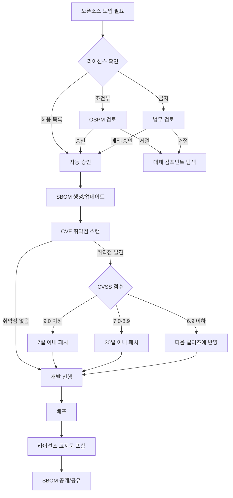

<!-- 이 파일은 산출물 예시입니다.
     실제 산출물은 agents/ 를 실행하여 생성하세요. -->

# 오픈소스 프로세스 다이어그램

버전: 1.0
갱신일: 2026-XX-XX

---

## 전체 오픈소스 관리 프로세스

---

## 프로세스 단계 요약

| 단계 | 담당자 | 산출물 |
|------|------|------|
| 라이선스 확인 | 개발자 | - |
| 승인 결정 | OSPM | 승인 기록 |
| SBOM 생성 | 개발자 | `[project].cdx.json` |
| 취약점 스캔 | 보안 담당자 | `cve-report.md` |
| 배포 | 개발자 | 라이선스 고지문 |

---

> 이 문서는 ISO/IEC 5230 3.1.5, 3.3.1, 3.3.2 및 ISO/IEC 18974 3.3.2 요구사항을 충족합니다.
