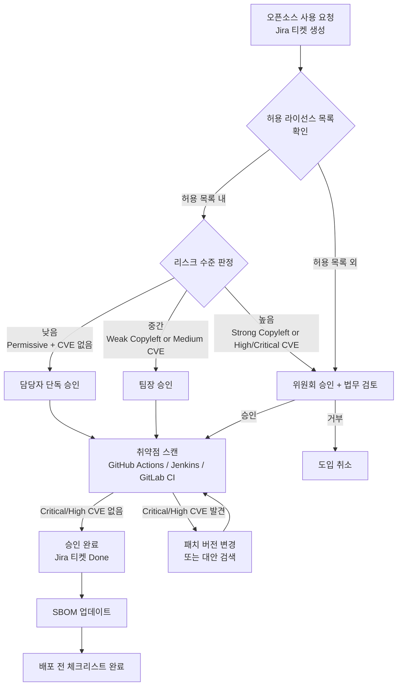
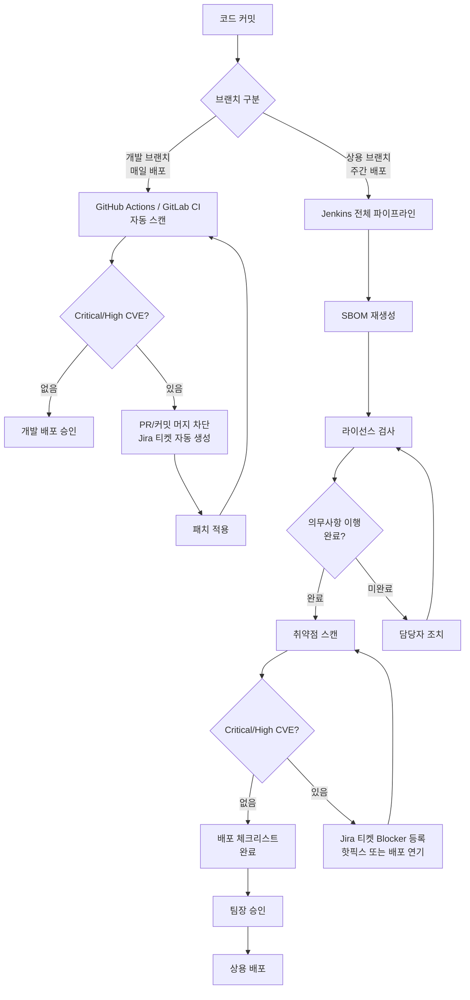
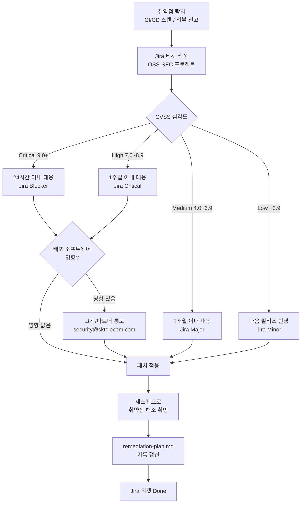
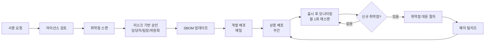

# 오픈소스 프로세스 흐름도
<!-- 5230 §3.1.5.1, §3.3.1.1, §3.4.1.1 -->

**회사명**: 테크유니콘
**작성일**: 2026-03-23

---

## 1. 오픈소스 사용 승인 프로세스

---

## 2. 배포 파이프라인 프로세스

---

## 3. 취약점 대응 프로세스

---

## 4. 전체 오픈소스 관리 사이클

---

## 참조 문서

| 프로세스 | 상세 절차 문서 |
|---------|-------------|
| 사용 승인 | `output/process/usage-approval.md` |
| 배포 체크리스트 | `output/process/distribution-checklist.md` |
| 취약점 대응 | `output/process/vulnerability-response.md` |
| 라이선스 정책 | `output/policy/oss-policy.md` |
| 허용 라이선스 | `output/policy/license-allowlist.md` |
