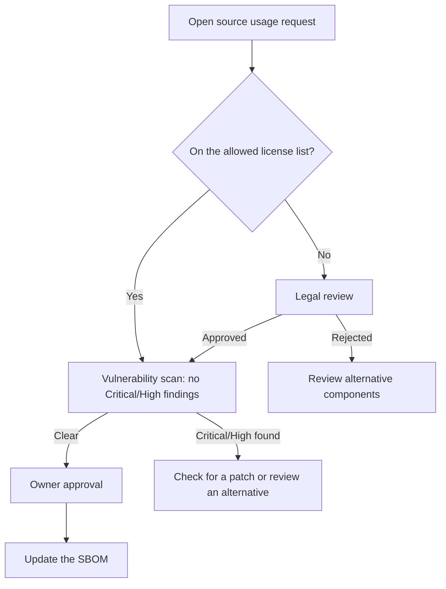
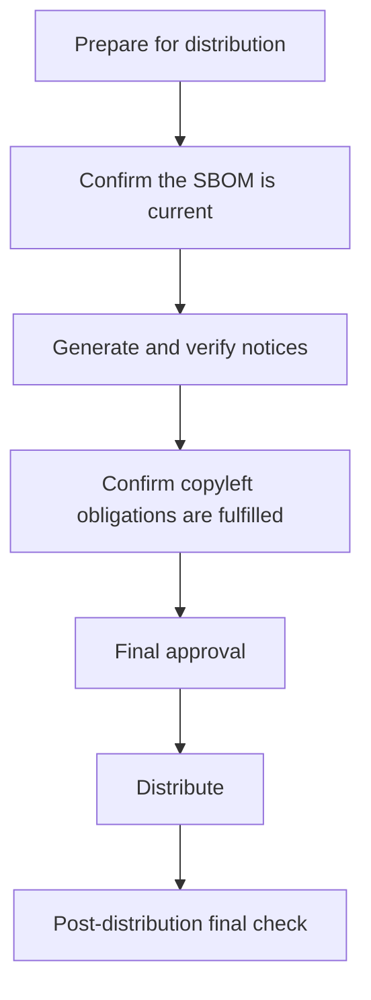
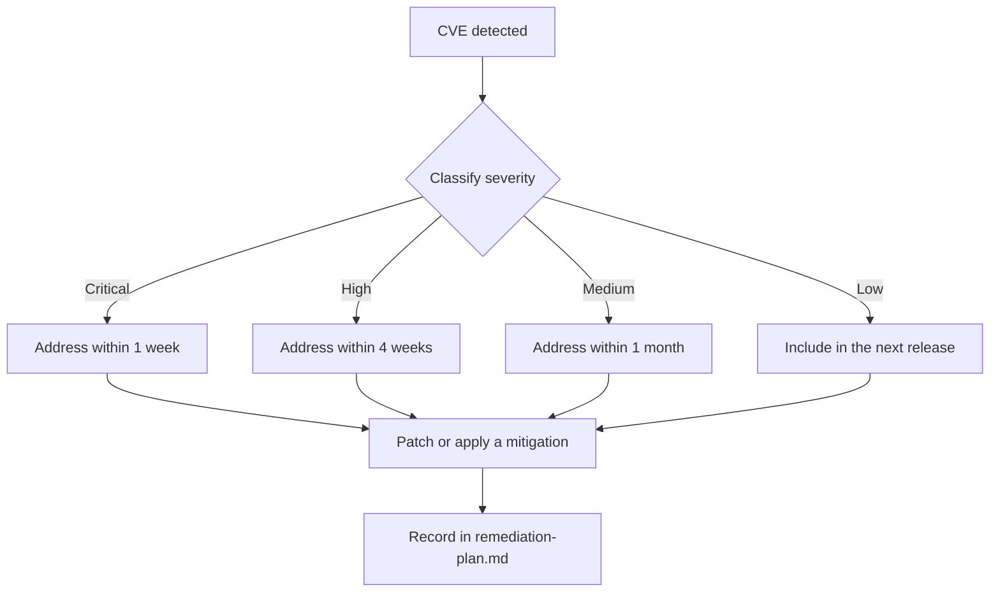

# Open Source Process Flow Diagram

<!-- 5230 §3.1.5.1, §3.3.2.1 · 18974 §4.1.5.1 -->

**Company name**: {company name}
**Date written**: YYYY-MM-DD
**Owner**: {Open Source Program Manager name}

> This document visualizes, as Mermaid flowcharts, the procedures already defined in prose in
> `usage-approval.md`, `distribution-checklist.md`, and `vulnerability-response.md`. For the
> rationale and exception handling behind each procedure, follow those documents; use this one as
> a quick-reference overview of the overall flow.

---

## 1. Open source usage approval flow

<!-- Must match the procedure in usage-approval.md -->

## 2. Pre-distribution checklist flow

<!-- Must match the procedure in distribution-checklist.md -->

## 3. Vulnerability response flow

<!-- Must match the procedure in vulnerability-response.md -->

---

## 4. Notes

- For the detailed conditions and exception handling of each flow, follow the corresponding process document referenced in §1.
- When a process changes, update this document together with the corresponding process document.
