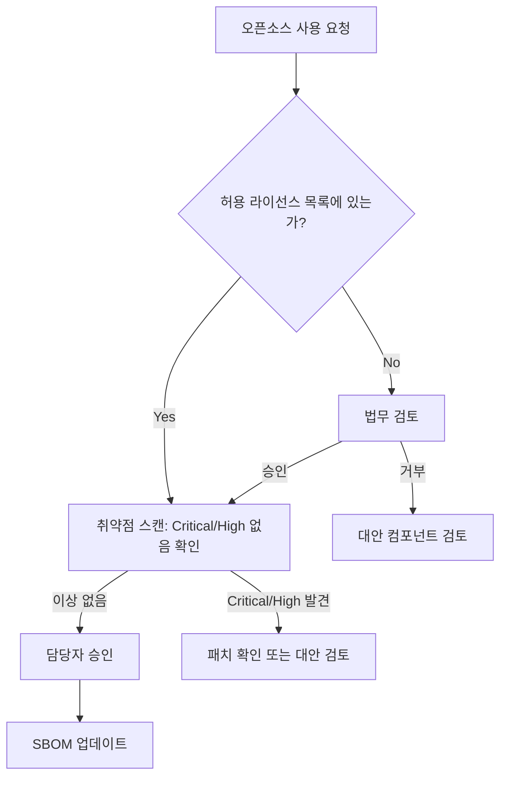
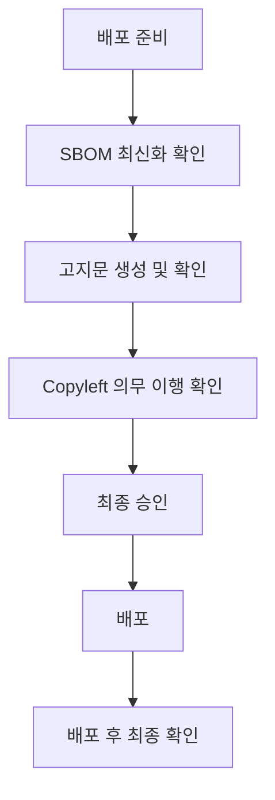
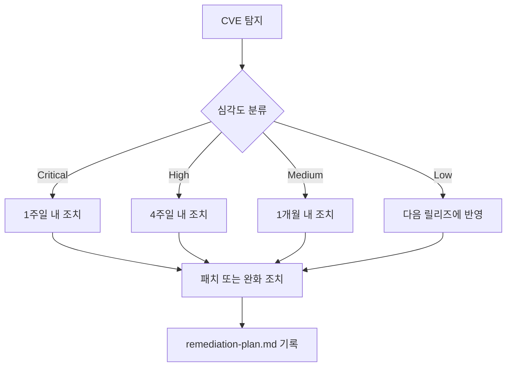

# 오픈소스 프로세스 흐름도

<!-- 5230 §3.1.5.1, §3.3.2.1 · 18974 §4.1.5.1 -->

**회사명**: {회사명}
**작성일**: YYYY-MM-DD
**담당자**: {오픈소스 담당자 이름}

> 이 문서는 `usage-approval.md`, `distribution-checklist.md`, `vulnerability-response.md`에서
> 글로 정의한 절차를 Mermaid 흐름도로 시각화한 것이다. 절차 자체의 근거·예외 조건은 해당 문서를
> 따르고, 이 문서는 전체 흐름을 한눈에 보기 위한 참조 자료로 쓴다.

---

## 1. 오픈소스 사용 승인 흐름

<!-- usage-approval.md 절차와 동일해야 한다 -->

## 2. 배포 전 체크리스트 흐름

<!-- distribution-checklist.md 절차와 동일해야 한다 -->

## 3. 취약점 대응 흐름

<!-- vulnerability-response.md 절차와 동일해야 한다 -->

---

## 4. 참고

- 각 흐름도의 세부 조건과 예외 처리는 대응하는 프로세스 문서(§1의 안내 참조) 본문을 따른다.
- 프로세스 변경 시 이 문서와 대응 프로세스 문서를 함께 갱신한다.
