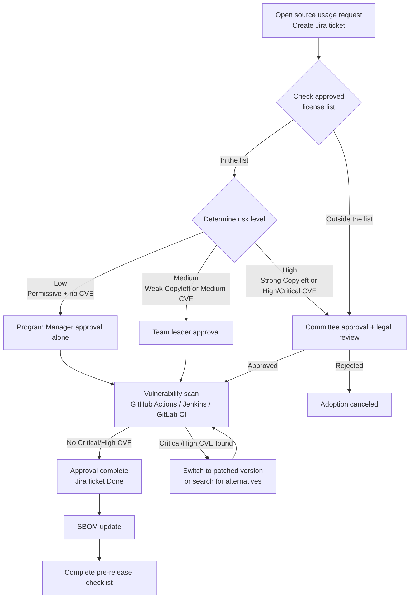
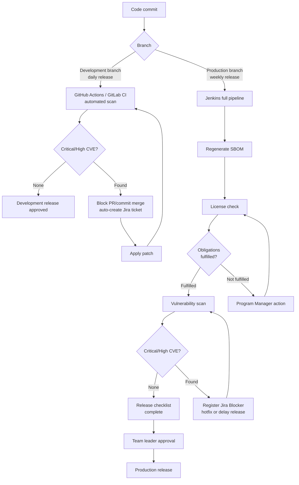
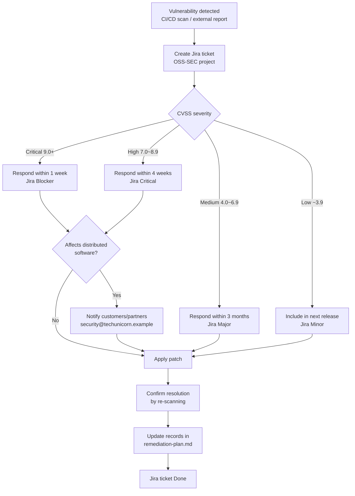
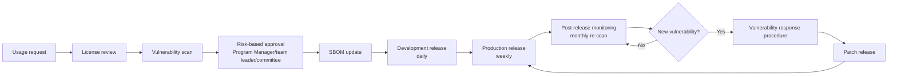

# Process Deliverables Best Practice

These are completed examples of the 4–7 deliverables generated by the `process-designer` agent.
Compare them with your own `output/process/` files to spot missing items.

> The process documents below are based on the six processes of the OpenChain KWG process guide (open source management, security vulnerability management, external inquiry response, contribution, internal project release, training and assessment) and ISO/IEC 5230 and 18974. The KWG guide is licensed under CC BY 4.0.

> **Go to reference:** [Open Source Process Chapter Guide](/docs/process)

---

**Deliverables on this page**

- Open source usage approval procedure
- Pre-distribution license compliance checklist
- Vulnerability response procedure
- Open source process flowcharts
- External inquiry response procedure
- Open source contribution procedure
- Internal project release procedure

## Open Source Usage Approval Procedure

Document: usage-approval.md

- **Company name**: Tech Unicorn
- **Date written**: 2026-03-23
- **Owner**: DevOps Team Open Source Program Manager

```
Related Standards
- 5230 §3.1.5.1·§3.3.1.1·§3.3.2.1
```

---

### 1. Procedure overview

```
Related Standards
- 5230 §3.1.5.1
```

Follow this procedure when adopting a new open source component or changing an existing version.

#### Risk-based approval levels

| Risk level | Conditions                                                                       | Approval level                 |
| ---------- | -------------------------------------------------------------------------------- | ------------------------------ |
| Low        | Permissive license + no Critical/High CVE                                        | Program Manager approval alone |
| Medium     | Weak copyleft or Medium CVE present                                              | Team leader approval           |
| High       | Strong/network copyleft, High/Critical CVE, or license outside the approved list | Committee approval             |

```
Open source adoption request (create a Jira ticket)
    ↓
License check (compare against the approved list)
    ↓
Determine the risk level
    ↓
[Low] → Program Manager approval
[Medium] → Team leader approval
[High] → Committee approval (including the legal team)
    ↓
Vulnerability scan (CVE check)
    ↓
[Critical/High CVE?] → Search for alternatives or check for patches
    ↓
Approval complete → SBOM update
    ↓
Complete distribution-checklist.md before release
```

---

### 2. CI/CD automation integration

Tech Unicorn uses GitHub Actions, Jenkins, and GitLab CI. The open source usage approval procedure is integrated into each pipeline as follows.

#### GitHub Actions

```yaml
# .github/workflows/oss-scan.yml
name: OSS License & Vulnerability Scan
on:
  pull_request:
    branches: [main, develop]

jobs:
  oss-check:
    runs-on: ubuntu-latest
    steps:
      - uses: actions/checkout@v7
      - name: License Scan
        run: |
          # Compare against the approved list after the license scan
          npx license-checker --summary --excludePrivatePackages
      - name: Vulnerability Scan
        run: |
          # CVE scan
          npm audit --audit-level=high
```

#### Jenkins (Jenkinsfile)

```groovy
stage('OSS Compliance') {
    steps {
        sh 'license-checker --summary'
        sh 'osv-scanner --lockfile package-lock.json'
    }
    post {
        failure {
            // Automatically create a Jira ticket
            jiraNewIssue site: 'TU-JIRA',
                         projectKey: 'OSS',
                         summary: 'OSS compliance check failed'
        }
    }
}
```

#### GitLab CI (.gitlab-ci.yml)

```yaml
oss-scan:
  stage: test
  script:
    - license-checker --summary
    - osv-scanner --lockfile package-lock.json
  only:
    - merge_requests
    - main
```

---

### 3. Usage approval request form (Jira ticket)

Create an **OSS** project ticket in Jira and record the following items.

| Item                     | Content                                        |
| ------------------------ | ---------------------------------------------- |
| Requester                | (name/department)                              |
| Request date             | YYYY-MM-DD                                     |
| Component name           | (name)                                         |
| Version                  | (version)                                      |
| License                  | (SPDX identifier, e.g., Apache-2.0)            |
| Purpose of use           | (direct use / dependency / development use)    |
| Included in distribution | (included in distribution / internal use only) |
| Risk level               | (low / medium / high)                          |
| Alternatives considered  | (reviewed / not needed / reason: )             |

---

### 4. License obligation review

```
Related Standards
- 5230 §3.1.5.1
```

| License type              | Distribution method   | Obligations                                          | Fulfillment method                          | Approval level        |
| ------------------------- | --------------------- | ---------------------------------------------------- | ------------------------------------------- | --------------------- |
| MIT / Apache-2.0 / BSD    | All distributions     | Copyright notice, license notice                     | Include in the NOTICE file                  | Program Manager alone |
| LGPL                      | Embedded/distribution | Source code disclosure or guaranteed dynamic linking | Keep dynamic linking / disclose source code | Team leader approval  |
| GPL-2.0 / GPL-3.0         | Embedded/distribution | Full source code disclosure                          | Disclose source code (upon distribution)    | Committee approval    |
| AGPL-3.0                  | Including SaaS        | Source code disclosure including network services    | Disclose source code                        | Committee approval    |
| Outside the approved list | —                     | Prior legal review required                          |                                             | Committee approval    |

---

### 5. Prior vulnerability check

```
Related Standards
- 18974 §4.1.5.1·§4.3.2
```

When adopting a new component:

- [ ] Look up CVEs for the version in the OSV API or NVD
- [ ] Confirm there are no Critical/High CVEs
- [ ] If a Critical/High CVE exists: switch to a patched version or reconsider adoption
- [ ] Attach the scan results to the Jira ticket

---

### 6. SBOM update obligation

```
Related Standards
- 5230 §3.3.1.1
```

After approval, always:

- Run `output/sbom/sbom-commands.sh` to regenerate the SBOM
- Store the updated `*.cdx.json` file in the designated location

---

### 7. Approval records

| Date       | Component | Version   | License   | CVE check | Risk            | Approver | Jira ticket  |
| ---------- | --------- | --------- | --------- | --------- | --------------- | -------- | ------------ |
| YYYY-MM-DD | (name)    | (version) | (license) | ✅/⚠️     | Low/Medium/High | (name)   | OSS-(number) |

---

### 8. Approved license list reference

For the full list of approved and restricted licenses, see `output/policy/license-allowlist.md`.

---

## Pre-Distribution License Compliance Checklist

Document: distribution-checklist.md

- **Company name**: Tech Unicorn
- **Owner**: DevOps Team Open Source Program Manager

```
Related Standards
- 5230 §3.4.1.1·§3.4.1.2
```

---

### Application criteria per distribution channel

Tech Unicorn operates a development branch (daily releases) and a production branch (weekly releases).

| Distribution channel | Cycle  | Checklist application level                  |
| -------------------- | ------ | -------------------------------------------- |
| Development branch   | Daily  | Check automated scan results (items 1 and 4) |
| Production branch    | Weekly | Complete the full checklist before release   |

---

### 1. SBOM freshness check

```
Related Standards
- 5230 §3.3.1.2
```

- [ ] Is the SBOM up to date for this release?
- [ ] Did you run `output/sbom/sbom-commands.sh` to regenerate the SBOM?
- [ ] Are newly added dependencies reflected in the SBOM?

**CI/CD automation check:**

- [ ] Did the SBOM generation step pass in the GitHub Actions / Jenkins / GitLab CI pipeline?

---

### 2. License obligation fulfillment check

```
Related Standards
- 5230 §3.3.2.1·§3.1.5.1
```

- [ ] Did you check every license in `output/sbom/license-report.md`?
- [ ] Are there no licenses outside of `output/policy/license-allowlist.md`?
- [ ] When copyleft licenses are used, are the following items met:

| License | Obligations                                          | Fulfilled                      |
| ------- | ---------------------------------------------------- | ------------------------------ |
| GPL-2.0 | Source code disclosure, notice included              | ☐ Not applicable / ☐ Fulfilled |
| GPL-3.0 | Source code disclosure, notice included              | ☐ Not applicable / ☐ Fulfilled |
| LGPL    | Source code disclosure or guaranteed dynamic linking | ☐ Not applicable / ☐ Fulfilled |
| AGPL    | Source code disclosure including network services    | ☐ Not applicable / ☐ Fulfilled |
| MPL     | Source code disclosure of modified files             | ☐ Not applicable / ☐ Fulfilled |

---

### 3. Attribution notice generation and check

```
Related Standards
- 5230 §3.4.1.1
```

#### 3-1. Generating the notice

- Example generation tools: use whichever of `syft`, `scancode-toolkit`, or `tern` fits your environment.
- Include a `NOTICE` or `OPEN_SOURCE_LICENSES.txt` file in the build artifacts.
- Items to include: component name, version, license SPDX ID, copyright notice, and the full license text or a license URL.
- For binary distribution (embedded/apps): provide at least one of a bundled file, an About screen, or a QR code/URL.

#### 3-2. Checking the notice

- [ ] Is the `NOTICE` or `OPEN_SOURCE_LICENSES.txt` file included in the distribution package?
- [ ] Does the notice contain the copyright notice and license text for every open source component?
- [ ] For binary distribution, is a means of accessing the license notice in place?

---

### 4. Vulnerability scan result check

```
Related Standards
- 18974 §4.1.5.1
```

- [ ] Was a vulnerability scan performed in the CI/CD pipeline (GitHub Actions / Jenkins / GitLab CI)?
- [ ] Are there no Critical/High CVEs, or has a resolution plan been established?
- [ ] Was a related ticket created and handled in Jira?

---

### 5. Retaining compliance deliverables

```
Related Standards
- 5230 §3.4.1.2
```

- [ ] Did you retain a copy of the SBOM for this release? (Path: `output/sbom/{project}-{version}.cdx.json`)
- [ ] Did you retain a copy of the attribution notice?
- [ ] Are the retention location and retention period specified in the policy?

---

### 6. License non-compliance check

```
Related Standards
- 5230 §3.2.2.5
```

- [ ] Are there no license non-compliance cases in this release?
- [ ] If there are non-compliance cases, have corrective actions been completed?

---

### 7. Final approval

**Production branch release (weekly) — full sign-off required**

| Role                        | Name                                    | Signature/date |
| --------------------------- | --------------------------------------- | -------------- |
| Open Source Program Manager | DevOps Team Open Source Program Manager | YYYY-MM-DD     |
| Legal review (if required)  | (name)                                  | YYYY-MM-DD     |
| Release approver            | DevOps team leader                      | YYYY-MM-DD     |

---

### 8. Final check after release

Immediately after the release, check the following and record it in the fulfillment record.

- [ ] Visually confirm that the NOTICE file or a means of access is actually included in the released artifact
- [ ] Confirm that the SBOM for the released version is archived in `output/sbom/`
- [ ] Confirm that monitoring for new CVEs has started after the release (see Section 6 of vulnerability-response.md)
- [ ] Confirm that the release record (version, date/time, approver, channel) is captured in the fulfillment record

---

### Fulfillment record

```
Related Standards
- 5230 §3.4.1.2
```

Once this checklist is complete, record it with the date in the history below.

| Version   | Release date | Branch                 | Checklist complete | Owner  |
| --------- | ------------ | ---------------------- | ------------------ | ------ |
| (version) | YYYY-MM-DD   | Production/Development | ✅                 | (name) |

---

## Vulnerability Response Procedure

Document: vulnerability-response.md

- **Company name**: Tech Unicorn
- **Date written**: 2026-03-23
- **Owner**: DevOps Team Open Source Program Manager

```
Related Standards
- 5230 §3.2.2.5
- 18974 §4.1.5.1·§4.2.1.2
```

---

### 1. Vulnerability detection methods

```
Related Standards
- 18974 §4.1.5.1
```

| Detection method                           | Tool/channel                             | Cycle                                  |
| ------------------------------------------ | ---------------------------------------- | -------------------------------------- |
| SBOM-based automated scan (GitHub Actions) | OSV API / Dependabot                     | On commit/PR; development branch daily |
| SBOM-based automated scan (Jenkins)        | OSV API / Dependency-Track               | On build; weekly scheduled scan        |
| SBOM-based automated scan (GitLab CI)      | OSV API / GitLab Security                | On merge request                       |
| Vendor security advisories                 | NVD, GitHub Security Advisories, OSV.dev | Real-time subscription                 |
| Domestic vulnerability feed                | KISA KNVD (Korean SW vulnerability DB)   | Weekly check                           |
| External reports                           | security@techunicorn.example             | Always on                              |

---

### 2. Risk/impact score assignment criteria

```
Related Standards
- 18974 §4.1.5.1·§4.3.2
```

Severity classification based on CVSS v3.1 or v4.0 (when both scores are provided, the higher one governs):

| Severity    | CVSS score | Response deadline | Action                                          | Jira priority |
| ----------- | ---------- | ----------------- | ----------------------------------------------- | ------------- |
| 🔴 Critical | 9.0 ~ 10.0 | Within 1 week     | Patch immediately; consider halting the release | Blocker       |
| 🟠 High     | 7.0 ~ 8.9  | Within 4 weeks    | Patch or mitigate                               | Critical      |
| 🟡 Medium   | 4.0 ~ 6.9  | Within 3 months   | Include in the next regular release             | Major         |
| 🟢 Low      | 0.1 ~ 3.9  | Next release      | Apply with regular updates                      | Minor         |

:::info[Note]
Of the deadlines above, Critical and High are OpenChain KWG guide baselines, while Medium and Low are trustedoss recommendations. Depending on your organization's risk profile and capabilities, stricter deadlines (such as 24 hours for Critical and 1 week for High) can be adopted as an internal SLA.

Adjust priority with auxiliary signals: raise the response priority one level for vulnerabilities with an EPSS (exploitation probability) score of 0.1 or higher, or listed in CISA KEV (the catalog of known exploited vulnerabilities).
:::

---

### 3. Follow-up procedure

```
Related Standards
- 18974 §4.1.5.1
```

1. **Detection**: Recognize the vulnerability through CI/CD automated scans (GitHub Actions/Jenkins/GitLab CI) or an external report
2. **Recording**: Record the CVE ID, component, and CVSS score in `output/vulnerability/cve-report.md`
3. **Jira ticket creation**: **OSS-SEC** project type; priority set automatically by severity
4. **Assessment**: Assign the risk/impact score and decide the response
5. **Action**: Apply a patch, upgrade the version, or apply mitigations
6. **Verification**: Re-scan after the action to confirm the vulnerability is resolved
7. **Record update**: Record the completed action in `output/vulnerability/remediation-plan.md`

### Temporary mitigation when an immediate patch is not possible

When compatibility or the release schedule prevents an immediate patch, reduce exploitability first through
access restrictions, virtual patching (WAF rules and input filters), isolation, or disabling unused features,
and record the planned date of the official patch alongside.
If the vulnerability is judged not exploitable in practice, state `not_affected` via VEX.

8. **Jira ticket closure**: Mark the ticket Done after confirming the action is complete

---

### 4. Response criteria per release cycle

| Release branch     | Cycle  | When a Critical/High vulnerability is found                    |
| ------------------ | ------ | -------------------------------------------------------------- |
| Development branch | Daily  | Block the PR/commit merge and patch immediately                |
| Production branch  | Weekly | Release after confirming the patch; ship a hotfix if necessary |

---

### 5. Customer notification criteria

```
Related Standards
- 18974 §4.1.5.1
```

Notify customers or supply chain partners in the following cases:

- When a Critical/High vulnerability affects already distributed software
- Notification methods: email (security@techunicorn.example) / security bulletin / release notes
- Notification deadline: Critical — within 24 hours of recognition; High — within 3 business days of recognition
- Official statement of non-impact: when a component carries a CVE that is not exploitable in the product, state it in a VEX document (CycloneDX VEX or OpenVEX; status values affected / not_affected / fixed / under_investigation) delivered with the SBOM

---

### 6. Monitoring new vulnerabilities after release

```
Related Standards
- 18974 §4.1.5.1
```

- **Monitoring cycle**: Re-scan the full SBOM once a month (using scheduled Jenkins builds)
- **Subscribed channels**: NVD RSS, GitHub Security Advisories, OSV.dev
- **Owner**: DevOps Team Open Source Program Manager
- **Response trigger**: When a new CVE affects a component of distributed software, immediately start [3. Follow-up procedure]

---

### 7. Responding to external vulnerability reports

```
Related Standards
- 18974 §4.2.1.2
```

When a vulnerability report is received from outside:

1. **Reception**: security@techunicorn.example
2. **Acknowledgment**: Reply to confirm receipt within 2 business days
3. **Handling**: Handle it the same way as 3. Follow-up procedure
4. **Result notification**: Share the results with the reporter after the action is complete

---

### 8. Pre-release security testing

```
Related Standards
- 18974 §4.1.5.1
```

Before the weekly production branch release, perform the following:

- [ ] Regenerate the SBOM
- [ ] Run a vulnerability scan with the OSV API or Dependency-Track (Jenkins pipeline)
- [ ] Confirm there are no Critical/High vulnerabilities or establish a resolution plan
- [ ] Complete `output/process/distribution-checklist.md`

---

### 9. CVD (Coordinated Vulnerability Disclosure) procedure

```
Related Standards
- 18974 §4.1.5.1 (CVD disclosure policy)
```

Follow this procedure when publicly disclosing an externally discovered vulnerability.

#### 9.1 Private coordination principle (90-day rule)

- Disclose **within 90 days in principle** from the date the vulnerability was first recognized
- The following conditions must be met before disclosure:
  - [ ] A patch or mitigation is ready
  - [ ] Affected customers/partners have been notified in advance
  - [ ] A draft of the public Security Advisory is complete

#### 9.2 Conditions for extending the 90 days

Up to 30 additional days may be granted in the following cases:

- Coordination with supply chain partners is not complete
- A complex patch rollout makes the 90-day deadline unachievable

When extending, notify the vulnerability reporter (such as an external security researcher) of the reason for the extension and the expected disclosure schedule.

#### 9.3 Immediate disclosure exceptions

The vulnerability may be disclosed immediately, without the 90-day coordination, in the following cases:

- The vulnerability is already publicly known (0-day)
- The vulnerability is confirmed to be actively exploited

#### 9.4 Disclosure format

Items to include when disclosing a vulnerability:

- CVE ID (request a CVE assignment if none exists)
- Affected components and version ranges
- Vulnerability description and CVSS score
- Patched version or mitigation method
- Credit (at the external reporter's request)

Disclosure channels: the security notice page on the official website and an email notice via security@techunicorn.example

#### 9.5 Record retention

Retain all CVD-related communications and decision records for **at least 3 years from the final disclosure date**.

| Retained item                             | Details                              |
| ----------------------------------------- | ------------------------------------ |
| Vulnerability recognition date            | YYYY-MM-DD                           |
| Reporter information                      | Name or handle (may be kept private) |
| Coordination start date / disclosure date | YYYY-MM-DD / YYYY-MM-DD              |
| Disclosure channel and URL                | Official website security notice URL |
| CVE ID                                    | CVE-YYYY-NNNNN                       |

---

## Open Source Process Flowcharts

Document: process-diagram.md

- **Company name**: Tech Unicorn
- **Date written**: 2026-03-23

```
Related Standards
- 5230 §3.1.5.1·§3.3.1.1·§3.4.1.1
```

---

### 1. Open source usage approval process



---

### 2. Release pipeline process



---

### 3. Vulnerability response process



---

### 4. Full open source management cycle



---

### Reference documents

| Process                | Detailed procedure document                |
| ---------------------- | ------------------------------------------ |
| Usage approval         | `output/process/usage-approval.md`         |
| Distribution checklist | `output/process/distribution-checklist.md` |
| Vulnerability response | `output/process/vulnerability-response.md` |
| License policy         | `output/policy/oss-policy.md`              |
| Approved licenses      | `output/policy/license-allowlist.md`       |

---

## External Inquiry Response Procedure

Document: inquiry-response.md

- **Company name**: Tech Unicorn
- **Date written**: 2026-03-23
- **Owner**: Open Source Program Manager (OSPM)

```
Related Standards
- 5230 §3.2.1.2 (G2.2)
```

---

### 1. External inquiry reception channels

```
Related Standards
- 5230 §3.2.1.1·§3.2.1.2
```

| Inquiry type                   | Reception channel          | Owner            |
| ------------------------------ | -------------------------- | ---------------- |
| License compliance inquiries   | opensource@techunicorn.com | OSPM             |
| Security vulnerability reports | security@techunicorn.com   | Security Manager |
| Copyright infringement claims  | legal@techunicorn.com      | Legal Team       |
| Other open source inquiries    | opensource@techunicorn.com | OSPM             |

> The channels must be publicly accessible (stated on the website, in product attribution notices, etc.).

---

### 2. Inquiry classification

```
Related Standards
- 5230 §3.2.1.2 (inquiry handling procedure)
```

Received inquiries are classified into the following types for handling:

| Code  | Type                          | Examples                                                   |
| ----- | ----------------------------- | ---------------------------------------------------------- |
| INQ-L | License inquiry               | GPL source code requests, missing copyright notice reports |
| INQ-S | Security vulnerability report | CVE-related security vulnerability reports                 |
| INQ-C | Copyright infringement claim  | Unauthorized use claims, DMCA notices                      |
| INQ-G | General inquiry               | SBOM requests, license confirmation requests               |

---

### 3. Response SLA per inquiry type

```
Related Standards
- 5230 §3.2.1.2
```

| Type                           | Acknowledgment         | Investigation complete  | Final resolution                         |
| ------------------------------ | ---------------------- | ----------------------- | ---------------------------------------- |
| INQ-L (license)                | Within 2 business days | Within 10 business days | Within 30 business days                  |
| INQ-S (security)               | Within 1 business day  | Within 5 business days  | Per the vulnerability response procedure |
| INQ-C (copyright infringement) | Within 1 business day  | Within 5 business days  | Decided after legal consultation         |
| INQ-G (general)                | Within 3 business days | Within 15 business days | Within 30 business days                  |

---

### 4. Response procedure (8 steps)

```
Related Standards
- 5230 §3.2.1.2 (external inquiry handling flow)
```

1. **Receipt notification**: Send an automatic reply immediately upon receipt, or the owner sends an acknowledgment email. Register the inquiry in the internal issue tracker (GitHub Issues)
2. **Investigation notification**: Send a reply within the SLA announcing that the investigation has started
3. **Internal investigation**: Check the SBOM and distribution history; review relevant license and copyright information
4. **Report to the requester**: Notify the requester of the investigation results and response plan
5. **Remediation**: If unfulfilled license obligations are confirmed, take corrective action immediately
6. **Resolution notification**: Notify the requester of the outcome once remediation is complete or the inquiry is satisfied
7. **Process improvement**: Review recurrence prevention measures through an OSPM review
8. **Record retention**: Retain records for at least 3 years from the closure date

---

### 5. Escalation criteria

```
Related Standards
- 5230 §3.2.1.2
```

Escalate immediately to the legal team and management in the following cases:

- The inquiry includes a threat of copyright infringement litigation
- The same inquiry recurs or is received from multiple external organizations
- The inquiry cannot be handled within the SLA
- The inquiry comes through the press or a public channel

Escalation path: OSPM → Legal Team → CTO

---

### 6. Inquiry record retention

```
Related Standards
- 5230 §3.2.1.2 (inquiry handling records)
```

All external inquiries and response records are retained for **at least 3 years**, including the following information:

| Retained item         | Details                                  |
| --------------------- | ---------------------------------------- |
| Receipt date          | YYYY-MM-DD                               |
| Inquiry type          | INQ-L / INQ-S / INQ-C / INQ-G            |
| Inquiry summary       | Key requests                             |
| Investigation results | Verified facts                           |
| Response actions      | Corrective actions or the response given |
| Closure date          | YYYY-MM-DD                               |
| Owner                 | Open Source Program Manager              |

Retention location: GitHub Issues (private repository)
Retention period: **at least 3 years from the closure date**

---

## Open Source Contribution Procedure

:::note[Conditional generation]
Generated when the `process-designer` agent question Q5 is answered "Yes".
:::

Document: contribution-process.md

- **Company name**: OpenWave
- **Date written**: 2026-04-25
- **Owner**: CTO (concurrently the Open Source Program Manager)

```
Related Standards
- 5230 §3.5.1.2 (G3L.6)
```

---

### 1. Pre-contribution review procedure

```
Related Standards
- 5230 §3.5.1.2 (contribution management procedure)
```

Before contributing to an external open source project, confirm the following:

| Check item                                                | Method                              | Owner             |
| --------------------------------------------------------- | ----------------------------------- | ----------------- |
| License of the target project                             | Check the LICENSE file              | Contributor       |
| Whether company IP (patents, trade secrets) is included   | Complete the IP checklist           | External law firm |
| Whether a CLA (Contributor License Agreement) is required | Check the project's CONTRIBUTING.md | Contributor       |
| Work-relatedness of the contribution                      | CTO confirmation                    | CTO               |

Information to submit with a contribution request:

- Target project name and repository URL
- Summary of the contribution (bug fix / feature addition / documentation, etc.)
- Whether patent-related technology is included (yes/no)
- Whether third-party libraries are included (yes/no)

---

### 2. Approval criteria by contribution type

```
Related Standards
- 5230 §3.5.1.2 (open source contribution management)
```

| Contribution type                       | Required approval              | Criteria                          |
| --------------------------------------- | ------------------------------ | --------------------------------- |
| Typo and documentation fixes            | CTO confirmation               | Confirm no company IP is included |
| Bug fixes                               | CTO review                     | Confirm license compatibility     |
| Feature additions                       | CTO + external law firm review | Review IP and patent impact       |
| Starting contributions to a new project | CTO + external law firm review | Includes strategic review         |

Small organization note: with a 12-person team where the CTO concurrently serves as the open source owner,
contributions at the level of feature additions or above must always be coordinated with the external law firm in advance.

---

### 3. CLA (Contributor License Agreement) handling procedure

```
Related Standards
- 5230 §3.5.1.2 (contribution procedure)
```

When contributing to a project that requires a CLA:

1. **CLA review**: The external law firm reviews the CLA terms to check for clauses unfavorable to the company
2. **Signature approval**: The CTO gives final approval on whether to sign the CLA
3. **Signing method**: Individual signature or corporate CLA signature (per the project's policy)
4. **Record retention**: Retain a copy of the signed CLA according to the criteria in [5. Contribution record retention]

CLA signature rejection criteria:

- The CLA contains clauses requiring the contributor to give up company IP
- The CLA contains clauses affecting the company's patents

---

### 4. Contribution execution criteria

```
Related Standards
- 5230 §3.5.1.2
```

When making an approved contribution, comply with the following:

- [ ] Copyright notice: `Copyright (c) {year} OpenWave`
- [ ] Include the SPDX license identifier (per the project's policy)
- [ ] Use a company email address: `{name}@openwave.io`
- [ ] Do not include trade secrets or internal system information
- [ ] Confirm the contribution does not exceed the approved scope

---

### 5. Contribution record retention

```
Related Standards
- 5230 §3.5.1.2 (contribution record keeping)
```

All open source contribution activity is recorded and retained for **at least 3 years** with the following information:

| Retained item              | Example                          |
| -------------------------- | -------------------------------- |
| Contribution date          | 2026-04-25                       |
| Project and repository URL | github.com/project/repo          |
| Contribution summary       | Bug fix #1234                    |
| Approver                   | CTO (Gildong Hong)               |
| CLA signed                 | Yes / No                         |
| Pull request URL           | github.com/project/repo/pull/456 |

Retention location: GitHub Issues (internal private repository) / shared Google Drive folder
Retention period: **at least 3 years from the contribution date**

---

## Internal Project Release Procedure

:::note[Conditional generation]
Generated when the `process-designer` agent question Q6 is answered "Yes".
:::

Document: project-publication-process.md

- **Company name**: Tech Unicorn
- **Date written**: 2026-03-23
- **Owner**: DevOps Team Open Source Program Manager

```
Related Standards
- 5230 §3.5.1
```

---

### 1. Pre-release review checklist

- [ ] IP scan: confirm the codebase contains no third-party proprietary code or trade secrets
- [ ] License selection: choose an open source license that fits the project's purpose
- [ ] Security review: remove secret keys, credentials, and internal URLs before release
- [ ] Legal approval: confirm with legal that the release is permitted

---

### 2. License selection criteria

| Purpose                            | Recommended license    |
| ---------------------------------- | ---------------------- |
| Maximize adoption                  | MIT or Apache-2.0      |
| Encourage contributions back       | GPL-2.0 or GPL-3.0     |
| Library (commercial compatibility) | LGPL-2.1 or Apache-2.0 |

---

### 3. Three-step approval process

1. **Program Manager review**: Confirm the checklist is complete
2. **Legal approval**: Approve the IP scan results and license selection
3. **Management report**: Report the release purpose and maintenance plan

---

### 4. Post-release maintenance

- Regularly review external contributor PRs and issues (at least once a month)
- Maintain a SECURITY.md file (explaining how to report vulnerabilities)
- Retention: keep the release decision and approval records for at least 3 years from the release date
