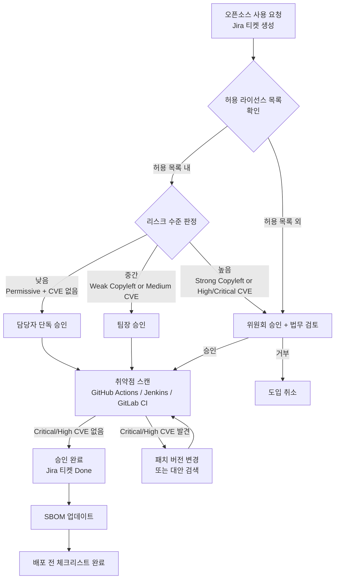
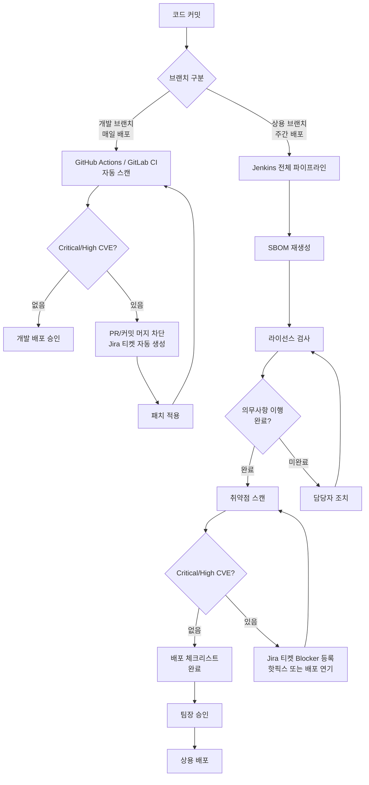
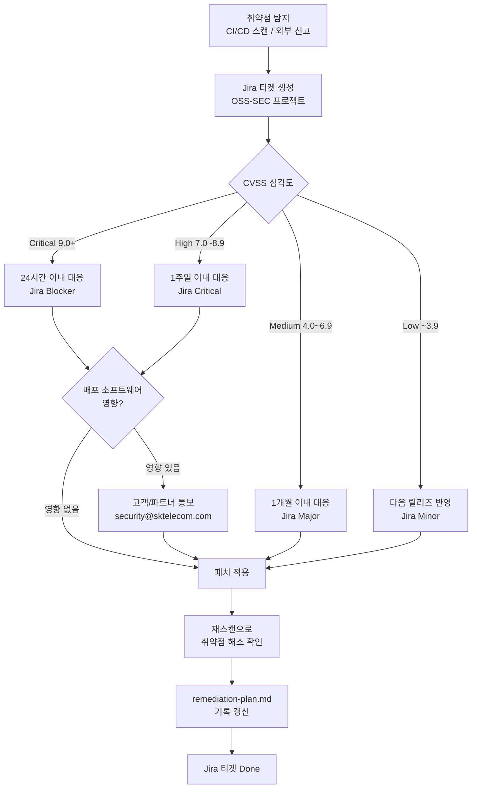
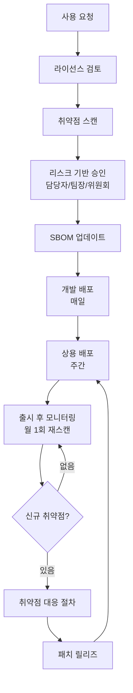

# Process Output Best Practice

`process-designer` This is a completed example of 4 to 7 outputs generated by the agent.
Use it to check missing items by comparing it with your `output/process/` file.

> **Go to reference:** [Open Source Process Chapter Guide](/docs/process)

---

## Open source use approval process

Document: usage-approval.md

- **Company Name**: Tech Unicorn
- **Written date**: 2026-03-23
- **Person in charge**: DevOps team open source representative

```
Related Standards
- 5230 §3.1.5.1·§3.3.1.1·§3.3.2.1
```

---

### 1. Procedure Overview

```
Related Standards
- 5230 §3.1.5.1
```

Follow this procedure when introducing a new open source component or changing an existing version.

#### Risk-based approval steps

| Risk level | Conditions                                                        | Approval Steps                    |
| ---------- | ----------------------------------------------------------------- | --------------------------------- |
| low        | Permissive License + Critical/High CVE None                       | Only approved by person in charge |
| middle     | Weak Copyleft or Medium CVE exists                                | Team leader approval              |
| High       | Strong/Network Copyleft, High/Critical CVE, non-whitelist license | Committee approval                |

```
오픈소스 도입 요청 (Jira 티켓 생성)
    ↓
라이선스 확인 (허용 목록 대조)
    ↓
리스크 수준 판정
    ↓
[낮음] → 담당자 승인
[중간] → 팀장 승인
[높음] → 위원회 승인 (법무팀 포함)
    ↓
취약점 스캔 (CVE 확인)
    ↓
[Critical/High CVE?] → 대안 검색 또는 패치 확인
    ↓
승인 완료 → SBOM 업데이트
    ↓
배포 전 distribution-checklist.md 완료
```

---

### 2. CI/CD Automation Integration

Tech Unicorn uses GitHub Actions, Jenkins, and GitLab CI. In each pipeline, the open source use approval process is integrated as follows.

#### GitHub Actions

```yaml
# .github/workflows/oss-scan.yml
name: OSS License & Vulnerability Scan
on:
  pull_request:
    branches: [main, develop]

jobs:
  oss-check:
    runs-on: ubuntu-latest
    steps:
      - uses: actions/checkout@v4
      - name: License Scan
        run: |
          # 라이선스 스캔 후 허용 목록 대조
          npx license-checker --summary --excludePrivatePackages
      - name: Vulnerability Scan
        run: |
          # CVE 스캔
          npm audit --audit-level=high
```

#### Jenkins (Jenkinsfile)

```groovy
stage('OSS Compliance') {
    steps {
        sh 'license-checker --summary'
        sh 'osv-scanner --lockfile package-lock.json'
    }
    post {
        failure {
            // Jira 티켓 자동 생성
            jiraNewIssue site: 'SKT-JIRA',
                         projectKey: 'OSS',
                         summary: 'OSS 컴플라이언스 검사 실패'
        }
    }
}
```

#### GitLab CI (.gitlab-ci.yml)

```yaml
oss-scan:
  stage: test
  script:
    - license-checker --summary
    - osv-scanner --lockfile package-lock.json
  only:
    - merge_requests
    - main
```

---

### 3. Usage Authorization Request Form (Jira Ticket)

Create a project **OSS** type ticket in Jira and record the items below.

| Item                             | Content                                     |
| -------------------------------- | ------------------------------------------- |
| Requester                        | (name/department)                           |
| Request date                     | YYYY-MM-DD                                  |
| Component name                   | (name)                                      |
| version                          | (version)                                   |
| License                          | (SPDX identifier, e.g. Apache-2.0)          |
| Purpose of use                   | (Direct use / Dependency / Development use) |
| Whether to include distribution  | (Includes distribution / Internal use only) |
| Risk level                       | (low/medium/high)                           |
| Whether to consider alternatives | (Reviewed / No need to review / Reason: )   |

---

### 4. Review license obligations

```
Related Standards
- 5230 §3.1.5.1
```

| License Type         | Distribution method | Obligations                                       | How to implement                             | Approval Steps       |
| -------------------- | ------------------- | ------------------------------------------------- | -------------------------------------------- | -------------------- |
| MIT/Apache-2.0/BSD   | All Distributions   | Copyright notice, license notice                  | Included in NOTICE file                      | Representative only  |
| LGPL                 | Embedded/Deployed   | Source code disclosure or dynamic link guaranteed | Maintain dynamic link / Disclose source code | Team leader approval |
| GPL-2.0 / GPL-3.0    | Embedded/Deployed   | Full source code disclosure                       | Source code disclosure (when distributed)    | Committee approval   |
| AGPL-3.0             | Includes SaaS       | Source code including network service released    | Source code released                         | Committee approval   |
| Other than whitelist | —                   | Prior legal review required                       |                                              | Committee approval   |

---

### 5. Pre-check for vulnerabilities

```
Related Standards
- 18974 §4.1.5.1·§4.3.2
```

When introducing a new component:

- [ ] Lookup CVE for the corresponding version in OSV API or NVD
- [ ] Critical/High CVE None confirmed
- [ ] When Critical/High CVE exists: Change to patch version or reconsider introduction
- [ ] Attach scan results to Jira ticket

---

### 6. SBOM Update Obligation

```
Related Standards
- 5230 §3.3.1.1
```

After approval you must:

- Run `output/sbom/sbom-commands.sh` to regenerate SBOM
- Store the updated `*.cdx.json` file in a designated location.

---

### 7. Approval records

| date       | component | version   | License   | CVE OK | Risk            | Approver | Jira Tickets |
| ---------- | --------- | --------- | --------- | ------ | --------------- | -------- | ------------ |
| YYYY-MM-DD | (name)    | (version) | (license) | ✅/⚠️  | Low/Medium/High | (name)   | OSS-(number) |

---

### 8. See list of permitted licenses

For a full list of permitted and restricted licenses, see `output/policy/license-allowlist.md`.

---

## Pre-deployment license compliance checklist

Document: distribution-checklist.md

- **Company Name**: Tech Unicorn
- **Person in charge**: DevOps team open source representative

```
Related Standards
- 5230 §3.4.1.1·§3.4.1.2
```

---

### Application criteria for each distribution channel

Tech Unicorn operates as a development branch (daily distribution) and a commercial branch (weekly distribution).

| Distribution Channel | cycle  | Checklist application level                  |
| -------------------- | ------ | -------------------------------------------- |
| development branch   | daily  | Check automated scan results (Items 1 and 4) |
| Commercial Branch    | Weekly | Deploy after completing the entire checklist |

---

### 1. Check SBOM latestness

```
Related Standards
- 5230 §3.3.1.2
```

- [ ] Is SBOM up to date as of this release?
- [ ] Did you run `output/sbom/sbom-commands.sh` to recreate SBOM?
- [ ] Are newly added dependencies reflected in SBOM?

**CI/CD Automation Check:**

- [ ] Has the SBOM generation step in the GitHub Actions / Jenkins / GitLab CI pipeline been passed?

---

### 2. Confirmation of compliance with license obligations

```
Related Standards
- 5230 §3.3.2.1·§3.1.5.1
```

- [ ] Have you verified all licenses for `output/sbom/license-report.md`?
- [ ] Does it contain a license that is not in `output/policy/license-allowlist.md`?
- [ ] When using a Copyleft license, have the following items been met:

| License | Obligations                                       | Fulfillment                                   |
| ------- | ------------------------------------------------- | --------------------------------------------- |
| GPL-2.0 | Source code released, notice included             | ☐ Not applicable / ☐ Implementation completed |
| GPL-3.0 | Source code released, notice included             | ☐ Not applicable / ☐ Implementation completed |
| LGPL    | Source code disclosure or dynamic link guaranteed | ☐ Not applicable / ☐ Implementation completed |
| AGPL    | Source code including network service released    | ☐ Not applicable / ☐ Implementation completed |
| MPL     | Modified file source code released                | ☐ Not applicable / ☐ Implementation completed |

---

### 3. Create and confirm notice

```
Related Standards
- 5230 §3.4.1.1
```

#### 3-1. Create a notice

- Example of creation tool: Use the tool that suits your environment among `syft`, `scancode-toolkit`, and `tern`.
- Include `NOTICE` or `OPEN_SOURCE_LICENSES.txt` files in the build output.
- Included items: component name, version, license SPDX ID, copyright notice, license text or license URL.
- When distributing binary (embedded/app): Provide at least one of the enclosed file, About screen, or QR code/URL.

#### 3-2. Check the notice

- [ ] Is the `NOTICE` or `OPEN_SOURCE_LICENSES.txt` file included in the distribution package?
- [ ] Does the notice contain the copyright notice and license text for all open source components?
- [ ] Has a license notification method been secured when distributing binaries?

---

### 4. Check vulnerability scan results

```
Related Standards
- 18974 §4.1.5.1
```

- [ ] Has a vulnerability scan been performed on the CI/CD pipeline (GitHub Actions / Jenkins / GitLab CI)?
- [ ] Is there no Critical/High CVE or has a resolution plan been established?
- [ ] Has a related ticket been created and processed in Jira?

---

### 5. Archiving compliance deliverables

```
Related Standards
- 5230 §3.4.1.2
```

- [ ] Have you kept a SBOM copy of this release? (Path: `output/sbom/{프로젝트}-{버전}.cdx.json`)
- [ ] Have you kept a copy of the notice?
- [ ] Are the storage location and storage period specified in the policy?

---

### 6. Check for cases of license non-compliance

```
Related Standards
- 5230 §3.2.2.5
```

- [ ] Are there any cases of license non-compliance in this release?
- [ ] If there are instances of non-compliance, have corrective actions been completed?

---

### 7. Final approval

**Commercial Branch Deployment (Weekly) — Full Payment Required**

| Category                   | name                            | Signature/Confirmation Date |
| -------------------------- | ------------------------------- | --------------------------- |
| Open source representative | DevOps Team Open Source Manager | YYYY-MM-DD                  |
| Legal review (if required) | (name)                          | YYYY-MM-DD                  |
| Distribution Approved by   | DevOps Team Leader              | YYYY-MM-DD                  |

---

### 8. Final confirmation after deployment

Immediately after deployment is completed, check the following and reflect it in the implementation record.

- [ ] Visually check whether the NOTICE file or means of access is actually included in the distributed artifact.
- [ ] Check whether the distributed version of SBOM was last stored in `output/sbom/`
- [ ] Check whether new CVE monitoring has started after deployment (see section 6 of vulnerability-response.md)
- [ ] Check whether the distribution record (version, date, approver, channel) is left in the implementation record.

---

### Fulfillment record

```
Related Standards
- 5230 §3.4.1.2
```

Once you complete this checklist, record it in the history below with the date.

| version   | Distribution date | branch                 | Complete Checklist | Contact person |
| --------- | ----------------- | ---------------------- | ------------------ | -------------- |
| (version) | YYYY-MM-DD        | Commercial/Development | ✅                 | (name)         |

---

## Vulnerability response procedures

Document: vulnerability-response.md

- **Company Name**: Tech Unicorn
- **Written date**: 2026-03-23
- **Person in charge**: DevOps team open source representative

```
Related Standards
- 5230 §3.2.2.5
- 18974 §4.1.5.1·§4.2.1.2
```

---

### 1. Vulnerability detection method

```
Related Standards
- 18974 §4.1.5.1
```

| Detection method                               | Tools/Channel                   | cycle                                    |
| ---------------------------------------------- | ------------------------------- | ---------------------------------------- |
| SBOM-based automatic scanning (GitHub Actions) | OSV API / Dependabot            | Upon commit/PR, development branch daily |
| Auto scan based on SBOM (Jenkins)              | OSV API / Dependency Track      | Regular weekly scans at build time       |
| SBOM based automatic scanning (GitLab CI)      | OSV API / GitLab Security       | When making a merge request              |
| Supplier Security Advisory                     | NVD, GitHub Security Advisories | Real-time subscription                   |
| External reporting                             | security@sktelecom.com          | Always                                   |

---

### 2. Risk/impact score allocation criteria

```
Related Standards
- 18974 §4.1.5.1·§4.3.2
```

CVSS Severity classification as of v3.1:

| Severity    | CVSS Score | Response Deadline | What to do                                                     | Jira priorities |
| ----------- | ---------- | ----------------- | -------------------------------------------------------------- | --------------- |
| 🔴 Critical | 9.0 ~ 10.0 | Within 1 week     | Immediately review patches and discontinuation of distribution | Blocker         |
| 🟠 High     | 7.0 ~ 8.9  | Within 4 weeks    | Patch or Mitigation                                            | Critical        |
| 🟡 Medium   | 4.0 ~ 6.9  | Within 1 month    | Included in next regular release                               | Major           |
| 🟢Low       | 0.1 ~ 3.9  | Next release      | Reflected during regular updates                               | Minor           |

> **Note**: The above deadlines are the OpenChain KWG guide baseline. Depending on the risk profile of the service you are operating, stricter deadlines such as 24 hours for Critical or 1 week for High can be applied as an internal SLA.

---

### 3. Follow-up procedures

```
Related Standards
- 18974 §4.1.5.1
```

1. **Detection**: Vulnerability recognition through CI/CD automatic scanning (GitHub Actions/Jenkins/GitLab CI) or external reporting
2. **Record**: Record CVE ID, component, CVSS score in `output/vulnerability/cve-report.md`
3. **Create Jira ticket**: Project **OSS-SEC** type, priority automatically set based on severity
4. **Assessment**: Assign risk/impact scores and decide what to do
5. **Action**: Apply patches, upgrade versions, or take mitigation actions.
6. **Verification**: Verify that the vulnerability is resolved by re-scanning after completing the action.
7. **Record Update**: Record action completed on `output/vulnerability/remediation-plan.md`
8. **Jira ticket closure**: Done after confirming action completion

---

### 4. Response standards for each distribution cycle

| Deployment Branch  | cycle  | When Critical/High vulnerability is discovered                         |
| ------------------ | ------ | ---------------------------------------------------------------------- |
| development branch | daily  | Patch immediately after blocking the corresponding PR/commit merge     |
| Commercial Branch  | Weekly | Deploy after confirming patch completion, deploy hotfixes if necessary |

---

### 5. Customer notification standards

```
Related Standards
- 18974 §4.1.5.1
```

Notify customers or supply chain partners in the following cases:

- When a Critical/High vulnerability affects already deployed software
- Notification method: Email (security@sktelecom.com) / Security Bulletin / Release Notes
- Notification deadline: Critical — within 24 hours after recognition, High — within 3 business days after recognition

---

### 6. Monitor new vulnerabilities after release

```
Related Standards
- 18974 §4.1.5.1
```

- **Monitoring cycle**: Re-scan all SBOM once a month (using Jenkins regular builds)
- **Subscription Channels**: NVD RSS, GitHub Security Advisories, OSV.dev
- **Person in charge**: DevOps team open source representative
- **Response trigger**: Immediately when a new CVE affects a component of the distributed software [3. [Follow-up procedure] Initiation

---

### 7. Response to external vulnerability reports

```
Related Standards
- 18974 §4.2.1.2
```

When receiving a vulnerability report from outside:

1. **Attn**: security@sktelecom.com
2. **Confirmation response**: Receipt confirmation reply within 2 business days
3. **Handling**: 3. Same as follow-up procedure.
4. **Result Notification**: Results are shared with the reporter after action is completed.

---

### 8. Pre-launch security testing

```
Related Standards
- 18974 §4.1.5.1
```

Before weekly deployment of the commercial branch, perform the following items:

- [ ] SBOM regeneration
- [ ] Vulnerability scanning using OSV API or Dependency Track (Jenkins pipeline)
- [ ] Confirm that there are no Critical/High vulnerabilities or establish a plan to resolve them
- [ ] `output/process/distribution-checklist.md` Completed

---

## Open source process flow chart

Document: process-diagram.md

- **Company Name**: Tech Unicorn
- **Written date**: 2026-03-23

```
Related Standards
- 5230 §3.1.5.1·§3.3.1.1·§3.4.1.1
```

---

### 1. Open source use approval process



---

### 2. Deployment pipeline process



---

### 3. Vulnerability response process



---

### 4. Full open source management cycle



---

### Reference Document

| process                        | Detailed procedure documentation           |
| ------------------------------ | ------------------------------------------ |
| Approved for use               | `output/process/usage-approval.md`         |
| Deployment Checklist           | `output/process/distribution-checklist.md` |
| Vulnerability response         | `output/process/vulnerability-response.md` |
| Response to external inquiries | `output/process/inquiry-response.md`       |
| License Policy                 | `output/policy/oss-policy.md`              |
| Permissive License             | `output/policy/license-allowlist.md`       |

---

## External inquiry response procedure

Document: inquiry-response.md

- **Company Name**: Tech Unicorn
- **Written date**: 2026-03-23
- **Person in charge**: DevOps team open source representative

```
Related Standards
- 5230 §3.2.1.2
```

---

### 1. Inquiry reception channel

```
Related Standards
- 5230 §3.2.1.1
```

| Channel Type                  | Address/URL                                    | Contact person                  |
| ----------------------------- | ---------------------------------------------- | ------------------------------- |
| License Inquiry               | opensource@example.com                         | Open source representative      |
| Report security vulnerability | security@example.com                           | Security Officer                |
| Public issue tracker          | GitHub Issues (public repo)                    | Development team representative |
| mail                          | Sejong-daero, Jung-gu, Seoul (company address) | —                               |

---

### 2. Classification of inquiry types

| Type Code | Description                                | SLA (Response Deadline)                                        |
| --------- | ------------------------------------------ | -------------------------------------------------------------- |
| INQ-L     | Request to fulfill license obligations     | Within 5 business days                                         |
| INQ-S     | Report security vulnerability              | Confirmation within 2 business days, processing within 90 days |
| INQ-C     | Compliance General Inquiries               | Within 7 business days                                         |
| INQ-G     | Source code disclosure request (GPL, etc.) | Within 14 business days                                        |

---

### 3. Response procedures

```
Related Standards
- 5230 §3.2.1.2
```

1. **Confirmation of receipt**: Automatic response or manual confirmation reply within 1 business day after receiving the inquiry.
2. **Classification**: Determine inquiry type (INQ-L/S/C/G)
3. **Assignment of person in charge**: Assignment of open source person in charge or security person depending on the type.
4. **Content Review**: The person in charge understands the content of the inquiry and escalates internally if necessary.
5. **Legal consultation**: For INQ-L·INQ-G types, consult with legal representative
6. **Write a response**: Prepare a formal response based on the review results
7. **Send**: Response sent within SLA
8. **Record Storage**: Inquiry history is kept in the internal system for 3 years

---

### 4. Escalation criteria

| Conditions                          | Escalation target                                                                |
| ----------------------------------- | -------------------------------------------------------------------------------- |
| Lawsuit or threat of legal action   | Immediately report to legal representative                                       |
| Report Critical Vulnerability       | Immediately report to security team + initiate vulnerability-response.md process |
| Expected response deadline exceeded | After reporting to the team leader, we discussed extending the deadline          |

---

### 5. Keep inquiry history

Retained for at least 3 years from the date of inquiry closure (in case of legal disputes).

| Storage Items                           | Storage location              | Storage period                |
| --------------------------------------- | ----------------------------- | ----------------------------- |
| Original incoming email                 | Email Server Archives         | 3 years from termination date |
| Response records (processes, results)   | Internal Documentation System | 3 years from termination date |
| General Counsel Opinion (if applicable) | Legal Archives                | 3 years from termination date |

---

## Open source contribution process

> **Conditional Creation**: Generated when `process-designer` agent Q5 answers “Yes”.

Document: contribution-process.md

- **Company Name**: Tech Unicorn
- **Written date**: 2026-03-23
- **Person in charge**: DevOps team open source representative

```
Related Standards
- 5230 §3.5.1.2
```

---

### 1. Review items before contributing

```
Related Standards
- 5230 §3.5.1.2
```

- [ ] Check the license of the project you are contributing to (including whether CLA is required)
- [ ] Confirm that the contribution does not contain the company's proprietary code or trade secrets
- [ ] Verification that the contribution does not infringe on existing patents
- [ ] Obtain prior approval from the approval authority.

---

### 2. Approval criteria by type

| Contribution Type                      | Approver                                                                         |
| -------------------------------------- | -------------------------------------------------------------------------------- |
| Correct typos, improve documents       | Only approved by person in charge                                                |
| Bug fix (regardless of business logic) | Team leader approval                                                             |
| Contributing new features              | Committee approval (including legal review)                                      |
| Company-led project disclosure         | 07-conformance linkage — application of project-publication-process.md procedure |

---

### 3. Contributor License Agreement (CLA) processing

- If a project requires a CLA signature, the open source person in charge will review the contents and decide whether to sign in consultation with the legal department.
- A copy of the signed CLA is kept in the `output/process/` folder for 3 years.

---

### 4. Keep contribution history

| Storage Items                                                              | Storage period                                 |
| -------------------------------------------------------------------------- | ---------------------------------------------- |
| Contribution approval history (date, project, contribution type, approver) | At least 3 years from the date of contribution |
| Copy of CLA signature                                                      | At least 3 years from the date of contribution |

---

## Internal project disclosure procedures

> **Conditional Creation**: Generated when `process-designer` agent Q6 answers “Yes”.

Document: project-publication-process.md

- **Company Name**: Tech Unicorn
- **Written date**: 2026-03-23
- **Person in charge**: DevOps team open source representative

```
Related Standards
- 5230 §3.5.1
```

---

### 1. Pre-publication review checklist

- [ ] IP scan: Verifies that the codebase does not contain third-party proprietary code or trade secrets
- [ ] License selection: Decide on an open source license that suits the project purpose
- [ ] Security review: Removal of secret keys, credentials, and internal URLs before disclosure
- [ ] Legal approval: Check with legal affairs whether disclosure is possible

---

### 2. License selection criteria

| Purpose                           | Recommended License    |
| --------------------------------- | ---------------------- |
| Drive maximum utilization         | MIT or Apache-2.0      |
| Induce contribution and return    | GPL-2.0 or GPL-3.0     |
| Library (commercially compatible) | LGPL-2.1 or Apache-2.0 |

---

### 3. 3-step approval process

1. **Personal Review**: Confirm completion of checklist
2. **Legal Approval**: Approval of IP scan results and license selection
3. **Management Reporting**: Reporting of public purpose and maintenance plan.

---

### 4. Maintenance after release

- Regular review of external contributor PR/issues (at least once a month)
- Maintain the SECURITY.md file (information on how to report vulnerabilities)
- Storage: Records of disclosure decisions and approvals are kept for at least 3 years from the date of disclosure.
