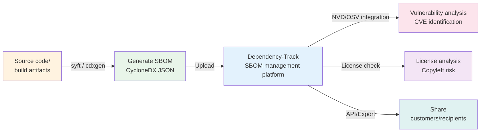

# SBOM Basics: An Introduction to the Software Bill of Materials

## 1. What this chapter covers

In this chapter you will learn what an SBOM is, its minimum required elements, the main formats, and the SBOM ecosystem.

There is no hands-on work. Just read and understand.

This background will serve as the basis for creating a real SBOM in the `05-tools/sbom-generation` chapter. The goal is to understand "Why are we using this tool?" and "What is this file?" before you run a command.

---

## 2. What is an SBOM?

### Definition

An SBOM (Software Bill of Materials) is **a list of every component** included in a piece of software. It enumerates all the ingredients that make up the software, including open source libraries, frameworks, runtimes, and build tools.

### The food ingredient list analogy

A food package lists "flour, sugar, eggs, butter..." An SBOM is the ingredient list for software.

> "This software includes React 18.2.0, axios 1.4.0, and log4j 2.14.0."

Consumers — recipients, customers, and regulators — read this list to check safety and licensing.

### What you cannot answer without an SBOM

Without an SBOM, the following questions are hard to answer.

| Situation                                    | Problem                                                                         |
| -------------------------------------------- | ------------------------------------------------------------------------------- |
| License audit                                | You risk a license violation because you do not know what open source is in use |
| Disclosure of a vulnerability like Log4Shell | You cannot immediately tell whether your products are affected                  |
| SBOM request from a customer                 | A delivery contract stalls because you cannot provide one                       |
| Supply chain audit                           | You have no record of the components in use                                     |

---

## 3. SBOM minimum required elements (per NTIA)

The U.S. National Telecommunications and Information Administration (NTIA) has defined seven minimum elements that an SBOM must include.

| Element                 | English name             | Description                                           | Example                                                |
| ----------------------- | ------------------------ | ----------------------------------------------------- | ------------------------------------------------------ |
| Supplier name           | Supplier Name            | Organization or individual that created the component | Apache Software Foundation                             |
| Component name          | Component Name           | Package or library name                               | log4j-core                                             |
| Version                 | Version                  | Exact version string                                  | 2.14.1                                                 |
| Unique identifier       | Other Unique Identifiers | CPE, PURL, hash, etc.                                 | `pkg:maven/org.apache.logging.log4j/log4j-core@2.14.1` |
| Dependency relationship | Dependency Relationship  | Relationships with other components                   | spring-boot depends on log4j-core                      |
| SBOM author             | Author of SBOM Data      | The tool or person that created the SBOM              | syft v1.x                                              |
| Timestamp               | Timestamp                | Date and time the SBOM was created                    | 2024-01-15T09:30:00Z                                   |

> This step satisfies the conceptual understanding required by ISO/IEC 18974 [G3B.1 Background].

**What is a unique identifier (PURL)?**

A Package URL (PURL) is a standard format that uniquely identifies a package worldwide.

```
pkg:{type}/{namespace}/{name}@{version}
```

Examples:

- `pkg:npm/lodash@4.17.21` — npm package
- `pkg:pypi/requests@2.28.0` — Python package
- `pkg:maven/org.springframework/spring-core@6.0.0` — Java Maven package

With a PURL, you can automatically match components against vulnerability databases (NVD, OSV) to find CVEs.

---

## 4. SBOM format comparison

Two standard formats are mainly used in the industry today.

| Item           | SPDX                                            | CycloneDX                                              |
| -------------- | ----------------------------------------------- | ------------------------------------------------------ |
| Maintained by  | Linux Foundation                                | OWASP                                                  |
| Latest version | 3.0                                             | 1.6                                                    |
| Strengths      | License compliance focus, ISO/IEC 5962 standard | Security-specific fields, supports JSON/XML/Protobuf   |
| Tooling        | fossology, reuse, spdx-tools                    | syft, cdxgen, Dependency-Track                         |
| Main uses      | License audit, open source contribution         | Security vulnerability analysis, supply chain security |

### Why this kit uses CycloneDX

1. **Rich tool support**: both syft and cdxgen produce CycloneDX as their default output.
2. **Security-specific fields**: vulnerability information (VEX) can be embedded directly in the SBOM.
3. **JSON format**: easy for humans to read and easy to wire into CI/CD pipelines and APIs.
4. **Dependency-Track integration**: works seamlessly with the SBOM management platform.

---

## 5. The SBOM ecosystem

An SBOM does not stand alone. It flows through a cycle of creation → management → analysis → sharing.



### The generation tools

**syft**

- Maintained by: Anchore
- Purpose: generate an SBOM from Docker images, containers, and filesystems
- Strengths: simple to install and automatically detects a wide range of language runtimes
- Command: `syft <image> -o cyclonedx-json`

**cdxgen**

- Maintained by: OWASP
- Purpose: analyze package manifests in source code directories
- Strengths: automatically recognizes language-specific files such as `package.json`, `pom.xml`, and `requirements.txt`
- Command: `cdxgen -o bom.json`

You will practice with both tools in the `05-tools/sbom-generation` chapter.

### AI SBOM: extending the SBOM to models and datasets

For organizations building AI systems, a conventional SBOM is not enough. Beyond code
dependencies, pre-trained models (such as Llama) and training datasets are also supply chain
components with license obligations. The extension that captures them is the **AI SBOM**.

Two formats are the de facto industry standards: **SPDX 3.0 AI Profile** offers precise
license and copyright expression, while **CycloneDX 1.6 ML-BOM** carries rich model-card
metadata (performance, ethics, security). Organizations can adopt either or both.

To build one yourself, this kit's [5.4 AI SBOM hands-on](../05-tools/ai-sbom/index.md) walks through generating an ML-BOM for a HuggingFace model with [BomLens](https://github.com/sktelecom/bomlens).

The hands-on work in this kit (chapter 05) targets conventional SBOMs. To cover AI systems,
refer to the [KWG AI SBOM Compliance Guide](https://openchain-project.github.io/OpenChain-KWG/guide/ai-sbom_guide/),
which provides a clause checklist, a phased roadmap, and tool walkthroughs (OWASP AIBOM
Generator, cdxgen). Legal considerations for AI coding tools are covered in
[AI Coding Governance](/ai-coding/intro).

---

## 6. Frequently asked questions

**Q: If I publish an SBOM, won't it expose my company's proprietary technology?**

A: An SBOM lists the open source you use, not your proprietary code. All it reveals is "which open source libraries do you use?" Most of your competitors already use the same libraries, so it gives away no competitive advantage.

---

**Q: Does software with no open source still need an SBOM?**

A: In practice, purely proprietary software is extremely rare. Build tools, runtimes, and even standard libraries are often open source. Once you generate an SBOM, you will usually find more open source components than you expected.

---

**Q: How often should an SBOM be updated?**

A: We recommend updating it at least once per release. Integrate it into your CI/CD pipeline to keep it current automatically. ISO/IEC 18974 requires the SBOM to be kept up to date.

---

**Q: What should I do if a customer requests an SBOM?**

A: By following this kit, you can generate an SBOM in CycloneDX JSON format. If the customer requires a different format, you can use a conversion tool or coordinate with the Program Manager to adjust.

---

## 7. Completion checklist

- [ ] I can explain what an SBOM is and why it is needed
- [ ] I know the 7 NTIA minimum elements
- [ ] I understand the difference between SPDX and CycloneDX
- [ ] I understand the SBOM ecosystem (creation → management → analysis → sharing)

---

## 8. Next steps

Having read this document, you now have a solid grasp of SBOM concepts and the surrounding ecosystem.

- To finish the background reading, continue to [Standard requirements at a glance](./checklist-mapping.md).
- To start the hands-on work, install syft, cdxgen, and Dependency-Track in [Environment preparation](../01-setup/index.md).
