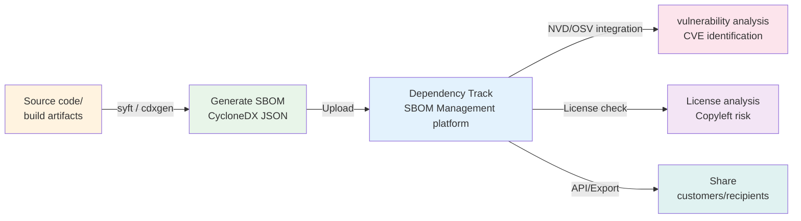

# SBOM Basics: Introduction to Software Composition Specifications

## 1. What we do in this chapter

In this chapter, you will understand the concepts of SBOM, its minimum required elements, representative formats, and the SBOM ecosystem.

There is no hands-on training. Just focus on reading and understanding.

This background knowledge will serve as a basis for creating the actual SBOM in later chapters.
The goal is to understand “Why are we using this tool?” and “What is this file?” before executing a command.

---

## 2. What is SBOM

### definition

SBOM (Software Bill of Materials) is **a list of all components** included in the Software.
It lists all the ingredients that make up the software, including open source libraries, frameworks, runtimes, and build tools.

### food ingredient list analogy

Food packaging says "flour, sugar, eggs, butter..."
SBOM is the ingredient list of the software.

> "This software includes React 18.2.0, axios 1.4.0, and log4j 2.14.0."

Consumers (suppliers, customers, regulators) look at this list to verify safety and licensing.

### What you don't know without SBOM

It is difficult to answer the following question without SBOM.

| Situation                                         | problem                                                                     |
| ------------------------------------------------- | --------------------------------------------------------------------------- |
| License Audit                                     | Risk of license violation due to not knowing what open source is being used |
| Announcement of vulnerabilities such as Log4Shell | Not immediately sure if our products are affected                           |
| SBOM request from supplier                        | Delivery contract is disrupted due to inability to provide                  |
| Supply Chain Audit                                | No evidence of components used                                              |

---

## 3. SBOM minimum required elements (based on NTIA)

The U.S. National Telecommunications and Information Administration (NTIA) has defined seven minimum elements that SBOM must include.

| element                 | English name             | Description                                          | Example                                                   |
| ----------------------- | ------------------------ | ---------------------------------------------------- | --------------------------------------------------------- |
| Supplier name           | Supplier Name            | Organization or individual who created the component | Apache Software Foundation                                |
| Component name          | Component Name           | package or library name                              | log4j-core                                                |
| version                 | Version                  | exact version string                                 | 2.14.1                                                    |
| unique identifier       | Other Unique Identifiers | CPE, PURL, Hash, etc.                                | `pkg:maven/org.apache.logging.log4j/log4j-core@__ISO13__` |
| dependency relationship | Dependency Relationship  | Relationships with other components                  | spring-boot depends on log4j-core                         |
| SBOM Author             | Author of SBOM Data      | The tool or person that created SBOM                 | syft v0.86.0                                              |
| creation time           | Timestamp                | Date and time SBOM was created                       | 2024-01-15T09:30:00Z                                      |

> This step satisfies the understanding base of the requirements of ISO/IEC 18974 [G3B.1 Background].

**What is a unique identifier (PURL)?**

The Package URL (PURL) is a standard format that uniquely identifies a package globally.

```
pkg:{type}/{namespace}/{name}@{version}
```

example:

- `pkg:npm/lodash@__ISO13__` — npm package
- `pkg:pypi/requests@__ISO13__` — Python package
- `pkg:maven/org.springframework/spring-core@__ISO13__` — Java Maven package

With PURL, you can automatically map with vulnerability databases (NVD, OSV) to find CVEs.

---

## 4. SBOM format comparison

There are currently two standard formats mainly used in the industry:

| Item              | SPDX                                              | CycloneDX                                                     |
| ----------------- | ------------------------------------------------- | ------------------------------------------------------------- |
| Management entity | Linux Foundation                                  | OWASP                                                         |
| Latest version    | 2.3                                               | 1.5                                                           |
| Features          | License compliance focused, ISO/IEC 5962 standard | Includes security-specific fields, supports JSON/XML/Protobuf |
| Support Tools     | fossology, reuse, spdx-tools                      | syft, cdxgen, Dependency-Track                                |
| Main uses         | License Audit, Open Source Contribution           | Security vulnerability analysis, supply chain security        |

### Why choose CycloneDX in this kit?

1. **Rich tool support**: syft and cdxgen both support CycloneDX as default output.
2. **Security Specialized Field**: vulnerability information (VEX) can be included directly in SBOM
3. **JSON format**: Easy for humans to read and easy to connect with CI/CD pipeline and API
4. **Dependency-Track integration**: Perfectly integrated with SBOM management platform

---

## 5. SBOM Ecosystem

SBOM does not exist on its own. It leads to the flow of creation → management → analysis → sharing.



### Introduction to creation tools

**syft**

- Provided by: Anchore
- Purpose: Create SBOM from Docker images, containers, and filesystems.
- Features: Simple installation and automatic detection of various language runtimes
- Command: `시작`

**cdxgen**

- Credit: OWASP
- Purpose: Analyzing package manifests in source code directories.
- Features: Automatically recognizes language-specific files such as `package.json`, `pom.xml`, and `requirements.txt`
- Command: `cdxgen -o bom.json`

Both tools are practiced in chapter `05-tools/sbom-generation`.

---

## 6. Frequently Asked Questions

**Q: If I create SBOM, won't my company's technology be exposed?**

A: SBOM is a list of used open source code, not proprietary code. What is exposed is "which open source libraries do you use?" Most of your competitors already use the same libraries, so it's irrelevant for competitive advantage.

---

**Q: Do software without open source also require SBOM?**

A: In reality, pure proprietary software is extremely rare. Build tools, runtimes, and even standard libraries are often open source. If you create SBOM, you will find more open source components than expected.

---

**Q: How often should SBOM be updated?**

A: We recommend updating at least every release. Integrate it into your CI/CD pipeline to automatically keep it up to date. ISO/IEC 18974 requires SBOM to be kept up to date.

---

**Q: What should I do if the supplier requests SBOM?**

A: By following this kit, you can generate SBOM in CycloneDX JSON format. If your supplier requires a different format, you can use a conversion tool or consult with your representative to make adjustments.

---

## 7. Completion Confirmation Checklist

- [ ] Can explain the definition and necessity of SBOM
- [ ] NTIA Know the 7 minimum elements
- [ ] I understand the difference between SPDX and CycloneDX
- [ ] SBOM Understood the ecosystem (creation → management → analysis → sharing)

---

## 8. Next steps

If you have read this document, you have a good understanding of the concepts and ecosystem of SBOM.

Next, go to `docs/01-setup/` to prepare your lab environment.
Once you complete the installation of syft, cdxgen, and Dependency-Track, you can begin full-scale practice.

```bash
# next step
cd docs/01-setup
```
