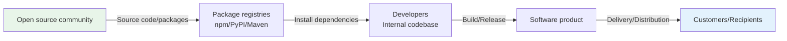

# Software Supply Chain Security: Why It Matters Now

## 1. What this chapter covers

This is a background chapter — read it, no hands-on work required. Through real-world incidents, you will see what software supply chain security looks like in practice, why an SBOM (Software Bill of Materials) has become an essential tool, and how international regulations now require it.

After reading this chapter, you will have a clear answer to the question "Why do I need this kit?" Everything you do in later chapters — writing policy, designing processes, creating an SBOM, analyzing vulnerabilities — makes more sense in the context laid out here.

---

## 2. What is the software supply chain?

### How open source enters a product

Software is never built in isolation. Developers pull open source libraries from package registries such as npm, PyPI, and Maven, and each of those libraries depends on still other libraries. This entire chain is the **software supply chain**.

Modern software is **70-80% open source components**. In other words, far more code comes from outside than your team writes itself. This speeds up development, but it is also a conduit through which external threats can flow inward.

Supply chain security is the discipline of identifying and managing the risks that can arise anywhere along this path — vulnerabilities, malware, and license violations.

---

## 3. Three real-world supply chain attacks

The following three cases show that supply chain security is anything but an abstract concept.

#### SolarWinds (2020)

**What happened**
Attackers inserted malware (Sunburst) into SolarWinds' internal build pipeline. Because it was bundled into a legitimate software update (the Orion Platform) and distributed that way, existing security tools had an extremely hard time detecting it.

**Scope of impact**
More than 18,000 organizations worldwide — including federal agencies such as the U.S. Treasury and the Department of State — installed the malicious update. Attackers had undetected access to internal networks for months.

**Lesson**
The build pipeline that produces the software can itself be a target. You need a system that verifies where every component in the product comes from and that the build process is safe.

---

#### Log4Shell (2021, CVE-2021-44228)

**What happened**
An injection vulnerability was found in Apache Log4j 2, a logging library used almost universally across Java applications. It abused JNDI (Java Naming and Directory Interface), letting an attacker achieve remote code execution (RCE) with a single specially crafted string.

**Scope of impact**
Hundreds of millions of systems worldwide were affected, covering the services of virtually every major technology company — Apple, Amazon, Tesla, Twitter, and more. About 800,000 exploit attempts were detected within 72 hours of disclosure, and millions over the following weeks.

**Lesson**
You cannot even patch what you cannot find. With an SBOM, every system using Log4j could have been identified and remediated immediately.

---

#### XZ Utils (2024, CVE-2024-3094)

**What happened**
Over two years, an attacker using the pseudonym "Jia Tan" contributed to the XZ Utils open source project, posing as a trustworthy maintainer. After building credibility through steady contributions, they committed malicious code that planted a backdoor in sshd (the SSH daemon). A widespread compromise was averted only because a developer noticed anomalies just before the release shipped.

**Scope of impact**
Development and beta channels of major distributions — Fedora beta, Debian testing, openSUSE Tumbleweed — had pulled in the vulnerable versions, and the discovery came just before stable releases. Had discovery been delayed by even a few days, backdoors would have landed on millions of servers.

**Lesson**
The identity and long-term behavior of open source contributors deserve scrutiny. The health of the open source projects you depend on — their governance and maintainer activity — is also part of supply chain security.

---

## 4. International regulatory trends

Supply chain security is moving beyond voluntary best practice and becoming a legal requirement.

#### U.S. Executive Order EO 14028 (2021)

**Background**
In response to a series of large-scale supply chain attacks such as SolarWinds and Microsoft Exchange, the Biden administration signed this cybersecurity executive order in May 2021.

**Key content and what changed since**

- It directed agencies to establish SBOM guidance for software delivered to the federal government,
  and the **SBOM minimum elements** defined by the NTIA (National Telecommunications and Information
  Administration) date from this effort.
- The administration's course has since changed: EO 14306 (2025-06) removed the SBOM artifact
  requirements, and OMB M-26-05 (2026-02) rescinded the blanket attestation mandates, moving to a
  **risk-based, per-agency approach**.

**Impact on Korean companies**
The blanket SBOM mandate for U.S. federal procurement has been relaxed, but the NTIA minimum
elements remain the de facto SBOM standard, and the practical SBOM demands now come from the EU CRA
and customer procurement contracts. Companies active in the U.S. market should prepare for
contract-level requirements.

---

#### EU Cyber Resilience Act — CRA (2024)

**Background**
An EU-wide regulation adopted in 2024 to strengthen the cybersecurity of digital products placed on the EU Digital Single Market.

**Key requirements**

- Apply security requirements to digital products placed on the EU market (software included)
- Mandatory management of the open source component list and remediation of vulnerabilities
- **Reporting duties for actively exploited vulnerabilities and severe incidents apply first, from
  2026-09-11**; the essential requirements apply in full from 2027-12-11.

**Penalties**
For non-compliance, up to **EUR 15 million** or **2.5% of annual global turnover**, whichever is greater.

**Impact on Korean companies**
This applies to **any business** that sells software products or services in the EU. All products with digital elements — cloud services, mobile apps, IoT devices — are in scope.

---

#### Trends in Korea

Discussions on mandating supply chain security are advancing quickly in Korea as well.

- **MSIT/KISA Software Supply Chain Security Guidelines (2023)**: Korea's first official guideline recommending the adoption of SBOM.
- **Review of SBOM for public-sector software projects**: Authorities are considering requiring an SBOM for software procured by public institutions.
- **Discussion of a domestic SBOM mandate**: Similar domestic regulation is likely to follow once the EU CRA takes effect.

---

## 5. How both standards contribute to supply chain security

ISO/IEC 5230 and ISO/IEC 18974 each address one of the two key risks in supply chain security.

- **ISO/IEC 5230**: removes the risk of license violations by ensuring transparency in open source use.
- **ISO/IEC 18974**: removes security risk by identifying and responding to known vulnerabilities.

Conforming to both standards together covers both the **licensing** and the **security** side of supply chain security.

| Risk type              | Responsible Standard | Main tools          |
| ---------------------- | -------------------- | ------------------- |
| License violation      | ISO/IEC 5230         | SBOM + License Scan |
| Security vulnerability | ISO/IEC 18974        | SBOM + CVE scan     |

The core tool shared by both standards is the **SBOM**. You need an SBOM to scan licenses, and you need it to look up CVEs. As the Log4Shell case showed, without an SBOM you cannot even tell where a component is being used.

---

## 6. Assessing your organization's supply chain risk

Now that you know the incidents and the regulations, the next question is "So how much risk does my organization carry?" Below is a simple assessment framework you can start with, no tools required.

### The four assessment axes

Gauge each open source component (or the product as a whole) along the four axes below. The higher the rating, the greater the risk.

| Assessment axis      | Key question                                                                                   | High-risk case                                                   |
| -------------------- | ---------------------------------------------------------------------------------------------- | ---------------------------------------------------------------- |
| **Dependency depth** | Did you pull it in directly, or was it pulled in by another library (a transitive dependency)? | When a large share of dependencies are invisible transitive ones |
| **Exposure surface** | Does it process external input directly (parsers, networking, deserialization)?                | When it processes external input                                 |
| **Project health**   | Are the maintainers active? Are there recent releases and contributors?                        | When the project is unmaintained (the XZ Utils lesson)           |
| **Blast radius**     | If it is compromised, how far does the damage reach (authentication, payments, customer data)? | When it can reach critical assets                                |

### Dependency depth — the most commonly missed risk

Libraries you pull in directly (direct dependencies) are visible, but the **transitive dependencies** they pull in — dependencies of dependencies — are not. For both Log4Shell and XZ Utils, the reaction in many organizations was "but I never used that directly." An SBOM lays out all of these transitive dependencies, which makes it the starting point for risk assessment.

### A three-step assessment procedure

1. **Get the inventory** — use an SBOM to build a component list that includes transitive dependencies ([Create SBOM](../05-tools/sbom-generation/index.md)).
2. **Identify high risk** — rate each component high/medium/low along the four axes above and single out the high-risk ones.
3. **Apply first where it matters** — apply policy (approved licenses and approvals), vulnerability response, and continuous monitoring to the high-risk components first.

:::info Regular reviews
This assessment is not a one-time exercise. Dependencies and threats keep changing, so revisit it regularly.
:::

---

## 7. Self-study

:::info Self-study mode (about 1 hour)
You can simply read this chapter. Focus on understanding the concepts.
:::

1. Read this page — get the full context of supply chain security
2. Summarize, in your own words, the three key lessons from the incidents
3. Identify which international regulations apply to your company
4. Read `sbom-101.md` for a detailed understanding of SBOM technical concepts

---

## 8. Completion checklist

- [ ] I can explain the three supply chain security incidents (SolarWinds, Log4Shell, XZ Utils)
- [ ] I understand why an SBOM is needed
- [ ] I have identified how EO 14028 and the EU CRA affect my company
- [ ] I understand the role each standard plays in supply chain security
- [ ] I can gauge my organization's high-risk components using the four assessment axes

---

## 9. Next steps

- **Learn the SBOM technical concepts**: go to `sbom-101.md` to learn the CycloneDX and SPDX formats and the SBOM minimum elements.
- **Go straight to environment preparation**: go to `docs/01-setup/` and start installing the toolchain.

Once you understand the concepts well enough, you can begin the hands-on work in `docs/01-setup/`. You can return to this chapter for reference at any time.
