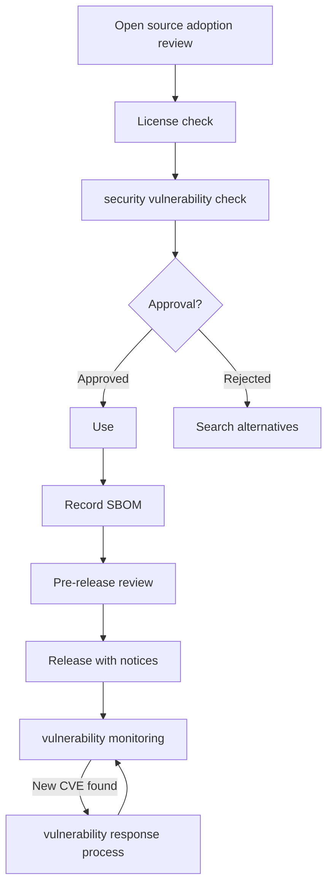
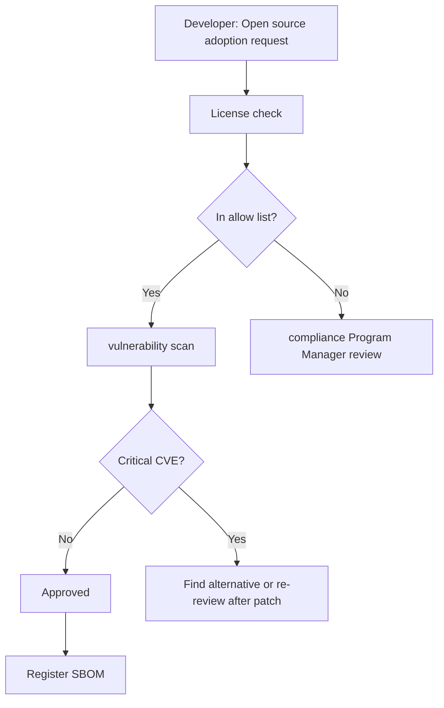

# Open source process: From use to distribution

## 1. What we do in this chapter

This chapter documents the approval of open source use, the pre-release checklist, and the vulnerability response procedures.
If a policy defines "what should be done," a process defines "how it is done."
Even if the policy document states that "using AGPL requires open source review," the policy ends up as nothing more than a declaration unless you decide who in practice reviews it, when, and in what form.

Work with the `agents/04-process-designer` agent to generate 4–7 deliverables tailored to your company's environment.
You also discuss integration with the CI/CD pipeline, aiming for a sustainable compliance system that is naturally embedded in the development flow.

---

## 2. Background knowledge

### Why you need processes

A policy says only "what," not "how." For developers to actually take action, they need specific procedures: who to ask and in what form. Process documentation fills this gap and makes the policy work in practice.

> Detailed explanations of each step in the open source process, along with real corporate examples, are available in the [KWG Open Source Guide — Process](https://openchain-project.github.io/OpenChain-KWG/guide/opensource_for_enterprise/3-process/). This chapter's structure and requirement descriptions are reworked from that KWG guide (CC BY 4.0).

### The overall open source lifecycle flow

Once you understand the full flow of open source entering and leaving the codebase, it becomes clear where and what kind of process is needed.



Approval on adoption, a checklist for distribution, and operational CVE response — these three points are addressed by the core processes below.

### The 6 core processes

ISO/IEC 5230 §3.5 requires separate policies and procedures for engaging with open source communities (contribution and disclosure). Even organizations with no plans to contribute or disclose need a policy document stating "not currently applicable."

#### 3-1. Open source usage approval process

When adopting new open source, proceed in order: check the license → check for vulnerabilities → obtain approval from the person in charge.
If you define a list of pre-approved licenses (an allow list), licenses on the list are approved automatically, minimizing the impact on development speed.

| Category               | Criteria                                            | Handling                          |
| ---------------------- | --------------------------------------------------- | --------------------------------- |
| Allowed                | On the allowed-license list, no known Critical CVEs | Automatic approval                |
| Conditionally accepted | Copyleft license, or has a High CVE                 | Approval after review by the lead |
| Prohibited             | Non-commercial license, or unpatched Critical CVE   | Use prohibited                    |

#### 3-2. Pre-release compliance check

Be sure to check the items below before distributing the software externally. If it does not pass this checklist, distribution does not proceed.

- Check that the SBOM has been updated recently (last update date)
- Check that the NOTICE file is included
- Confirm compliance with copyleft license source code disclosure obligations
- Verify that the review of licenses not on the allowed-license list has been completed

#### 3-3. Vulnerability response process

With an SBOM, you can quickly check whether your software is affected when a new CVE is released.
You use resources efficiently by applying different response deadlines based on the severity of the CVE.

:::tip Canonical response deadlines
The CVSS-severity response-deadline table (the KWG baseline plus a stricter organizational SLA option) and the VEX concept are consolidated in [Vulnerability response deadlines and VEX](/reference/concepts/vulnerability-response). The process output `vulnerability-response.md` documents these as your company SLA.
:::

#### 3-4. Open source contribution process (§3.5.1)

This is the process of contributing code, documentation, and bug reports to external open source projects.

**Key things to check when contributing:**

- IP protection: Legally confirm that your contributions do not include company confidential information, patented technology, or third-party IP.
- CLA handling: Verify and record whether the Contributor License Agreement has been signed.
- Approval stage: Obtain approval from the open source manager and team lead before contributing (apply differently depending on the size of the contribution).
- Contribution history: Record the contribution history (project, details, person in charge, date) in an internal log.

Even if you have no plans to contribute, you can still meet the §3.5.1 requirement by writing a declarative document in `contribution-process.md` stating "No current plan to contribute — this process will be followed when future plans are made."

#### 3-5. Internal project disclosure process (§3.5.1)

This is the process of releasing internally developed software as open source.

**Key things to check before disclosure:**

- IP clearance: Ensure the public code is free of third-party IP, customer data, and company secrets.
- License selection: Determine the open source license to apply to the software being released (MIT, Apache-2.0, etc.).
- Security scan: Scan for vulnerabilities and hard-coded credentials before disclosure.
- Approval stage: Final approval from the CTO or a designated committee.

Even if you have no plans to disclose, you can still meet the §3.5.1 requirement by writing a declarative document in `project-publication-process.md` stating "No current plan to disclose — this procedure will be followed when a disclosure decision is made."

---

### CI/CD integration points

To be sustainable, the process must be integrated naturally into the development flow. Automating manual checks reduces the burden on the person in charge and lowers the risk of omissions.

```yaml
# .github/workflows/oss-compliance.yml
name: OSS Compliance Check

on:
  pull_request:
  schedule:
    - cron: '0 9 * * 1' # Every Monday at 9 AM

jobs:
  license-check:
    runs-on: ubuntu-latest
    steps:
      - uses: actions/checkout@v4
      - name: Generate SBOM
        run: |
          docker run --rm -v $(pwd):/project \
            anchore/syft:latest /project \
            --output cyclonedx-json > sbom.cdx.json
      - name: License check
        run: echo "License review step"
```

The main CI/CD integration points are as follows:

- **PR stage**: Automatically check the license when a new dependency is added.
- **Build stage**: Generate the SBOM automatically.
- **Before deployment**: Run the deployment checklist automatically.
- **Periodic scan**: Monitor for known CVEs (on a cron schedule).

Even in an environment without CI/CD, you can run the same process based on a manual checklist.
When you introduce CI/CD later, you can simply automate the manual steps one at a time.

---

#### 3-6. External inquiry response process (§3.2.1)

This is the channel and procedure for receiving open-source-related inquiries from outside —
customers, the community, or license holders. It consists of a published intake channel (email or a
web form), acknowledgement, triage into compliance vs. security inquiries, assignment and response,
and record keeping. The external inquiry channel designated in chapter 02 is the entry point, and
the deliverable is generated as `inquiry-response.md`.

## 3. Self-study

:::info Self-study mode (about 1 to 2 hours)
The process requires significant customization to fit your company's environment. You proceed by talking with the agent.
:::

### Preparation

Before running the agent, organizing your company's situation in advance by answering the questions below will let the conversation move quickly.

**The 7 questions the agent asks**

1. The CI/CD tools you currently use (GitHub Actions / Jenkins / GitLab CI / None / Other)
2. Your software release cycle (Daily / Weekly / Monthly / Irregular)
3. Whether you use an issue tracker (GitHub Issues / Jira / None / Other)
4. The approval stage for open source use (Lead only / team lead approval / committee approval)
5. Do you plan to contribute to external open source projects? (yes/no)
6. Do you plan to release your in-house software as open source? (yes/no)
7. Do you have a channel in place to receive external license/vulnerability inquiries? (Channel address or "Not yet")

### Step-by-step exercise

**Step 1**: Summarize your company's situation in response to the 7 questions above.

**Step 2**: Run the agent.

:::tip Check before running
First terminate the current Claude session (`/exit` or `Ctrl+C`), then run the command below in a new terminal.
:::

```bash
cd agents/04-process-designer
claude
```

<details>
<summary>Agent conversation example (click to expand)</summary>

Below is an example of a conversation flow with the actual agent. When you run it, it proceeds like this.

**Agent guidance message:**

> Hello! This is the agent that creates the open source process deliverables.
> Answer 7 questions and 4 to 7 process documents will be generated automatically.

---

**Question 1/7** — What CI/CD tools do you currently use? (GitHub Actions / Jenkins / GitLab CI / None / Other)

`Sample answer: GitHub Actions`

**Question 2/7** — What is your software release cycle? (Daily / Weekly / Monthly / Irregular)

`Sample answer: Weekly`

**Question 3/7** — Do you use an issue tracker? (GitHub Issues / Jira / None / Other)

`Sample answer: GitHub Issues`

**Question 4/7** — What approval is required to use open source? (Lead only / team lead approval / committee approval)

`Sample answer: Team lead approval`

**Question 5/7** — Do you plan to contribute to external open source projects? (yes/no)

`Sample answer: No`

**Question 6/7** — Do you plan to release your in-house software as open source? (yes/no)

`Sample answer: No`

**Question 7/7** — Do you have a channel in place to receive external license/vulnerability inquiries?

`Sample answer: opensource@example.com is in operation`

---

**Example output on completion:**

| File                                            | Condition | Content                                                         |
| ----------------------------------------------- | --------- | --------------------------------------------------------------- |
| `output/process/usage-approval.md`              | Always    | Open source adoption approval form and procedure                |
| `output/process/distribution-checklist.md`      | Always    | Pre-release compliance checklist                                |
| `output/process/vulnerability-response.md`      | Always    | Vulnerability response procedure (includes CVD §8)              |
| `output/process/inquiry-response.md`            | Always    | Procedure for responding to external license/security inquiries |
| `output/process/process-diagram.md`             | Always    | Complete process overview as a Mermaid flowchart                |
| `output/process/contribution-process.md`        | Q5 "Yes"  | Open source contribution process (includes CLA handling)        |
| `output/process/project-publication-process.md` | Q6 "Yes"  | Internal project disclosure procedure                           |

**Items you must fill in manually:**

- Confirm the GitHub Actions workflow file path
- The approver's name and contact details

</details>

**Step 3**: When the Claude prompt opens, type `시작` ("start").

**Step 4**: Answer the 7 questions in order.

**Step 5**: Review the generated Mermaid flowchart.

When you open the generated `output/process/process-diagram.md` file on GitHub, the flowchart is rendered automatically. Review it to make sure it matches your actual workflow. If corrections are needed, ask the agent to add to it or edit the file directly.

**Step 6**: Check the files created in the `output/process/` directory.

```bash
ls output/process/
# usage-approval.md
# distribution-checklist.md
# vulnerability-response.md
# inquiry-response.md
# process-diagram.md
# contribution-process.md  (when Q5 is answered "Yes")
# project-publication-process.md  (when Q6 is answered "Yes")
```

**Step 7**: Plan your CI/CD integration.

Plan to add workflow files matching the CI/CD tools you currently use to your project.
If immediate adoption is difficult, schedule it for the next sprint or the next release cycle.

### When you get stuck

- **No CI/CD**: Answer "None." The agent creates a process based on a manual checklist. After you introduce CI/CD, you can automate it step by step.
- **Ambiguous approval stage**: Enter exactly what your team actually uses. You can change it later.
- **Mermaid won't render**: Check it yourself at [mermaid.live](https://mermaid.live).

### Expected output

| File                                            | Content                                                         |
| ----------------------------------------------- | --------------------------------------------------------------- |
| `output/process/usage-approval.md`              | Open source adoption approval form and procedure                |
| `output/process/distribution-checklist.md`      | Pre-release compliance checklist                                |
| `output/process/vulnerability-response.md`      | Vulnerability response procedure (includes the CVD 90-day rule) |
| `output/process/inquiry-response.md`            | Procedure for responding to external license/security inquiries |
| `output/process/process-diagram.md`             | Complete process overview as a Mermaid flowchart                |
| `output/process/contribution-process.md`        | Contribution process (created when Q5 is "Yes")                 |
| `output/process/project-publication-process.md` | Project disclosure process (created when Q6 is "Yes")           |

:::info Standard requirements met
Completing this exercise meets the requirements below:

**ISO/IEC 5230**

| Item ID | Requirement                                                 | Self-certification checklist                                                                                                          |
| ------- | ----------------------------------------------------------- | ------------------------------------------------------------------------------------------------------------------------------------- |
| 3.1.5   | License obligations review process                          | Do you have a documented procedure to review and record the obligations, restrictions, and rights granted by each identified license? |
| 3.2.1   | Procedure for receiving external license/security inquiries | Do you have a documented procedure for receiving and handling inquiries about open source compliance?                                 |
| 3.3.2   | Procedure for handling license use cases                    | Do you have a documented procedure for handling the common open source license use cases for the components in your supply software?  |
| 3.4.1   | Compliance artifact management                              | Do you have a process to ensure compliance artifacts accompany each distribution?                                                     |
| 3.5.1   | Open source contribution management process                 | Do you have a process for contributing to open source projects?                                                                       |

**ISO/IEC 18974**

| Item ID | Requirement                                               | Self-certification checklist                                                                                   |
| ------- | --------------------------------------------------------- | -------------------------------------------------------------------------------------------------------------- |
| 4.1.5   | Vulnerability detection and response procedures           | Do you have a documented procedure for handling known vulnerabilities in open source components?               |
| 4.2.1   | External security vulnerability report response procedure | Do you have a documented procedure for receiving and handling reports of open source security vulnerabilities? |

:::

---

## 4. Completion checklist

You must complete all of the items below to finish this chapter.

- [ ] `output/process/usage-approval.md` created
- [ ] `output/process/distribution-checklist.md` created
- [ ] `output/process/vulnerability-response.md` created (includes CVD §8)
- [ ] `output/process/inquiry-response.md` created [Required]
- [ ] `output/process/process-diagram.md` created (includes a Mermaid flowchart)
- [ ] `output/process/contribution-process.md` created (complete a declarative document regardless of whether you plan to contribute)
- [ ] `output/process/project-publication-process.md` created (complete a declarative document regardless of whether you plan to disclose)
- [ ] Response deadlines are defined for each vulnerability severity level
- [ ] Criteria for automatic approval of permissive licenses are specified
- [ ] An external inquiry receiving channel (email) is specified in the procedure

### process-diagram.md example (excerpt)

Ensure that the generated flowchart contains a structure similar to the one below.



> This step meets the ISO/IEC 5230 3.1.5, 3.2.1, 3.3.2, 3.4.1, and 3.5.1, and ISO/IEC 18974 4.1.5 and 4.2.1 requirements.

> 📋 **Example output**: See the actual format of the generated files in [Process output best practices](/reference/samples/process).

---

## 5. Next steps

Once all `output/process/` files have been created, move on to the SBOM creation step.

:::tip Check before running
First terminate the current Claude session (`/exit` or `Ctrl+C`), then run the command below in a new terminal.
:::

```bash
cd agents/05-sbom-guide
claude
```

Or, if you want to read the documentation first, go to [Create SBOM: Building a software bill of materials with syft and cdxgen](../05-tools/sbom-generation/index.md).

An SBOM (software bill of materials) is the key tool for making the processes created in this chapter actually work.
By recording which open source is included in a machine-readable format, you can automatically check license obligation compliance and the scope of impact of vulnerabilities.
