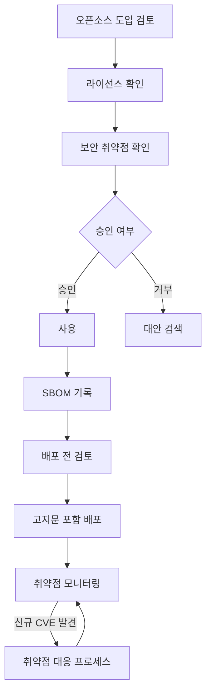
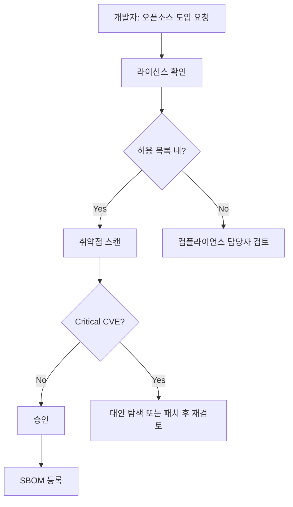

# open source process:From use to distribution

## 1. What we do in this chapter

This chapter acknowledges the use of open source,Pre-deployment checklist,Document vulnerability response procedures.
If a policy defines “what should be done”,A process defines “how it is done.”
Even if the policy document states that “use of AGPL requires open source review.”,Who in practice,when,
If you do not decide in what format it will be reviewed, the policy will end up being nothing more than a declaration.

`agents/04-process-designer` Communicate with the agent to generate 4-7 deliverables tailored to your company environment.
Integration with the CI/CD pipeline is also discussed.,Naturally embedded in the development flow
We aim for a sustainable compliance system.

---

## 2. Background knowledge

### Why we need processes

Policies only say “what” and not “how.” For developers to actually take action, they need specific procedures for who to request and in what form. Process documentation fills this gap and makes the policy work in practice.

> Detailed explanations of each step of the open source process and actual corporate examples are [KWG Open Source Guide — Process].(https://openchain-project.github.io/OpenChain-KWG/guide/opensource_for_enterprise/3-process/)See .

### Open source life cycle overall flow

If you understand the entire flow of open source entering and leaving the code base, you will know where and what
It becomes clear whether a process is needed.



Approved upon introduction,Checklist for deployment,Operational CVE Response — These three points are addressed by the core processes below:

### 5 core processes

ISO/IEC 5230 §3.5 engages open source communities(Contribution and Disclosure)Separate policies and procedures are required. Organizations with no plans to contribute or disclose will also need a policy document stating “not currently applicable.”

#### 3-1. Open source use approval process

Check license when introducing new open source → Check for vulnerabilities → Proceed in order of approval by the person in charge.
List of pre-allowed licenses(allowlist)If you define,Licenses in the list are automatically approved
processing to minimize impact on development speed.

| Category               | standards                                          | processing                                |
| ---------------------- | -------------------------------------------------- | ----------------------------------------- |
| allow                  | In the allowed license list,No known Critical CVEs | Automatic Approval                        |
| Conditional acceptance | Copyleft License,Has High CVE                      | Approval after review by person in charge |
| Ban                    | Non-commercial license,Critical CVE not patched    | Prohibited use                            |

#### 3-2. Compliance check before deployment

Be sure to check the items below before distributing the software externally. this checklist
If it does not pass, distribution will not proceed.

- SBOM Check for latest update(Last update date)
- notice(NOTICE)Check file inclusion
- Confirmation of compliance with copyleft license source code disclosure obligations
- Verify that review of licenses not in the allowed license list has been completed

#### 3-3. Vulnerability response process

With SBOM, you can quickly check whether your software is affected when a new CVE is released.
there is. We use resources efficiently by differentially applying response deadlines depending on the severity of the CVE.

| Severity | CVSS score | Response Deadline | action                          |
| -------- | ---------- | ----------------- | ------------------------------- |
| Critical | 9.0~10.0   | within 1 week     | Patch or Deprecate Immediately  |
| High     | 7.0~8.9    | Within 4 weeks    | Establish a priority patch plan |
| Medium   | 4.0~6.9    | Within 1 month    | Included in next release        |
| Low      | 0.1~3.9    | Next release      | Backlog registration            |

> **reference**:The above deadline is the OpenChain KWG guide baseline. Depending on your organization's risk profile, more stringent deadlines, such as 24 hours for Critical or 1 week for High, can be applied as internal SLAs.

#### 3-4. Open source contribution process(§3.5.1)

This is the process of contributing code, documents, and bug reports to external open source projects.

**Key things to check when contributing:**

- IP protection:Company Confidentiality in Your Contributions,patented technology,Legal confirmation that third party IP is not included
- CLA processing:Verify and record whether the Contributor License Agreement has been signed
- approval stage:Approval from open source manager and team leader before contribution(Differential application depending on contribution size)
- Contribution History:Contribution History(project,detail,manager,date)administered to the internal colon

Even if you do not have a plan to contribute, you can still meet the §3.5.1 requirement by writing a declarative document in `contribution-process.md` stating "No current plan to contribute — this process will be followed when making future plans."

#### 3-5. Internal project disclosure process(§3.5.1)

This is the process of releasing internally developed software as open source.

**Major confirmation items before disclosure:**

- IP clearance:Ensure public code is free of third-party IP, customer data, and company secrets
- Select license:Determine the open source license to apply to the software to be released(MIT,Apache-2.0, etc.)
- security scan:Scan vulnerabilities and hard-coded credentials before disclosure
- approval stage:CTO or designated committee final approval

Even if you have no plans to disclose, you can still meet the §3.5.1 requirement by writing a declarative document in `project-publication-process.md` stating “No current plans to disclose — this procedure will be followed when making disclosure decisions.”

---

### CI/CD integration points

To be sustainable, the process must be naturally integrated into the development flow. Automating manual checks
The burden on the person in charge is reduced and the risk of omission is also lowered.

```yaml
# .github/workflows/oss-compliance.yml
name: OSS Compliance Check

on:
  pull_request:
  schedule:
    - cron: '0 9 * * 1' # 매주 월요일 오전 9시

jobs:
  license-check:
    runs-on: ubuntu-latest
    steps:
      - uses: actions/checkout@v4
      - name: SBOM 생성
        run: |
          docker run --rm -v $(pwd):/project \
            anchore/syft:latest /project \
            --output cyclonedx-json > sbom.cdx.json
      - name: 라이선스 확인
        run: echo "라이선스 검토 단계"
```

The main CI/CD integration points are as follows:

- **PR Stage**:Automatically check license when adding new dependency
- **Build Phase**:SBOM automatically generated
- **Before deployment**:Auto-run deployment checklist
- **Periodic scan**:Known CVE monitoring(cron schedule)

Even in an environment without CI/CD, the same process can be operated based on a manual checklist.
When you introduce CI/CD later, you can simply automate manual steps sequentially.

---

## 3. Self-study

:::info Self-study mode(About 1 to 2 hours)
The process requires significant customization to fit the company's environment. You proceed by talking to the agent.
:::

### advance preparation

Before running the agent, if you organize your company's situation in advance by answering the four questions below, the conversation can proceed quickly.
It's going on.

**7 questions asked by agent**

1. CI/CD tools you are currently using(GitHub Actions / Jenkins / GitLab CI / None / Other)
2. Software deployment cycle(Daily / Weekly / Monthly / Irregular)
3. Whether to use issue tracker(GitHub Issues / Jira / None / Other)
4. Approval stage for open source use(Only person in charge / approved by team leader / approved by committee)
5. Do you plan to contribute to external open source projects?(yes/no)
6. Do you have any plans to release your in-house software as open source?(yes/no)
7. Do you have a channel in place to receive external license/vulnerability inquiries?(Channel address or "Not yet")

### Step-by-step practice

**Step 1**:Summary of the company's situation in response to the above 7 questions

**Step 2**:run agent

:::tip Check before execution
Terminate the current Claude session first(`/exit` or `Ctrl+C`)After doing it,Run the command below in a new terminal.
:::

```bash
cd agents/04-process-designer
claude
```

<details>
<summary>Agent conversation example(Click to expand)</summary>

Below is an example of a conversation flow with an actual agent. When running, it goes like this.

**Agent guidance message:**

> hello! This is an agent that creates open source process output.
> Answer 7 questions and 4 to 7 process documents will be automatically generated.

---

**Question 1/7** — What CI/CD tools are you currently using?(GitHub Actions / Jenkins / GitLab CI / None / Other)

`Sample answer: GitHub Actions`

**Question 2/7** — What is the software deployment cycle?(Daily / Weekly / Monthly / Irregular)

`Sample answer:Weekly`

**Question 3/7** — Do you use an issue tracker?(GitHub Issues / Jira / None / Other)

`Sample answer: GitHub Issues`

**Question 4/7** — Is there a need for approval to use open source?(Only person in charge / approved by team leader / approved by committee)

`Sample answer:Team leader approval`

**Question 5/7** — Do you plan to contribute to external open source projects?(yes/no)

`Sample answer:No`

**Question 6/7** — Do you have any plans to release your in-house software as open source?(yes/no)

`Sample answer:No`

**Question 7/7** — Is there a channel prepared to receive external license/vulnerability inquiries?

`Sample answer:opensource@example.com is in operation`

---

**Example of output upon completion of creation:**

| file                                            | Conditions | Content                                                         |
| ----------------------------------------------- | ---------- | --------------------------------------------------------------- |
| `output/process/usage-approval.md`              | Always     | Open source introduction approval form and procedure            |
| `output/process/distribution-checklist.md`      | Always     | Pre-deployment compliance checklist                             |
| `output/process/vulnerability-response.md`      | Always     | Vulnerability response procedures(Includes CVD §8)              |
| `output/process/inquiry-response.md`            | Always     | Procedure for responding to external license/security inquiries |
| `output/process/process-diagram.md`             | Always     | Mermaid Complete Process Overview with Flow Chart               |
| `output/process/contribution-process.md`        | Q5 “Yes”   | Open source contribution process(Includes CLA treatment)        |
| `output/process/project-publication-process.md` | Q6 “Yes”   | Internal project disclosure procedure                           |

**Items that require manual entry:**

- Check GitHub Actions workflow file path
- Approver name and contact information

</details>

**Step 3**: When the Claude prompt opens, type `시작`.

**Step 4**:Answer 7 questions in order

**Step 5**:Review the generated Mermaid flowchart

When you open the generated `output/process/process-diagram.md` file on GitHub, the flowchart is automatically displayed.
It is rendered. Review the flowchart to ensure it matches your actual workflow. If corrections are needed, contact the agent.
Request additions or edit files directly.

**Step 6**:Check the files created in the `output/process/` directory.

```bash
ls output/process/
# usage-approval.md
# distribution-checklist.md
# vulnerability-response.md
# inquiry-response.md
# process-diagram.md
# contribution-process.md  (Q5 "예" 답변 시)
# project-publication-process.md  (Q6 "예" 답변 시)
```

**Step 6**:Establishment of CI/CD integrated plan

Plan to add workflow files to your project that match the CI/CD tools you are currently using.
If it is difficult to apply immediately, schedule it for inclusion in the next sprint or next release cycle.

### When you get stuck

- **Without CI/CD**:Answer “None”. The agent creates a manual checklist-based process. After introducing CI/CD, it can be automated step by step.
- **If the payment stage is ambiguous**:Enter exactly what your team actually uses. It can be modified later.
- **If Mermaid does not render**: [mermaid.live](https://mermaid.live)Check it out for yourself.

### expected output

| file                                            | Content                                                         |
| ----------------------------------------------- | --------------------------------------------------------------- |
| `output/process/usage-approval.md`              | Open source introduction approval form and procedure            |
| `output/process/distribution-checklist.md`      | Pre-deployment compliance checklist                             |
| `output/process/vulnerability-response.md`      | Vulnerability response procedures(CVD 90-day rule included)     |
| `output/process/inquiry-response.md`            | Procedure for responding to external license/security inquiries |
| `output/process/process-diagram.md`             | Mermaid Complete Process Overview with Flow Chart               |
| `output/process/contribution-process.md`        | Contribution Process(Q5 Created when “Yes”)                     |
| `output/process/project-publication-process.md` | Project disclosure process(Q6 Created on “Yes”)                 |

:::info Standard requirements met
Completing this lab will meet the requirements below:

**ISO/IEC 5230**

| Item ID | Requirements                                                | Self-certification checklist                                                                                                          |
| ------- | ----------------------------------------------------------- | ------------------------------------------------------------------------------------------------------------------------------------- |
| 3.1.5   | License Obligations Review Process                          | Do you have a documented procedure to review and record the obligations, restrictions, and rights granted by each identified license? |
| 3.2.1   | Procedure for receiving external license/security inquiries | Do you have a documented procedure for receiving and handling inquiries about open source compliance?                                 |
| 3.3.2   | Compliance preparation before deployment                    | Do you have a process for creating the necessary compliance artifacts for each distribution?                                          |
| 3.4.1   | Compliance Output Management                                | Do you have a process to ensure compliance artifacts accompany each distribution?                                                     |
| 3.5.1   | Open source contribution management process                 | Do you have a process for contributing to open source projects?                                                                       |

**ISO/IEC 18974**

| Item ID | Requirements                                              | Self-certification checklist                                                                                   |
| ------- | --------------------------------------------------------- | -------------------------------------------------------------------------------------------------------------- |
| 4.1.5   | Vulnerability detection and response procedures           | Do you have a documented procedure for handling known vulnerabilities in open source components?               |
| 4.2.1   | External security vulnerability report response procedure | Do you have a documented procedure for receiving and handling reports of open source security vulnerabilities? |

:::

---

## 4. Completion Confirmation Checklist

You must complete all of the items below to complete this chapter.

- [ ] `output/process/usage-approval.md` created
- [ ] `output/process/distribution-checklist.md` created
- [ ] `output/process/vulnerability-response.md` created(Includes CVD §8)
- [ ] `output/process/inquiry-response.md` created [Required]
- [ ] `output/process/process-diagram.md` created(Mermaid flow chart included)
- [ ] `output/process/contribution-process.md` created(Complete a declaration document regardless of whether you plan to contribute or not.)
- [ ] `output/process/project-publication-process.md` created(Prepare a declaration document whether or not you plan to make it public)
- [ ] Response deadlines are defined for each vulnerability severity level
- [ ] Criteria for automatic approval of permissive licenses are specified
- [ ] External inquiry receiving channel(email)Specified in this procedure

### process-diagram.md example(portion)

Ensure that the generated flowchart contains a structure similar to the one below.



> This step is ISO/IEC 5230 3.1.5, 3.2.1, 3.3.2, 3.4.1,3.5.1 and ISO/IEC 18974 4.1.5,Meets 4.2.1 requirements.

> 📋 **Example of output**: [Process Output Best Practice](/reference/samples/process)You can check the actual format of the generated file at .

---

## 5. Next steps

Once all 4 `output/process/` files have been created, move to the SBOM creation step.

:::tip Check before execution
Terminate the current Claude session first(`/exit` or `Ctrl+C`)After doing it,Run the command below in a new terminal.
:::

```bash
cd agents/05-sbom-guide
claude
```

Or, if you want to read the documentation first, [Create SBOM:Creating a software configuration specification with syft and cdxgen](../05-tools/sbom-generation/index.md)Go to .

SBOM(software specifications)is the key to ensuring that the processes created in this chapter actually work.
It's a tool. Recording in a machine-readable format which open sources are included,License Obligations
You can automatically check compliance and the scope of impact of vulnerabilities.
