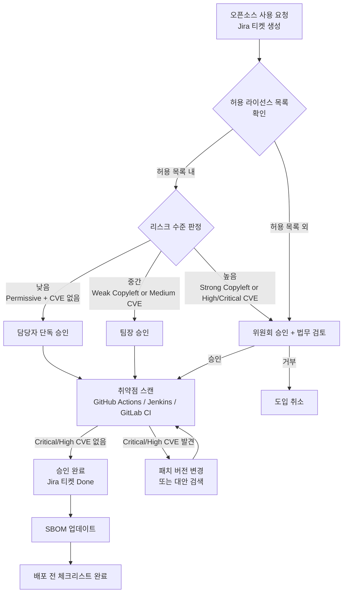
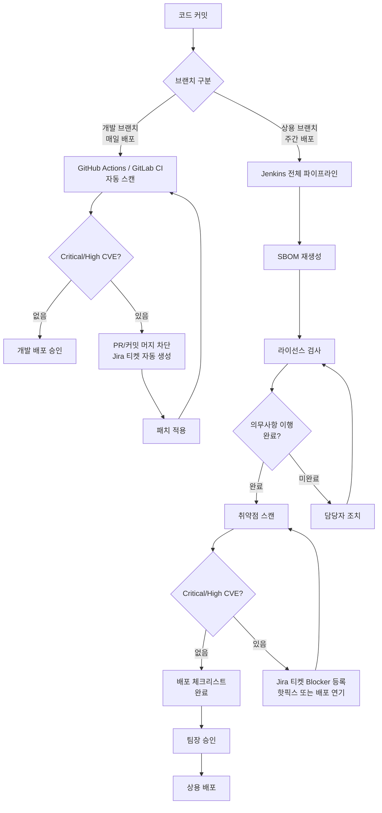
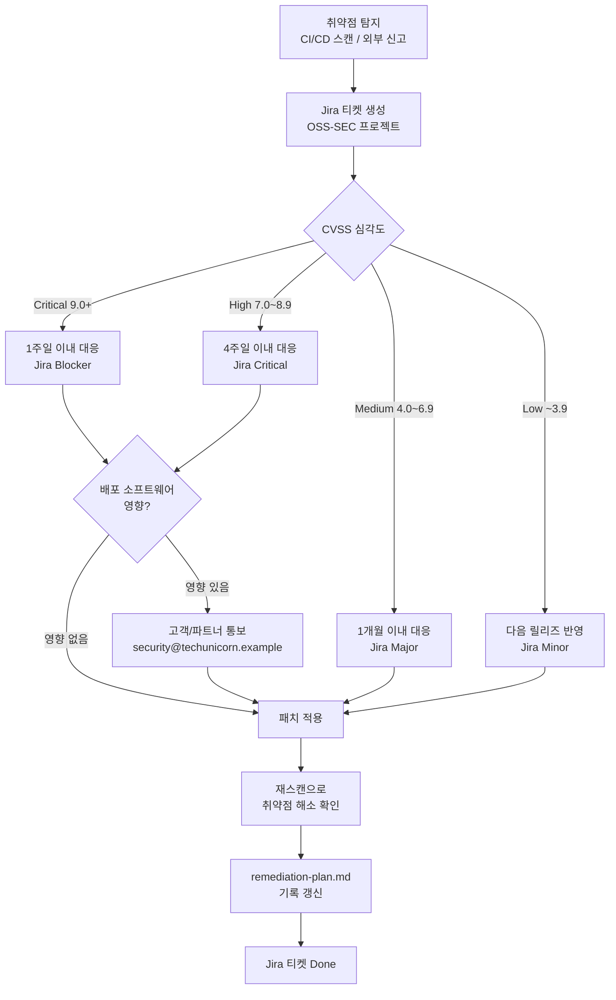
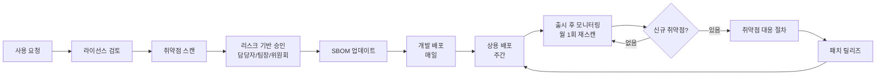

# 프로세스 산출물 Best Practice

`process-designer` agent가 생성하는 4~7개 산출물의 완성 예시입니다.
자신의 `output/process/` 파일과 비교하여 빠진 항목을 확인하는 용도로 활용하세요.

> 아래 프로세스 문서는 OpenChain KWG 프로세스 가이드의 6대 프로세스(오픈소스 관리, 보안 취약점 관리, 외부 문의 대응, 기여, 사내 공개, 교육과 평가)와 ISO/IEC 5230과 18974를 기준으로 작성됩니다. KWG 가이드는 CC BY 4.0 라이선스입니다.

> **레퍼런스 바로가기:** [오픈소스 프로세스 챕터 가이드](/docs/process)

---

**이 페이지에 수록된 산출물**

- 오픈소스 사용 승인 절차
- 배포 전 라이선스 컴플라이언스 체크리스트
- 취약점 대응 절차
- 오픈소스 프로세스 흐름도
- 외부 문의 대응 절차
- 오픈소스 기여 절차
- 사내 프로젝트 공개 절차

## 오픈소스 사용 승인 절차

문서: usage-approval.md

- **회사명**: 테크유니콘
- **작성일**: 2026-03-23
- **담당자**: DevOps팀 오픈소스 담당자

```
관련 표준
- 5230 §3.1.5.1·§3.3.1.1·§3.3.2.1
```

---

### 1. 절차 개요

```
관련 표준
- 5230 §3.1.5.1
```

오픈소스 컴포넌트를 신규 도입하거나 기존 버전을 변경할 때 이 절차를 따른다.

#### 리스크 기반 승인 단계

| 리스크 수준 | 조건                                                              | 승인 단계        |
| ----------- | ----------------------------------------------------------------- | ---------------- |
| 낮음        | Permissive 라이선스 + Critical/High CVE 없음                      | 담당자 단독 승인 |
| 중간        | Weak Copyleft 또는 Medium CVE 존재                                | 팀장 승인        |
| 높음        | Strong/Network Copyleft, High/Critical CVE, 허용 목록 외 라이선스 | 위원회 승인      |

```
오픈소스 도입 요청 (Jira 티켓 생성)
    ↓
라이선스 확인 (허용 목록 대조)
    ↓
리스크 수준 판정
    ↓
[낮음] → 담당자 승인
[중간] → 팀장 승인
[높음] → 위원회 승인 (법무팀 포함)
    ↓
취약점 스캔 (CVE 확인)
    ↓
[Critical/High CVE?] → 대안 검색 또는 패치 확인
    ↓
승인 완료 → SBOM 업데이트
    ↓
배포 전 distribution-checklist.md 완료
```

---

### 2. CI/CD 자동화 통합

테크유니콘은 GitHub Actions, Jenkins, GitLab CI를 모두 사용한다. 각 파이프라인에서 오픈소스 사용 승인 절차를 아래와 같이 통합한다.

#### GitHub Actions

```yaml
# .github/workflows/oss-scan.yml
name: OSS License & Vulnerability Scan
on:
  pull_request:
    branches: [main, develop]

jobs:
  oss-check:
    runs-on: ubuntu-latest
    steps:
      - uses: actions/checkout@v7
      - name: License Scan
        run: |
          # 라이선스 스캔 후 허용 목록 대조
          npx license-checker --summary --excludePrivatePackages
      - name: Vulnerability Scan
        run: |
          # CVE 스캔
          npm audit --audit-level=high
```

#### Jenkins (Jenkinsfile)

```groovy
stage('OSS Compliance') {
    steps {
        sh 'license-checker --summary'
        sh 'osv-scanner --lockfile package-lock.json'
    }
    post {
        failure {
            // Jira 티켓 자동 생성
            jiraNewIssue site: 'TU-JIRA',
                         projectKey: 'OSS',
                         summary: 'OSS 컴플라이언스 검사 실패'
        }
    }
}
```

#### GitLab CI (.gitlab-ci.yml)

```yaml
oss-scan:
  stage: test
  script:
    - license-checker --summary
    - osv-scanner --lockfile package-lock.json
  only:
    - merge_requests
    - main
```

---

### 3. 사용 승인 요청 양식 (Jira 티켓)

Jira에서 프로젝트 **OSS** 유형 티켓을 생성하여 아래 항목을 기록한다.

| 항목           | 내용                           |
| -------------- | ------------------------------ |
| 요청자         | (이름/부서)                    |
| 요청일         | YYYY-MM-DD                     |
| 컴포넌트명     | (이름)                         |
| 버전           | (버전)                         |
| 라이선스       | (SPDX 식별자, 예: Apache-2.0)  |
| 사용 목적      | (직접 사용 / 의존성 / 개발용)  |
| 배포 포함 여부 | (배포 포함 / 내부용만)         |
| 리스크 수준    | (낮음 / 중간 / 높음)           |
| 대안 검토 여부 | (검토함 / 검토불필요 / 이유: ) |

---

### 4. 라이선스 의무사항 검토

```
관련 표준
- 5230 §3.1.5.1
```

| 라이선스 유형          | 배포 방식     | 의무사항                           | 이행 방법                     | 승인 단계   |
| ---------------------- | ------------- | ---------------------------------- | ----------------------------- | ----------- |
| MIT / Apache-2.0 / BSD | 모든 배포     | 저작권 표시, 라이선스 고지         | NOTICE 파일에 포함            | 담당자 단독 |
| LGPL                   | 임베디드/배포 | 소스코드 공개 또는 동적링크 보장   | 동적링크 유지 / 소스코드 공개 | 팀장 승인   |
| GPL-2.0 / GPL-3.0      | 임베디드/배포 | 전체 소스코드 공개                 | 소스코드 공개 (배포 시)       | 위원회 승인 |
| AGPL-3.0               | SaaS 포함     | 네트워크 서비스 포함 소스코드 공개 | 소스코드 공개                 | 위원회 승인 |
| 허용 목록 외           | —             | 사전 법무 검토 필수                |                               | 위원회 승인 |

---

### 5. 취약점 사전 확인

```
관련 표준
- 18974 §4.1.5.1·§4.3.2
```

신규 컴포넌트 도입 시:

- [ ] OSV API 또는 NVD에서 해당 버전의 CVE 조회
- [ ] Critical/High CVE 없음 확인
- [ ] Critical/High CVE 존재 시: 패치 버전으로 변경 또는 도입 재검토
- [ ] Jira 티켓에 스캔 결과 첨부

---

### 6. SBOM 업데이트 의무

```
관련 표준
- 5230 §3.3.1.1
```

승인 후 반드시:

- `output/sbom/sbom-commands.sh`를 실행하여 SBOM 재생성
- 갱신된 `*.cdx.json` 파일을 지정 위치에 보관

---

### 7. 승인 기록

| 날짜       | 컴포넌트 | 버전   | 라이선스   | CVE 확인 | 리스크         | 승인자 | Jira 티켓  |
| ---------- | -------- | ------ | ---------- | -------- | -------------- | ------ | ---------- |
| YYYY-MM-DD | (이름)   | (버전) | (라이선스) | ✅/⚠️    | 낮음/중간/높음 | (이름) | OSS-(번호) |

---

### 8. 허용 라이선스 목록 참조

허용·제한 라이선스의 전체 목록은 `output/policy/license-allowlist.md` 를 참조한다.

---

## 배포 전 라이선스 컴플라이언스 체크리스트

문서: distribution-checklist.md

- **회사명**: 테크유니콘
- **담당자**: DevOps팀 오픈소스 담당자

```
관련 표준
- 5230 §3.4.1.1·§3.4.1.2
```

---

### 배포 채널별 적용 기준

테크유니콘은 개발 브랜치(매일 배포)와 상용 브랜치(주간 배포)로 운영한다.

| 배포 채널   | 주기 | 체크리스트 적용 수준              |
| ----------- | ---- | --------------------------------- |
| 개발 브랜치 | 매일 | 자동화 스캔 결과 확인 (항목 1, 4) |
| 상용 브랜치 | 주간 | 전체 체크리스트 완료 후 배포      |

---

### 1. SBOM 최신성 확인

```
관련 표준
- 5230 §3.3.1.2
```

- [ ] 이번 릴리즈 기준으로 SBOM이 최신 상태인가?
- [ ] `output/sbom/sbom-commands.sh`를 실행하여 SBOM을 재생성했는가?
- [ ] 신규 추가된 의존성이 SBOM에 반영되었는가?

**CI/CD 자동화 확인:**

- [ ] GitHub Actions / Jenkins / GitLab CI 파이프라인에서 SBOM 생성 단계가 통과되었는가?

---

### 2. 라이선스 의무사항 이행 확인

```
관련 표준
- 5230 §3.3.2.1·§3.1.5.1
```

- [ ] `output/sbom/license-report.md`의 모든 라이선스를 확인했는가?
- [ ] `output/policy/license-allowlist.md`에 없는 라이선스가 포함되어 있지 않은가?
- [ ] Copyleft 라이선스 사용 시 아래 항목을 충족했는가:

| 라이선스 | 의무사항                           | 이행 여부               |
| -------- | ---------------------------------- | ----------------------- |
| GPL-2.0  | 소스코드 공개, 고지문 포함         | ☐ 해당없음 / ☐ 이행완료 |
| GPL-3.0  | 소스코드 공개, 고지문 포함         | ☐ 해당없음 / ☐ 이행완료 |
| LGPL     | 소스코드 공개 또는 동적링크 보장   | ☐ 해당없음 / ☐ 이행완료 |
| AGPL     | 네트워크 서비스 포함 소스코드 공개 | ☐ 해당없음 / ☐ 이행완료 |
| MPL      | 수정된 파일 소스코드 공개          | ☐ 해당없음 / ☐ 이행완료 |

---

### 3. 고지문(Notice) 생성 및 확인

```
관련 표준
- 5230 §3.4.1.1
```

#### 3-1. 고지문 생성

- 생성 도구 예시: `syft`, `scancode-toolkit`, `tern` 중 환경에 맞는 도구 사용.
- `NOTICE` 또는 `OPEN_SOURCE_LICENSES.txt` 파일을 빌드 산출물에 포함한다.
- 포함 항목: 컴포넌트명, 버전, 라이선스 SPDX ID, 저작권 표시, 라이선스 전문 또는 라이선스 URL.
- 바이너리 배포(임베디드·앱) 시: 동봉 파일, About 화면, 또는 QR코드·URL 중 최소 하나 제공.

#### 3-2. 고지문 확인

- [ ] `NOTICE` 또는 `OPEN_SOURCE_LICENSES.txt` 파일이 배포 패키지에 포함되었는가?
- [ ] 고지문에 모든 오픈소스 컴포넌트의 저작권 표시 및 라이선스 텍스트가 있는가?
- [ ] 바이너리 배포 시 라이선스 고지 접근 수단이 확보되었는가?

---

### 4. 취약점 스캔 결과 확인

```
관련 표준
- 18974 §4.1.5.1
```

- [ ] CI/CD 파이프라인(GitHub Actions / Jenkins / GitLab CI)에서 취약점 스캔이 수행되었는가?
- [ ] Critical/High CVE가 없거나 해소 계획이 수립되었는가?
- [ ] Jira에 관련 티켓이 생성·처리되었는가?

---

### 5. 컴플라이언스 산출물 보관

```
관련 표준
- 5230 §3.4.1.2
```

- [ ] 이번 배포의 SBOM 사본을 보관했는가? (경로: `output/sbom/{프로젝트}-{버전}.cdx.json`)
- [ ] 고지문 사본을 보관했는가?
- [ ] 보관 위치와 보관 기간이 정책에 명시되어 있는가?

---

### 6. 라이선스 미준수 사례 확인

```
관련 표준
- 5230 §3.2.2.5
```

- [ ] 이번 릴리즈에 라이선스 미준수 사례가 없는가?
- [ ] 미준수 사례가 있다면 시정 조치가 완료되었는가?

---

### 7. 최종 승인

**상용 브랜치 배포 (주간) — 전체 결재 필요**

| 구분                | 이름                     | 서명/확인일 |
| ------------------- | ------------------------ | ----------- |
| 오픈소스 담당자     | DevOps팀 오픈소스 담당자 | YYYY-MM-DD  |
| 법무 검토 (필요 시) | (이름)                   | YYYY-MM-DD  |
| 배포 승인자         | DevOps팀장               | YYYY-MM-DD  |

---

### 8. 배포 후 최종 확인

배포 완료 직후 다음을 확인하고 이행 기록에 반영한다.

- [ ] 배포된 아티팩트에 NOTICE 파일 또는 접근 수단이 실제 포함되었는지 육안 확인
- [ ] 배포된 버전의 SBOM이 `output/sbom/`에 최종 보관되었는지 확인
- [ ] 배포 이후 신규 CVE 모니터링이 개시되었는지 확인 (vulnerability-response.md 6절 참조)
- [ ] 배포 기록(버전, 일시, 승인자, 채널)이 이행 기록에 남았는지 확인

---

### 이행 기록

```
관련 표준
- 5230 §3.4.1.2
```

이 체크리스트를 완료하면 날짜와 함께 아래 이력에 기록한다.

| 버전   | 배포일     | 브랜치    | 체크리스트 완료 | 담당자 |
| ------ | ---------- | --------- | --------------- | ------ |
| (버전) | YYYY-MM-DD | 상용/개발 | ✅              | (이름) |

---

## 취약점 대응 절차

문서: vulnerability-response.md

- **회사명**: 테크유니콘
- **작성일**: 2026-03-23
- **담당자**: DevOps팀 오픈소스 담당자

```
관련 표준
- 5230 §3.2.2.5
- 18974 §4.1.5.1·§4.2.1.2
```

---

### 1. 취약점 탐지 방법

```
관련 표준
- 18974 §4.1.5.1
```

| 탐지 방법                            | 도구/채널                                | 주기                         |
| ------------------------------------ | ---------------------------------------- | ---------------------------- |
| SBOM 기반 자동 스캔 (GitHub Actions) | OSV API / Dependabot                     | 커밋/PR 시, 개발 브랜치 매일 |
| SBOM 기반 자동 스캔 (Jenkins)        | OSV API / Dependency Track               | 빌드 시, 주간 정기 스캔      |
| SBOM 기반 자동 스캔 (GitLab CI)      | OSV API / GitLab Security                | 머지 리퀘스트 시             |
| 공급업체 보안 권고                   | NVD, GitHub Security Advisories, OSV.dev | 실시간 구독                  |
| 국내 취약점 정보                     | KISA KNVD (국내 SW 취약점 DB)            | 주 1회 확인                  |
| 외부 신고                            | security@techunicorn.example             | 상시                         |

---

### 2. 위험/영향 점수 할당 기준

```
관련 표준
- 18974 §4.1.5.1·§4.3.2
```

CVSS v3.1 또는 v4.0 기준 심각도 분류 (두 점수가 모두 제공되면 더 높은 점수를 기준으로 한다):

| 심각도      | CVSS 점수  | 대응 기한   | 조치 방법                 | Jira 우선순위 |
| ----------- | ---------- | ----------- | ------------------------- | ------------- |
| 🔴 Critical | 9.0 ~ 10.0 | 1주일 이내  | 즉시 패치, 배포 중단 검토 | Blocker       |
| 🟠 High     | 7.0 ~ 8.9  | 4주일 이내  | 패치 또는 완화 조치       | Critical      |
| 🟡 Medium   | 4.0 ~ 6.9  | 1개월 이내  | 다음 정기 릴리즈에 포함   | Major         |
| 🟢 Low      | 0.1 ~ 3.9  | 다음 릴리즈 | 정기 업데이트 시 반영     | Minor         |

:::info[참고]
위 기한은 OpenChain KWG 가이드 기준선입니다. 조직의 리스크 프로파일과 역량에 따라 더 엄격한 기한(Critical 24시간·High 1주일 등)을 내부 SLA로 적용할 수 있습니다.

보조 지표로 우선순위를 조정한다: EPSS(악용 확률)가 0.1 이상이거나 CISA KEV(실제 악용 확인 목록)에 등재된 취약점은 대응 우선순위를 한 단계 상향한다.
:::

---

### 3. 후속 조치 절차

```
관련 표준
- 18974 §4.1.5.1
```

1. **탐지**: CI/CD 자동 스캔(GitHub Actions/Jenkins/GitLab CI) 또는 외부 신고로 취약점 인지
2. **기록**: `output/vulnerability/cve-report.md`에 CVE ID, 컴포넌트, CVSS 점수 기록
3. **Jira 티켓 생성**: 프로젝트 **OSS-SEC** 유형, 우선순위는 심각도 기준 자동 설정
4. **평가**: 위험/영향 점수 할당 및 조치 방법 결정
5. **조치**: 패치 적용, 버전 업그레이드, 또는 완화 조치 수행
6. **검증**: 조치 완료 후 재스캔으로 취약점 해소 확인
7. **기록 갱신**: `output/vulnerability/remediation-plan.md`에 조치 완료 기록

### 즉시 패치가 어려운 경우 임시 완화

호환성이나 릴리즈 일정 때문에 즉시 패치할 수 없을 때는 접근 제한, 가상 패치(WAF 규칙·입력 필터),
격리, 미사용 기능 비활성화로 악용 가능성을 낮춘 뒤, 정식 패치 예정일을 함께 기록한다.
실제 악용 불가로 판단되면 VEX 로 `not_affected` 를 명시한다.

8. **Jira 티켓 종결**: 조치 완료 확인 후 Done 처리

---

### 4. 배포 주기별 대응 기준

| 배포 브랜치 | 주기 | Critical/High 취약점 발견 시                |
| ----------- | ---- | ------------------------------------------- |
| 개발 브랜치 | 매일 | 해당 PR/커밋 머지 차단 후 즉시 패치         |
| 상용 브랜치 | 주간 | 패치 완료 확인 후 배포, 필요 시 핫픽스 배포 |

---

### 5. 고객 통보 기준

```
관련 표준
- 18974 §4.1.5.1
```

아래 경우 고객 또는 공급망 파트너에게 통보한다:

- Critical/High 취약점이 이미 배포된 소프트웨어에 영향을 줄 때
- 통보 방법: 이메일(security@techunicorn.example) / 보안 게시판 / 릴리즈 노트
- 통보 기한: Critical — 인지 후 24시간 이내, High — 인지 후 3영업일 이내
- 영향 없음의 공식 표현: 컴포넌트에 CVE 가 있으나 제품에서 악용 불가한 경우, VEX 문서(CycloneDX VEX 또는 OpenVEX, 상태값 affected / not_affected / fixed / under_investigation)로 명시해 SBOM 과 함께 제공한다

---

### 6. 출시 후 신규 취약점 모니터링

```
관련 표준
- 18974 §4.1.5.1
```

- **모니터링 주기**: 월 1회 전체 SBOM 재스캔 (Jenkins 정기 빌드 활용)
- **구독 채널**: NVD RSS, GitHub Security Advisories, OSV.dev
- **담당자**: DevOps팀 오픈소스 담당자
- **대응 트리거**: 새로운 CVE가 배포 소프트웨어의 컴포넌트에 영향을 줄 때 즉시 [3. 후속 조치 절차] 개시

---

### 7. 외부 취약점 신고 대응

```
관련 표준
- 18974 §4.2.1.2
```

외부에서 취약점 신고 접수 시:

1. **수신**: security@techunicorn.example
2. **확인 응답**: 2 영업일 이내 수신 확인 회신
3. **처리**: 3. 후속 조치 절차와 동일하게 처리
4. **결과 통보**: 조치 완료 후 신고자에게 결과 공유

---

### 8. 출시 전 보안 테스트

```
관련 표준
- 18974 §4.1.5.1
```

상용 브랜치 주간 배포 전 아래 항목을 수행한다:

- [ ] SBOM 재생성
- [ ] OSV API 또는 Dependency Track으로 취약점 스캔 (Jenkins 파이프라인)
- [ ] Critical/High 취약점 없음 확인 또는 해소 계획 수립
- [ ] `output/process/distribution-checklist.md` 완료

---

### 9. CVD(조정된 취약점 공개) 절차

```
관련 표준
- 18974 §4.1.5.1 (CVD 공시 정책)
```

외부에서 발견된 취약점을 공개적으로 공시할 때 아래 절차를 따른다.

#### 9.1 비공개 조율 원칙 (90일 원칙)

- 취약점 최초 인지일로부터 **원칙적으로 90일 이내** 공개
- 공개 전 아래 조건이 충족되어야 한다:
  - [ ] 패치 또는 완화 조치 준비 완료
  - [ ] 영향받는 고객/파트너에게 사전 통보 완료
  - [ ] 공개 권고문(Security Advisory) 초안 작성 완료

#### 9.2 90일 연장 조건

아래 경우 최대 30일 추가 연장 가능:

- 공급망 파트너와의 조율이 완료되지 않은 경우
- 복잡한 패치 배포로 90일 내 이행이 불가능한 경우

연장 시 취약점 신고자(외부 보안 연구자 등)에게 연장 사유 및 예상 공개 일정을 통보한다.

#### 9.3 즉시 공개 예외

아래 경우 90일 조율 없이 즉시 공개할 수 있다:

- 취약점이 이미 외부에 공개(0-day)된 경우
- 취약점이 실제 악용되고 있음이 확인된 경우

#### 9.4 공개 형식

취약점 공시 시 포함 항목:

- CVE ID (없는 경우 CVE 발급 신청)
- 영향받는 컴포넌트 및 버전 범위
- 취약점 설명 및 CVSS 점수
- 패치 버전 또는 완화 방법
- 크레딧 (외부 신고자 요청 시)

공개 채널: 공식 웹사이트 보안 공지 페이지 및 security@techunicorn.example 메일 공지

#### 9.5 기록 보관

CVD 관련 모든 커뮤니케이션 및 결정 이력을 **최종 공개일로부터 최소 3년** 보관한다.

| 보관 항목            | 내용                         |
| -------------------- | ---------------------------- |
| 취약점 인지 일자     | YYYY-MM-DD                   |
| 신고자 정보          | 이름 또는 핸들 (비공개 가능) |
| 조율 시작일 / 공개일 | YYYY-MM-DD / YYYY-MM-DD      |
| 공개 채널 및 URL     | 공식 웹사이트 보안 공지 URL  |
| CVE ID               | CVE-YYYY-NNNNN               |

---

## 오픈소스 프로세스 흐름도

문서: process-diagram.md

- **회사명**: 테크유니콘
- **작성일**: 2026-03-23

```
관련 표준
- 5230 §3.1.5.1·§3.3.1.1·§3.4.1.1
```

---

### 1. 오픈소스 사용 승인 프로세스



---

### 2. 배포 파이프라인 프로세스



---

### 3. 취약점 대응 프로세스



---

### 4. 전체 오픈소스 관리 사이클



---

### 참조 문서

| 프로세스        | 상세 절차 문서                             |
| --------------- | ------------------------------------------ |
| 사용 승인       | `output/process/usage-approval.md`         |
| 배포 체크리스트 | `output/process/distribution-checklist.md` |
| 취약점 대응     | `output/process/vulnerability-response.md` |
| 라이선스 정책   | `output/policy/oss-policy.md`              |
| 허용 라이선스   | `output/policy/license-allowlist.md`       |

---

## 외부 문의 대응 절차

문서: inquiry-response.md

- **회사명**: 테크유니콘
- **작성일**: 2026-03-23
- **담당자**: 오픈소스 프로그램 매니저 (OSPM)

```
관련 표준
- 5230 §3.2.1.2 (G2.2)
```

---

### 1. 외부 문의 수신 채널

```
관련 표준
- 5230 §3.2.1.1·§3.2.1.2
```

| 문의 유형                  | 수신 채널                  | 담당자      |
| -------------------------- | -------------------------- | ----------- |
| 라이선스 컴플라이언스 문의 | opensource@techunicorn.com | OSPM        |
| 보안 취약점 신고           | security@techunicorn.com   | 보안 담당자 |
| 저작권 침해 주장           | legal@techunicorn.com      | 법무팀      |
| 기타 오픈소스 관련 문의    | opensource@techunicorn.com | OSPM        |

> 채널이 공개적으로 접근 가능해야 한다 (웹사이트, 제품 고지문 등에 명시).

---

### 2. 문의 유형 분류

```
관련 표준
- 5230 §3.2.1.2 (문의 처리 절차)
```

수신된 문의는 아래 유형으로 분류하여 처리한다:

| 분류 코드 | 유형             | 예시                                          |
| --------- | ---------------- | --------------------------------------------- |
| INQ-L     | 라이선스 문의    | GPL 소스코드 제공 요청, 저작권 표시 누락 지적 |
| INQ-S     | 보안 취약점 신고 | CVE 관련 보안 취약점 보고                     |
| INQ-C     | 저작권 침해 주장 | 무단 사용 주장, DMCA 통지                     |
| INQ-G     | 일반 문의        | SBOM 제공 요청, 라이선스 확인 요청            |

---

### 3. 문의 유형별 대응 SLA

```
관련 표준
- 5230 §3.2.1.2
```

| 분류                | 수신 확인     | 조사 완료      | 최종 처리                  |
| ------------------- | ------------- | -------------- | -------------------------- |
| INQ-L (라이선스)    | 2 영업일 이내 | 10 영업일 이내 | 30 영업일 이내             |
| INQ-S (보안)        | 1 영업일 이내 | 5 영업일 이내  | 취약점 대응 절차 기준 적용 |
| INQ-C (저작권 침해) | 1 영업일 이내 | 5 영업일 이내  | 법무 협의 후 결정          |
| INQ-G (일반)        | 3 영업일 이내 | 15 영업일 이내 | 30 영업일 이내             |

---

### 4. 대응 절차 (8단계)

```
관련 표준
- 5230 §3.2.1.2 (외부 문의 처리 흐름)
```

1. **접수 알림**: 수신 즉시 자동 회신 또는 담당자가 접수 확인 이메일 발송. 내부 이슈 트래커(GitHub Issues)에 등록
2. **조사 알림**: SLA 내 조사 착수를 알리는 회신 발송
3. **내부 조사**: SBOM 및 배포 이력 확인, 관련 라이선스·저작권 정보 검토
4. **요청자 보고**: 조사 결과 및 대응 계획 통보
5. **문제 보완**: 라이선스 의무 미이행 확인 시 즉시 시정 조치 수행
6. **해결 알림**: 시정 완료 또는 문의 사항 충족 후 요청자에게 결과 통보
7. **프로세스 개선**: OSPM 검토를 통해 재발 방지 조치 검토
8. **기록 보관**: 종결일로부터 최소 3년 보관

---

### 5. 에스컬레이션 기준

```
관련 표준
- 5230 §3.2.1.2
```

아래 경우 법무팀 및 경영진에게 즉시 에스컬레이션한다:

- 저작권 침해 소송 위협이 포함된 경우
- 동일 문의가 반복되거나 다수 외부 기관에서 접수된 경우
- SLA 내 처리가 불가능한 경우
- 언론 또는 공개 채널을 통한 문의인 경우

에스컬레이션 경로: OSPM → 법무팀 → CTO

---

### 6. 문의 이력 보관

```
관련 표준
- 5230 §3.2.1.2 (문의 처리 기록)
```

모든 외부 문의 및 대응 기록은 아래 정보를 포함하여 **최소 3년** 보관한다:

| 보관 항목      | 내용                          |
| -------------- | ----------------------------- |
| 접수 일자      | YYYY-MM-DD                    |
| 문의 유형      | INQ-L / INQ-S / INQ-C / INQ-G |
| 문의 내용 요약 | 핵심 요청 사항                |
| 조사 결과      | 사실 확인 내용                |
| 대응 조치      | 시정 조치 내용 또는 답변 내용 |
| 종결 일자      | YYYY-MM-DD                    |
| 담당자         | 오픈소스 프로그램 매니저      |

보관 위치: GitHub Issues (비공개 저장소)
보관 기간: **종결일로부터 최소 3년**

---

## 오픈소스 기여 절차

:::note[조건부 생성]
`process-designer` agent Q5 "예" 답변 시 생성됩니다.
:::

문서: contribution-process.md

- **회사명**: 오픈웨이브(OpenWave)
- **작성일**: 2026-04-25
- **담당자**: CTO (오픈소스 담당 겸직)

```
관련 표준
- 5230 §3.5.1.2 (G3L.6)
```

---

### 1. 기여 전 검토 절차

```
관련 표준
- 5230 §3.5.1.2 (기여 관리 절차)
```

외부 오픈소스 프로젝트에 기여하기 전 아래를 확인한다:

| 확인 항목                           | 확인 방법                     | 담당자         |
| ----------------------------------- | ----------------------------- | -------------- |
| 기여 대상 프로젝트의 라이선스       | LICENSE 파일 확인             | 기여자         |
| 회사 IP(특허, 영업비밀) 포함 여부   | IP 체크리스트 작성            | 외부 법무 법인 |
| CLA(기여자 라이선스 동의) 요구 여부 | 프로젝트 CONTRIBUTING.md 확인 | 기여자         |
| 기여 내용의 업무 관련성             | CTO 확인                      | CTO            |

기여 요청 시 제출 정보:

- 기여 대상 프로젝트명 및 저장소 URL
- 기여 내용 요약 (버그픽스 / 기능 추가 / 문서 등)
- 특허 관련 기술 포함 여부 (예/아니오)
- 제3자 라이브러리 포함 여부 (예/아니오)

---

### 2. 기여 유형별 승인 기준

```
관련 표준
- 5230 §3.5.1.2 (오픈소스 기여 관리)
```

| 기여 유형             | 승인 필요 단계            | 기준                 |
| --------------------- | ------------------------- | -------------------- |
| 오탈자·문서 수정      | CTO 확인                  | 회사 IP 미포함 확인  |
| 버그 픽스             | CTO 검토                  | 라이선스 호환성 확인 |
| 기능 추가             | CTO + 외부 법무 법인 검토 | IP·특허 영향 검토    |
| 새 프로젝트 기여 시작 | CTO + 외부 법무 법인 검토 | 전략적 검토 포함     |

소규모 조직 특이사항: 팀원 12명 체제에서 CTO가 오픈소스 담당을 겸직하므로,
기능 추가 이상의 기여는 반드시 외부 법무 법인과 사전 협의한다.

---

### 3. CLA(기여자 라이선스 동의) 처리 절차

```
관련 표준
- 5230 §3.5.1.2 (기여 절차)
```

CLA가 요구되는 프로젝트에 기여할 때:

1. **CLA 내용 검토**: 외부 법무 법인이 CLA 조항을 검토하여 회사에 불리한 조항 여부 확인
2. **서명 승인**: CTO가 CLA 서명 여부를 최종 승인
3. **서명 방법**: 개인 서명 또는 기업 CLA 서명 (프로젝트 정책에 따름)
4. **기록 보관**: 서명한 CLA 사본을 [5. 기여 이력 보관] 기준에 따라 보관

CLA 서명 거절 기준:

- 기여자가 회사 IP를 포기해야 하는 조항 포함 시
- 회사의 특허에 영향을 미치는 조항 포함 시

---

### 4. 기여 수행 기준

```
관련 표준
- 5230 §3.5.1.2
```

승인 후 기여 수행 시 준수 사항:

- [ ] 저작권 표시: `Copyright (c) {연도} OpenWave`
- [ ] SPDX 라이선스 식별자 명기 (해당 프로젝트 정책에 따름)
- [ ] 회사 이메일 주소 사용: `{이름}@openwave.io`
- [ ] 영업비밀·내부 시스템 정보 포함 금지
- [ ] 기여 내용이 승인 범위를 벗어나지 않음 확인

---

### 5. 기여 이력 보관

```
관련 표준
- 5230 §3.5.1.2 (기여 이력 기록)
```

모든 오픈소스 기여 활동은 아래 정보를 기록하여 **최소 3년** 보관한다:

| 보관 항목                   | 예시                             |
| --------------------------- | -------------------------------- |
| 기여 일자                   | 2026-04-25                       |
| 기여 프로젝트 및 저장소 URL | github.com/project/repo          |
| 기여 내용 요약              | 버그 픽스 #1234                  |
| 승인자                      | CTO (홍길동)                     |
| CLA 서명 여부               | 예 / 아니오                      |
| Pull Request URL            | github.com/project/repo/pull/456 |

보관 위치: GitHub Issues (내부 비공개 저장소) / Google Drive 공유 폴더
보관 기간: **기여일로부터 최소 3년**

---

## 사내 프로젝트 공개 절차

:::note[조건부 생성]
`process-designer` agent Q6 "예" 답변 시 생성됩니다.
:::

문서: project-publication-process.md

- **회사명**: 테크유니콘
- **작성일**: 2026-03-23
- **담당자**: DevOps팀 오픈소스 담당자

```
관련 표준
- 5230 §3.5.1
```

---

### 1. 공개 전 검토 체크리스트

- [ ] IP 스캔: 코드베이스에 제3자 독점 코드·영업 비밀이 없음 확인
- [ ] 라이선스 선택: 프로젝트 목적에 맞는 오픈소스 라이선스 결정
- [ ] 보안 검토: 공개 전 비밀키·자격증명·내부 URL 제거
- [ ] 법무 승인: 공개 가능 여부 법무 확인

---

### 2. 라이선스 선택 기준

| 목적                   | 권장 라이선스            |
| ---------------------- | ------------------------ |
| 최대 활용 유도         | MIT 또는 Apache-2.0      |
| 기여 환원 유도         | GPL-2.0 또는 GPL-3.0     |
| 라이브러리 (상용 호환) | LGPL-2.1 또는 Apache-2.0 |

---

### 3. 3단계 승인 프로세스

1. **담당자 검토**: 체크리스트 완료 확인
2. **법무 승인**: IP 스캔 결과 및 라이선스 선택 승인
3. **경영진 보고**: 공개 목적 및 유지관리 계획 보고

---

### 4. 공개 후 유지 관리

- 외부 기여자 PR·이슈 정기 검토 (최소 월 1회)
- SECURITY.md 파일 유지 (취약점 신고 방법 안내)
- 보관: 공개 결정 기록 및 승인 기록을 공개일로부터 최소 3년 보관
