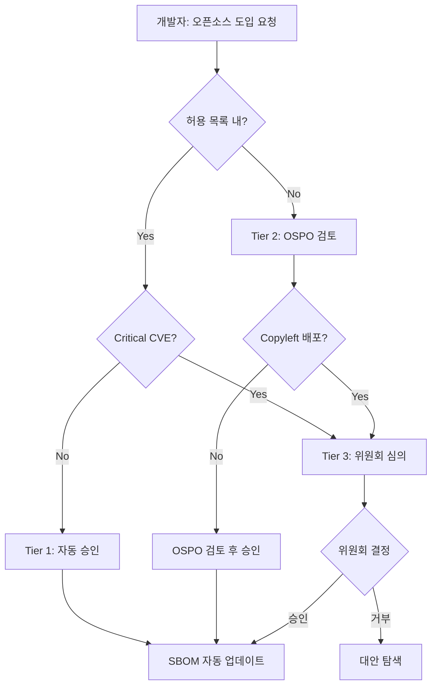

# 프로세스 산출물 Best Practice

`process-designer` agent가 생성하는 4개 산출물의 완성 예시입니다.
CI/CD 도구와 배포 주기에 따라 자동화 수준이 달라집니다.

> **레퍼런스 바로가기:** [오픈소스 프로세스 챕터 가이드](/docs/04-process)

---

## 스타트업 (CI/CD 없음, 비정기 배포)

**프로필**: 8명, CI/CD 없음, GitHub Issues, 담당자 단독 승인

### usage-approval.md

**회사명**: 클라우드샵(주)

**승인 흐름**

1. 개발자: 신규 오픈소스 도입 시 라이선스 확인 → `license-allowlist.md` 대조
2. 허용 목록 내 라이선스: GitHub Issue에 간단 기록 후 즉시 사용
3. 허용 목록 외 라이선스: `opensource@cloudshop.io` 에 검토 요청
4. 담당자(김민준): 3 영업일 이내 승인/거부 회신

**허용 목록 외 라이선스 검토 요청 양식 (GitHub Issue 본문)**

```
[오픈소스 검토 요청]
패키지명: <패키지명@버전>
라이선스: <라이선스명>
사용 목적: <기능 설명>
배포 방식: 내부만 / SaaS 배포 포함
요청자: <이름>
```

### distribution-checklist.md

**회사명**: 클라우드샵(주)

배포 전 아래 항목을 순서대로 확인한다.

- [ ] SBOM 최신 상태 확인 (`syft` 재실행, 마지막 업데이트 날짜 확인)
- [ ] `license-allowlist.md` 외 라이선스 없음 확인
- [ ] 고지 의무 있는 패키지(MIT, Apache-2.0 등) NOTICE 파일 포함 확인
- [ ] Critical/High CVE 미해결 항목 없음 확인 (OSV API 기준)
- [ ] AGPL 라이선스 패키지 없음 또는 소스 공개 준비 완료
- [ ] 담당자 최종 확인: 김민준

모든 항목 체크 후 배포 진행.

---

## 중소기업 (GitHub Actions, 주간 배포)

**프로필**: 50명, GitHub Actions, 주간 배포, GitHub Issues, 팀장 승인

### usage-approval.md

**자동 승인 기준**

PR 생성 시 GitHub Actions가 자동으로 라이선스를 확인한다.
`license-allowlist.md` 내 라이선스 + Critical CVE 없음 → 자동 통과

**수동 검토 기준 (팀장 승인 필요)**

- 허용 목록 외 라이선스
- High CVE 이상 취약점 존재
- Copyleft 라이선스를 앱/납품 제품에 사용

**GitHub Actions 워크플로우 예시**

```yaml
# .github/workflows/oss-check.yml
name: OSS Compliance Check
on:
  pull_request:
jobs:
  license-check:
    runs-on: ubuntu-latest
    steps:
      - uses: actions/checkout@v4
      - name: Generate SBOM
        run: |
          docker run --rm -v $(pwd):/project anchore/syft:latest \
            /project --output cyclonedx-json > sbom.cdx.json
      - name: Upload SBOM artifact
        uses: actions/upload-artifact@v4
        with:
          name: sbom
          path: sbom.cdx.json
```

### vulnerability-response.md

**취약점 심각도별 대응 기한**

| 심각도 | CVSS 점수 | 대응 기한 | 담당자 |
|--------|-----------|-----------|--------|
| Critical | 9.0~10.0 | 24시간 이내 | 팀장 즉시 보고 + 긴급 패치 |
| High | 7.0~8.9 | 1주일 이내 | 보안 담당(정다은) |
| Medium | 4.0~6.9 | 1개월 이내 | 다음 스프린트 포함 |
| Low | 0.1~3.9 | 다음 릴리즈 | 백로그 등록 |

**취약점 발견 시 조치 순서**

1. GitHub Dependabot 경보 확인 또는 주간 OSV 스캔 결과 확인
2. GitHub Issue에 `[CVE-취약점]` 라벨로 기록 (비공개)
3. 심각도에 따라 패치 일정 수립
4. 패치 완료 후 Issue 종료 및 패치 내용 기록

**취약점 공개 정책**

외부에서 취약점 신고 수신 시 (`security@techstart.co.kr`):
- 접수 확인: 1 영업일 이내
- 조사 및 처리: 30일 이내
- 처리 결과 회신: 처리 완료 후 5일 이내

---

## 대기업 (GitLab CI, 매일 배포, 위원회 승인)

**프로필**: 300명+, GitLab CI, 매일 배포, Jira, 위원회 승인

### usage-approval.md

**승인 티어 구분**

| 티어 | 조건 | 처리 방식 | 소요 시간 |
|------|------|----------|---------|
| Tier 1 자동 승인 | 허용 목록 내, Critical CVE 없음 | GitLab CI 자동 통과 | 즉시 |
| Tier 2 담당자 검토 | 허용 목록 외 Permissive, High CVE | OSPO 검토 | 2 영업일 |
| Tier 3 위원회 심의 | Copyleft 배포 제품 사용, AGPL, 신규 유형 | OSPO + 법무 + 팀장 위원회 | 5 영업일 |

**Jira 연동**

Tier 2/3 검토 요청은 Jira `OSS-REVIEW` 프로젝트에 티켓 생성.
담당자 자동 할당 및 SLA 모니터링.

### process-diagram.md (Mermaid 흐름도 예시)


