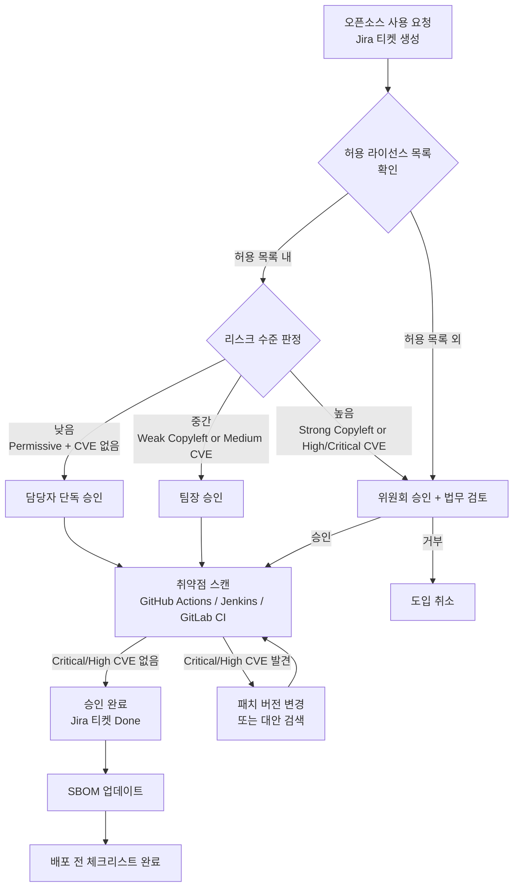
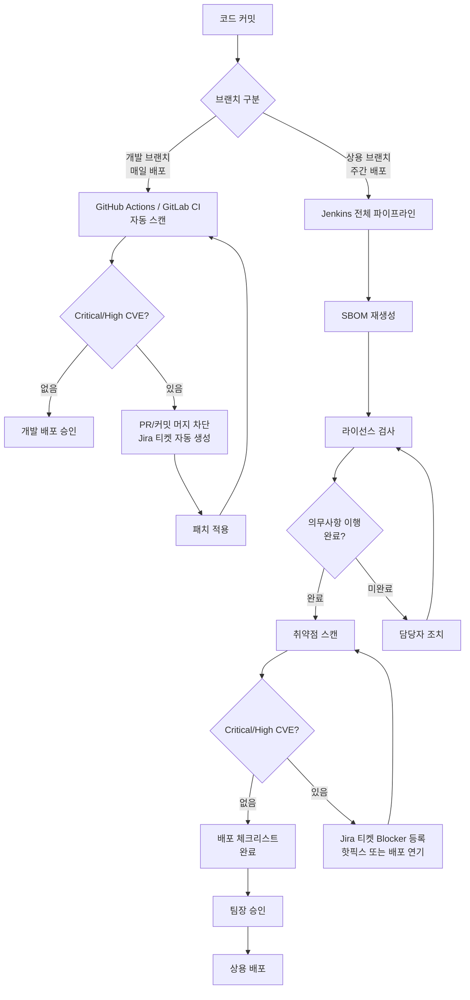
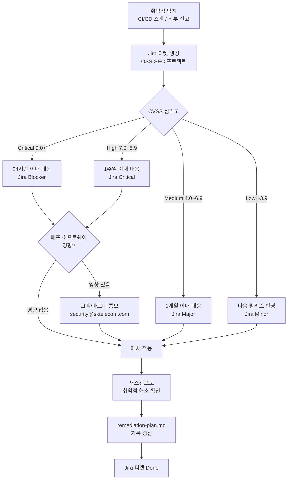
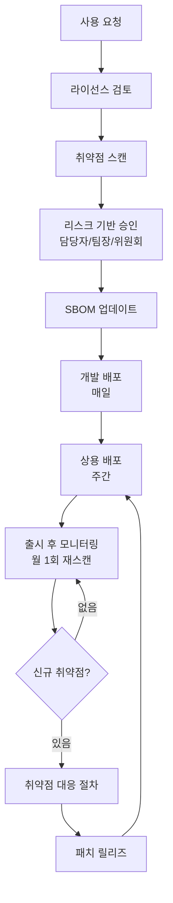

# 프로세스 산출물 Best Practice

`process-designer` agent가 생성하는 4개 산출물의 완성 예시입니다.
자신의 `output/process/` 파일과 비교하여 빠진 항목을 확인하는 용도로 활용하세요.

> **레퍼런스 바로가기:** [오픈소스 프로세스 챕터 가이드](/docs/process)

---

## 오픈소스 사용 승인 절차

문서: usage-approval.md

- **회사명**: 테크유니콘
- **작성일**: 2026-03-23
- **담당자**: DevOps팀 오픈소스 담당자

```
관련 표준
- 5230 §3.1.5.1·§3.3.1.1·§3.3.2.1
```

---

### 1. 절차 개요

```
관련 표준
- 5230 §3.1.5.1
```

오픈소스 컴포넌트를 신규 도입하거나 기존 버전을 변경할 때 이 절차를 따른다.

#### 리스크 기반 승인 단계

| 리스크 수준 | 조건 | 승인 단계 |
|-----------|------|---------|
| 낮음 | Permissive 라이선스 + Critical/High CVE 없음 | 담당자 단독 승인 |
| 중간 | Weak Copyleft 또는 Medium CVE 존재 | 팀장 승인 |
| 높음 | Strong/Network Copyleft, High/Critical CVE, 허용 목록 외 라이선스 | 위원회 승인 |

```
오픈소스 도입 요청 (Jira 티켓 생성)
    ↓
라이선스 확인 (허용 목록 대조)
    ↓
리스크 수준 판정
    ↓
[낮음] → 담당자 승인
[중간] → 팀장 승인
[높음] → 위원회 승인 (법무팀 포함)
    ↓
취약점 스캔 (CVE 확인)
    ↓
[Critical/High CVE?] → 대안 검색 또는 패치 확인
    ↓
승인 완료 → SBOM 업데이트
    ↓
배포 전 distribution-checklist.md 완료
```

---

### 2. CI/CD 자동화 통합

테크유니콘은 GitHub Actions, Jenkins, GitLab CI를 모두 사용한다. 각 파이프라인에서 오픈소스 사용 승인 절차를 아래와 같이 통합한다.

#### GitHub Actions

```yaml
# .github/workflows/oss-scan.yml
name: OSS License & Vulnerability Scan
on:
  pull_request:
    branches: [main, develop]

jobs:
  oss-check:
    runs-on: ubuntu-latest
    steps:
      - uses: actions/checkout@v4
      - name: License Scan
        run: |
          # 라이선스 스캔 후 허용 목록 대조
          npx license-checker --summary --excludePrivatePackages
      - name: Vulnerability Scan
        run: |
          # CVE 스캔
          npm audit --audit-level=high
```

#### Jenkins (Jenkinsfile)

```groovy
stage('OSS Compliance') {
    steps {
        sh 'license-checker --summary'
        sh 'osv-scanner --lockfile package-lock.json'
    }
    post {
        failure {
            // Jira 티켓 자동 생성
            jiraNewIssue site: 'SKT-JIRA',
                         projectKey: 'OSS',
                         summary: 'OSS 컴플라이언스 검사 실패'
        }
    }
}
```

#### GitLab CI (.gitlab-ci.yml)

```yaml
oss-scan:
  stage: test
  script:
    - license-checker --summary
    - osv-scanner --lockfile package-lock.json
  only:
    - merge_requests
    - main
```

---

### 3. 사용 승인 요청 양식 (Jira 티켓)

Jira에서 프로젝트 **OSS** 유형 티켓을 생성하여 아래 항목을 기록한다.

| 항목 | 내용 |
|------|------|
| 요청자 | (이름/부서) |
| 요청일 | YYYY-MM-DD |
| 컴포넌트명 | (이름) |
| 버전 | (버전) |
| 라이선스 | (SPDX 식별자, 예: Apache-2.0) |
| 사용 목적 | (직접 사용 / 의존성 / 개발용) |
| 배포 포함 여부 | (배포 포함 / 내부용만) |
| 리스크 수준 | (낮음 / 중간 / 높음) |
| 대안 검토 여부 | (검토함 / 검토불필요 / 이유: ) |

---

### 4. 라이선스 의무사항 검토

```
관련 표준
- 5230 §3.1.5.1
```

| 라이선스 유형 | 배포 방식 | 의무사항 | 이행 방법 | 승인 단계 |
|------------|---------|---------|---------|---------|
| MIT / Apache-2.0 / BSD | 모든 배포 | 저작권 표시, 라이선스 고지 | NOTICE 파일에 포함 | 담당자 단독 |
| LGPL | 임베디드/배포 | 소스코드 공개 또는 동적링크 보장 | 동적링크 유지 / 소스코드 공개 | 팀장 승인 |
| GPL-2.0 / GPL-3.0 | 임베디드/배포 | 전체 소스코드 공개 | 소스코드 공개 (배포 시) | 위원회 승인 |
| AGPL-3.0 | SaaS 포함 | 네트워크 서비스 포함 소스코드 공개 | 소스코드 공개 | 위원회 승인 |
| 허용 목록 외 | — | 사전 법무 검토 필수 | | 위원회 승인 |

---

### 5. 취약점 사전 확인

```
관련 표준
- 18974 §4.1.5.1·§4.3.2
```

신규 컴포넌트 도입 시:

- [ ] OSV API 또는 NVD에서 해당 버전의 CVE 조회
- [ ] Critical/High CVE 없음 확인
- [ ] Critical/High CVE 존재 시: 패치 버전으로 변경 또는 도입 재검토
- [ ] Jira 티켓에 스캔 결과 첨부

---

### 6. SBOM 업데이트 의무

```
관련 표준
- 5230 §3.3.1.1
```

승인 후 반드시:
- `output/sbom/sbom-commands.sh`를 실행하여 SBOM 재생성
- 갱신된 `*.cdx.json` 파일을 지정 위치에 보관

---

### 7. 승인 기록

| 날짜 | 컴포넌트 | 버전 | 라이선스 | CVE 확인 | 리스크 | 승인자 | Jira 티켓 |
|------|---------|------|---------|---------|--------|--------|---------|
| YYYY-MM-DD | (이름) | (버전) | (라이선스) | ✅/⚠️ | 낮음/중간/높음 | (이름) | OSS-(번호) |

---

### 8. 허용 라이선스 목록 참조

허용·제한 라이선스의 전체 목록은 `output/policy/license-allowlist.md` 를 참조한다.

---

## 배포 전 라이선스 컴플라이언스 체크리스트

문서: distribution-checklist.md

- **회사명**: 테크유니콘
- **담당자**: DevOps팀 오픈소스 담당자

```
관련 표준
- 5230 §3.4.1.1·§3.4.1.2
```

---

### 배포 채널별 적용 기준

테크유니콘은 개발 브랜치(매일 배포)와 상용 브랜치(주간 배포)로 운영한다.

| 배포 채널 | 주기 | 체크리스트 적용 수준 |
|---------|------|-----------------|
| 개발 브랜치 | 매일 | 자동화 스캔 결과 확인 (항목 1, 4) |
| 상용 브랜치 | 주간 | 전체 체크리스트 완료 후 배포 |

---

### 1. SBOM 최신성 확인

```
관련 표준
- 5230 §3.3.1.2
```

- [ ] 이번 릴리즈 기준으로 SBOM이 최신 상태인가?
- [ ] `output/sbom/sbom-commands.sh`를 실행하여 SBOM을 재생성했는가?
- [ ] 신규 추가된 의존성이 SBOM에 반영되었는가?

**CI/CD 자동화 확인:**
- [ ] GitHub Actions / Jenkins / GitLab CI 파이프라인에서 SBOM 생성 단계가 통과되었는가?

---

### 2. 라이선스 의무사항 이행 확인

```
관련 표준
- 5230 §3.3.2.1·§3.1.5.1
```

- [ ] `output/sbom/license-report.md`의 모든 라이선스를 확인했는가?
- [ ] `output/policy/license-allowlist.md`에 없는 라이선스가 포함되어 있지 않은가?
- [ ] Copyleft 라이선스 사용 시 아래 항목을 충족했는가:

| 라이선스 | 의무사항 | 이행 여부 |
|---------|---------|---------|
| GPL-2.0 | 소스코드 공개, 고지문 포함 | ☐ 해당없음 / ☐ 이행완료 |
| GPL-3.0 | 소스코드 공개, 고지문 포함 | ☐ 해당없음 / ☐ 이행완료 |
| LGPL | 소스코드 공개 또는 동적링크 보장 | ☐ 해당없음 / ☐ 이행완료 |
| AGPL | 네트워크 서비스 포함 소스코드 공개 | ☐ 해당없음 / ☐ 이행완료 |
| MPL | 수정된 파일 소스코드 공개 | ☐ 해당없음 / ☐ 이행완료 |

---

### 3. 고지문(Notice) 파일 확인

```
관련 표준
- 5230 §3.4.1.1
```

- [ ] `NOTICE` 또는 `OPEN_SOURCE_LICENSES.txt` 파일이 배포 패키지에 포함되었는가?
- [ ] 고지문에 모든 오픈소스 컴포넌트의 저작권 표시 및 라이선스 텍스트가 있는가?
- [ ] 바이너리 배포 시 라이선스 고지 방법이 확보되었는가?

---

### 4. 취약점 스캔 결과 확인

```
관련 표준
- 18974 §4.1.5.1
```

- [ ] CI/CD 파이프라인(GitHub Actions / Jenkins / GitLab CI)에서 취약점 스캔이 수행되었는가?
- [ ] Critical/High CVE가 없거나 해소 계획이 수립되었는가?
- [ ] Jira에 관련 티켓이 생성·처리되었는가?

---

### 5. 컴플라이언스 산출물 보관

```
관련 표준
- 5230 §3.4.1.2
```

- [ ] 이번 배포의 SBOM 사본을 보관했는가? (경로: `output/sbom/{프로젝트}-{버전}.cdx.json`)
- [ ] 고지문 사본을 보관했는가?
- [ ] 보관 위치와 보관 기간이 정책에 명시되어 있는가?

---

### 6. 라이선스 미준수 사례 확인

```
관련 표준
- 5230 §3.2.2.5
```

- [ ] 이번 릴리즈에 라이선스 미준수 사례가 없는가?
- [ ] 미준수 사례가 있다면 시정 조치가 완료되었는가?

---

### 7. 최종 승인

**상용 브랜치 배포 (주간) — 전체 결재 필요**

| 구분 | 이름 | 서명/확인일 |
|------|------|-----------|
| 오픈소스 담당자 | DevOps팀 오픈소스 담당자 | YYYY-MM-DD |
| 법무 검토 (필요 시) | (이름) | YYYY-MM-DD |
| 배포 승인자 | DevOps팀장 | YYYY-MM-DD |

---

### 이행 기록

```
관련 표준
- 5230 §3.4.1.2
```

이 체크리스트를 완료하면 날짜와 함께 아래 이력에 기록한다.

| 버전 | 배포일 | 브랜치 | 체크리스트 완료 | 담당자 |
|------|--------|--------|--------------|--------|
| (버전) | YYYY-MM-DD | 상용/개발 | ✅ | (이름) |

---

## 취약점 대응 절차

문서: vulnerability-response.md

- **회사명**: 테크유니콘
- **작성일**: 2026-03-23
- **담당자**: DevOps팀 오픈소스 담당자

```
관련 표준
- 5230 §3.2.2.5
- 18974 §4.1.5.1·§4.2.1.2
```

---

### 1. 취약점 탐지 방법

```
관련 표준
- 18974 §4.1.5.1
```

| 탐지 방법 | 도구/채널 | 주기 |
|---------|---------|------|
| SBOM 기반 자동 스캔 (GitHub Actions) | OSV API / Dependabot | 커밋/PR 시, 개발 브랜치 매일 |
| SBOM 기반 자동 스캔 (Jenkins) | OSV API / Dependency Track | 빌드 시, 주간 정기 스캔 |
| SBOM 기반 자동 스캔 (GitLab CI) | OSV API / GitLab Security | 머지 리퀘스트 시 |
| 공급업체 보안 권고 | NVD, GitHub Security Advisories | 실시간 구독 |
| 외부 신고 | security@sktelecom.com | 상시 |

---

### 2. 위험/영향 점수 할당 기준

```
관련 표준
- 18974 §4.1.5.1·§4.3.2
```

CVSS v3.1 기준 심각도 분류:

| 심각도 | CVSS 점수 | 대응 기한 | 조치 방법 | Jira 우선순위 |
|--------|---------|---------|---------|------------|
| 🔴 Critical | 9.0 ~ 10.0 | 즉시 (24시간 이내) | 즉시 패치, 배포 중단 검토 | Blocker |
| 🟠 High | 7.0 ~ 8.9 | 1주일 이내 | 패치 또는 완화 조치 | Critical |
| 🟡 Medium | 4.0 ~ 6.9 | 1개월 이내 | 다음 정기 릴리즈에 포함 | Major |
| 🟢 Low | 0.1 ~ 3.9 | 다음 릴리즈 | 정기 업데이트 시 반영 | Minor |

---

### 3. 후속 조치 절차

```
관련 표준
- 18974 §4.1.5.1
```

1. **탐지**: CI/CD 자동 스캔(GitHub Actions/Jenkins/GitLab CI) 또는 외부 신고로 취약점 인지
2. **기록**: `output/vulnerability/cve-report.md`에 CVE ID, 컴포넌트, CVSS 점수 기록
3. **Jira 티켓 생성**: 프로젝트 **OSS-SEC** 유형, 우선순위는 심각도 기준 자동 설정
4. **평가**: 위험/영향 점수 할당 및 조치 방법 결정
5. **조치**: 패치 적용, 버전 업그레이드, 또는 완화 조치 수행
6. **검증**: 조치 완료 후 재스캔으로 취약점 해소 확인
7. **기록 갱신**: `output/vulnerability/remediation-plan.md`에 조치 완료 기록
8. **Jira 티켓 종결**: 조치 완료 확인 후 Done 처리

---

### 4. 배포 주기별 대응 기준

| 배포 브랜치 | 주기 | Critical/High 취약점 발견 시 |
|-----------|------|--------------------------|
| 개발 브랜치 | 매일 | 해당 PR/커밋 머지 차단 후 즉시 패치 |
| 상용 브랜치 | 주간 | 패치 완료 확인 후 배포, 필요 시 핫픽스 배포 |

---

### 5. 고객 통보 기준

```
관련 표준
- 18974 §4.1.5.1
```

아래 경우 고객 또는 공급망 파트너에게 통보한다:

- Critical/High 취약점이 이미 배포된 소프트웨어에 영향을 줄 때
- 통보 방법: 이메일(security@sktelecom.com) / 보안 게시판 / 릴리즈 노트
- 통보 기한: Critical — 인지 후 24시간 이내, High — 인지 후 3영업일 이내

---

### 6. 출시 후 신규 취약점 모니터링

```
관련 표준
- 18974 §4.1.5.1
```

- **모니터링 주기**: 월 1회 전체 SBOM 재스캔 (Jenkins 정기 빌드 활용)
- **구독 채널**: NVD RSS, GitHub Security Advisories, OSV.dev
- **담당자**: DevOps팀 오픈소스 담당자
- **대응 트리거**: 새로운 CVE가 배포 소프트웨어의 컴포넌트에 영향을 줄 때 즉시 [3. 후속 조치 절차] 개시

---

### 7. 외부 취약점 신고 대응

```
관련 표준
- 18974 §4.2.1.2
```

외부에서 취약점 신고 접수 시:
1. **수신**: security@sktelecom.com
2. **확인 응답**: 2 영업일 이내 수신 확인 회신
3. **처리**: 3. 후속 조치 절차와 동일하게 처리
4. **결과 통보**: 조치 완료 후 신고자에게 결과 공유

---

### 8. 출시 전 보안 테스트

```
관련 표준
- 18974 §4.1.5.1
```

상용 브랜치 주간 배포 전 아래 항목을 수행한다:

- [ ] SBOM 재생성
- [ ] OSV API 또는 Dependency Track으로 취약점 스캔 (Jenkins 파이프라인)
- [ ] Critical/High 취약점 없음 확인 또는 해소 계획 수립
- [ ] `output/process/distribution-checklist.md` 완료

---

## 오픈소스 프로세스 흐름도

문서: process-diagram.md

- **회사명**: 테크유니콘
- **작성일**: 2026-03-23

```
관련 표준
- 5230 §3.1.5.1·§3.3.1.1·§3.4.1.1
```

---

### 1. 오픈소스 사용 승인 프로세스



---

### 2. 배포 파이프라인 프로세스



---

### 3. 취약점 대응 프로세스



---

### 4. 전체 오픈소스 관리 사이클



---

### 참조 문서

| 프로세스 | 상세 절차 문서 |
|---------|-------------|
| 사용 승인 | `output/process/usage-approval.md` |
| 배포 체크리스트 | `output/process/distribution-checklist.md` |
| 취약점 대응 | `output/process/vulnerability-response.md` |
| 라이선스 정책 | `output/policy/oss-policy.md` |
| 허용 라이선스 | `output/policy/license-allowlist.md` |
